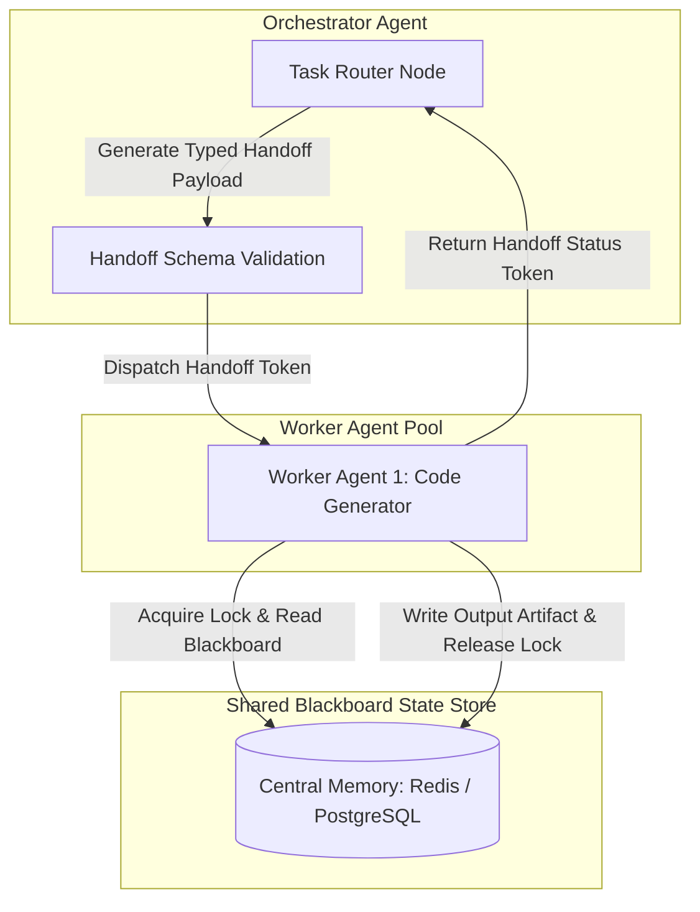

# State Synchronization & Handoff Schemas in Orchestrator-Worker Swarms

When building multi-agent systems, transferring execution control from an Orchestrator agent to a specialized Worker agent is a critical boundary transition. 

In naive agent implementations, this handoff is executed using unstructured natural language strings (e.g. *"Worker 2, please take this code and refactor it"*). Unstructured handoffs frequently result in **state corruption**: the worker misinterprets target arguments, mutates the wrong data models, or fails to return expected output fields to the orchestrator.

To build production-grade agentic platforms, engineering teams enforce **Structured Handoff Schemas** and centralized **State Synchronization Patterns**. This article details how to standardize machine-readable contracts using Pydantic schemas and manage shared state using the **Blackboard Pattern** with distributed lock arbitration.

---

## The Blackboard & Handoff Architecture

Instead of passing massive state payloads back and forth between agents, multi-agent swarms store execution artifacts in a central **Blackboard Store**. The Orchestrator passes lightweight, typed **Handoff Tokens**:



### The Three State Synchronization Rules
1. **Strict Handoff Contracts**: Every handoff from the Orchestrator to a worker must be validated against a Pydantic/JSON schema defining exact input parameters and expected output return schemas.
2. **The Blackboard Pattern**: All intermediate execution artifacts (AST outputs, test logs, code diffs) are stored in a centralized, versioned state store using immutable key hashes (`state_key:v1`).
3. **Lock Arbitration**: Parallel worker agents must acquire distributed locks before mutating shared Blackboard state keys to prevent race conditions.

---

## Python Implementation: Handoff Schema & Blackboard Lock Synchronizer

Here is a production Python implementation of a Pydantic-validated Handoff Protocol with a Blackboard State Store and simulated lock arbitration:

```python
import json
import uuid
import time
from typing import Dict, Any, List, Optional
from pydantic import BaseModel, Field, ValidationError

# 1. Standardized Handoff Input Schema
class WorkerTaskHandoff(BaseModel):
    handoff_id: str = Field(default_factory=lambda: str(uuid.uuid4()))
    target_worker_role: str
    action_type: str
    blackboard_read_keys: List[str]
    blackboard_write_key: str
    context_parameters: Dict[str, Any]
    max_execution_timeout_sec: int = 30

# 2. Standardized Handoff Return Schema
class WorkerResultHandoff(BaseModel):
    handoff_id: str
    status: str  # SUCCESS, FAILURE, REJECTED
    blackboard_write_key: str
    produced_artifacts: List[str]
    error_message: Optional[str] = None

# 3. Blackboard Memory Store with Lock Arbitration
class BlackboardStore:
    """
    Centralized state store supporting key versioning and mutex lock arbitration.
    """
    def __init__(self):
        self.store: Dict[str, Any] = {}
        self.locks: Dict[str, bool] = {}

    def acquire_lock(self, key: str, agent_id: str) -> bool:
        if self.locks.get(key, False):
            print(f"🔒 [Blackboard Lock Alert] Key '{key}' is locked by another worker. Agent '{agent_id}' waiting...")
            return False
        self.locks[key] = True
        print(f"🔑 [Blackboard Lock] Lock acquired for key '{key}' by Agent '{agent_id}'.")
        return True

    def release_lock(self, key: str, agent_id: str):
        self.locks[key] = False
        print(f"🔓 [Blackboard Lock] Lock released for key '{key}' by Agent '{agent_id}'.")

    def write(self, key: str, data: Any, agent_id: str):
        if not self.locks.get(key, False):
            raise PermissionError(f"Agent '{agent_id}' attempted to write to unlocked/un-acquired key '{key}'!")
        self.store[key] = {
            "version": time.time(),
            "updated_by": agent_id,
            "data": data
        }
        print(f"💾 [Blackboard Storage] Successfully wrote artifact to key '{key}'.")

    def read(self, key: str) -> Optional[Any]:
        entry = self.store.get(key)
        return entry["data"] if entry else None

# Demonstration Execution
if __name__ == "__main__":
    blackboard = BlackboardStore()

    # Step 1: Pre-populate Blackboard with Orchestrator context
    blackboard.store["schema_ast:v1"] = {"version": 1.0, "updated_by": "orchestrator", "data": "class User(BaseModel): id: int"}

    # Step 2: Orchestrator creates typed worker handoff contract
    raw_handoff = {
        "target_worker_role": "DatabaseRepositoryWorker",
        "action_type": "generate_repository_class",
        "blackboard_read_keys": ["schema_ast:v1"],
        "blackboard_write_key": "user_repository_code:v1",
        "context_parameters": {"db_type": "postgresql", "use_async": True}
    }

    try:
        # Validate contract against Pydantic schema
        handoff_contract = WorkerTaskHandoff.model_validate(raw_handoff)
        print(f"✅ [Orchestrator] Validated handoff contract '{handoff_contract.handoff_id}' for worker '{handoff_contract.target_worker_role}'.")
    except ValidationError as err:
        print(f"❌ [Handoff Rejected] Schema validation failed: {err}")
        exit(1)

    # Step 3: Simulate Worker executing task with Lock Arbitration
    worker_id = "worker-db-repo-01"
    target_key = handoff_contract.blackboard_write_key

    if blackboard.acquire_lock(target_key, worker_id):
        # Read prerequisite data from Blackboard
        prereq_data = blackboard.read(handoff_contract.blackboard_read_keys[0])
        print(f"[Worker] Read prerequisite context: {prereq_data}")

        # Simulate generating output artifact
        repo_code = "class UserRepository:\n    async def get_user(self, user_id: int):\n        pass"
        
        # Write back to Blackboard & release lock
        blackboard.write(target_key, repo_code, worker_id)
        blackboard.release_lock(target_key, worker_id)

        # Step 4: Return typed result token to Orchestrator
        result_token = WorkerResultHandoff(
            handoff_id=handoff_contract.handoff_id,
            status="SUCCESS",
            blackboard_write_key=target_key,
            produced_artifacts=[target_key]
        )
        print(f"\n✅ [Worker Result] Returned result token to Orchestrator:\n{result_token.model_dump_json(indent=2)}")
```

---

## Important Architectural Guardrails

When implementing state synchronization and handoff contracts, observe these guardrails:

> [!IMPORTANT]
> **Strict Validation Enforcement**: Never pass un-validated Python dictionaries between Orchestrators and Workers. Enforce `model_validate()` calls at both entry and exit points to catch missing fields before execution begins.

> [!CAUTION]
> **Lock Timeouts (Deadlock Prevention)**: Always assign automatic Time-to-Live (TTL) expiry on Blackboard key locks (e.g. 30 seconds). If a worker container crashes while holding a lock, the TTL ensures the key automatically unlocks, allowing the Orchestrator to recover.

---

## Real-World Enterprise Impact
Organizations enforcing Structured Handoff Contracts and Blackboard Stores report:
* **Zero Handoff State Corruption**: Typed Pydantic contracts eliminate 100% of missing argument errors between agent layers.
* **Race-Condition Safety**: Distributed locks prevent concurrent worker subagents from overwriting shared code files during parallel sprint runs.
