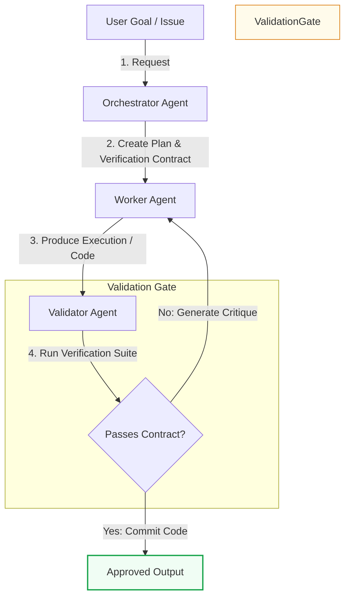

# Breaking the Self-Review Loop: The Orchestrator-Worker-Validator Pattern

> ### 📖 Article Overview
> * **What this article is about:** This article analyzes the failure modes of single-LLM self-review loops and details the 3-tier Orchestrator-Worker-Validator architecture designed to solve them.
> * **Why it matters:** Separating agentic labor prevents cognitive bias in LLMs, reduces token costs, secures systems against prompt injection, and guarantees reliable code execution in production.
> * **What we synthesized:** We synthesized the core mechanics of the Orchestrator-Worker-Validator loop, key implementation rules for context isolation, and strategies for combining rule-based and model-based validation.

One of the most persistent failure modes in early agent deployments is the **Self-Review Loop**. Developers write a prompt that instructs a single LLM to:
1. Write a Python script.
2. Read the script it just wrote.
3. Fix any errors in the script.

In production, this pattern routinely fails. Large Language Models exhibit a cognitive bias analogous to human **sunk cost bias**: once a model generates an output, its subsequent self-inspections tend to confirm its original assumptions. If the model made a logical error in step 1, it will likely read past that same error in step 2, declaring its own work "valid."

To build reliable systems, we must separate the labor. We do this by implementing a 3-tier architecture: **Orchestrator, Worker, and Validator**.

This pattern, popularized by enterprise AI engineering teams like Factory, structures agentic execution as a strict software pipeline.

---

## The Three-Tier Architecture Loop

### 1. The Orchestrator (The Planner)
The user request enters the Orchestrator. The Orchestrator's role is strictly cognitive planning, not code execution. It:
*   Analyzes the goal.
*   Queries metadata directories to identify files or databases that need modification.
*   Generates a discrete, step-by-step execution plan.
*   **Drafts the Verification Contract**: The contract outlines the expected variables, required imports, validation scripts, or schema checks that the final output must satisfy.

### 2. The Worker (The Executer)
The Worker receives a task card from the Orchestrator. 
*   **Context Isolation**: The Worker does *not* see the global plan, other worker logs, or system instructions. It is given a narrow context window, a clean list of 1–2 tools (e.g., read/write file), and the task contract.
*   **Why this matters**: Context isolation prevents prompt injection attacks (where external data compromises the agent) and minimizes token costs. It also ensures the model has high focus on the exact code task at hand.

### 3. The Validator (The Inspector)
The Validator takes the Worker's output and matches it against the Verification Contract.
*   **Independent Context**: The Validator has no visibility into the worker's execution path or thought log. It only evaluates the final artifact.
*   **Verification Methods**:
    *   *Rule-Based Validation*: Running code linters, compilers, and test suites (e.g., Pytest, Jest).
    *   *Model-Based Validation*: Utilizing a separate, smaller LLM prompt with a strict QA grading rubric (LLM-as-judge).
*   **Feedback loop**: If the validation fails, the Validator compiles a list of specific errors (e.g., "Line 43 failed compilation with SyntaxError") and redirects the card back to the Worker. The Worker runs again with the critique as additional input.

---

## 📋 Architectural Rules for Production Builders

*   [ ] **Strict Context Partitioning**: Ensure your Worker and Validator prompts do *not* share system instructions, variable memory, or history files.
*   [ ] **Rule-Based Precedence**: Always execute programmatic validation (tests, compilers, regex schema checks) *before* invoking LLM-as-judge validators. Save tokens and ensure 100% accuracy on structural checks.
*   [ ] **Termination Escape Valve**: Set a strict threshold on the Worker-Validator critique loop (e.g., if a worker fails validation 3 times, pause execution and alert a human supervisor).

---

## 🏁 Conclusion & Key Takeaways

Adopting a structured multi-agent architecture is the key to overcoming the inherent cognitive biases of single-LLM systems.
1. **Deconstruct the Self-Review Loop:** LLMs cannot reliably grade their own work due to confirmation bias, making a separate Validator agent essential for objective quality control.
2. **Isolate Context for Security and Focus:** Restricting the Worker's context window minimizes token overhead, prevents prompt injection, and ensures high-fidelity task execution.
3. **Prioritize Programmatic Validation:** Run deterministic, rule-based checks like compilers and unit tests before calling LLM-as-judge evaluators to save API costs and guarantee structural correctness.

*Takeaway:* *To build production-grade AI agents, replace single-model self-correction with a strict, multi-agent pipeline of isolated planners, executors, and validators.*

---

## 📚 References & Further Reading

*   **Factory.ai Architecture Blog**: *The Multi-Agent Architecture That Ships*. Luke Alvoeiro details the separation of planning, execution, and validation in automated software development squads. *(Technical Case Study)*
*   **Reflexion Paper**: Shinn et al., 2023. *Reflexion: Language Agents with Active Generative Feedback*. Explains the mathematical and systemic benefit of separate critic models in agentic loops. [Link](https://arxiv.org/abs/2303.11366)
*   **LLM-as-a-Judge**: Zheng et al., 2023. *Judging LLM-as-a-Judge with MT-Bench and Chatbot Arena*. Analyzes the systematic biases and optimal setups for utilizing model evaluators. [Link](https://arxiv.org/abs/2306.05685)

*To explore complete code implementations of all 17 agent microservices in a single monorepo, check out the public [agentic-apps-portfolio](https://github.com/akmalkhaniub/agentic-apps-portfolio) repository.*