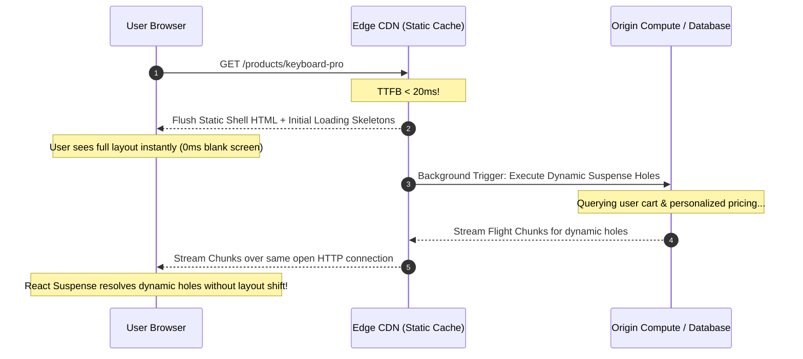

For two decades, the architecture of the web has been trapped in a binary compromise:

You could choose **Static Site Generation (SSG)**: build your HTML files at compile time, deploy them to an edge Content Delivery Network (CDN), and deliver sub-50ms Time to First Byte (TTFB) anywhere on Earth. But the moment a user logs in, or an e-commerce page displays real-time inventory counts, the model fractures. You are forced to ship skeleton loaders, execute client-side waterfalls, and watch Cumulative Layout Shift (CLS) degrade user experience.

Or you could choose **Server-Side Rendering (SSR)**: dynamically compute HTML on every inbound request with fresh database state. But now your TTFB is held hostage by your slowest database query. If a personalized recommendation engine takes 400 milliseconds to calculate, the user stares at a completely blank white screen for nearly half a second before receiving a single byte of HTML.

In 2024, Next.js introduced **Partial Prerendering (PPR)** and the experimental **`dynamicIO`** compiler flag.

PPR does not choose between static and dynamic. It delivers both in **a single, multiplexed HTTP response stream**:
1. At build time, Next.js pre-renders a static HTML shell containing your navigation bar, layout, and loading skeletons.
2. When an edge request arrives, that static shell is flushed from the CDN cache in **under 20 milliseconds**.
3. Over the exact same open HTTP connection, the server continues execution in the background, computing dynamic React Server Components and streaming their Flight chunks into pre-allocated holes in the DOM.

Here is the deep architectural breakdown of how Partial Prerendering works at the byte and network layers.



---

## 1. Why This Feature? The Physics of Time to First Byte (TTFB)

In web performance, TTFB is the critical gating factor for all downstream metrics. If the browser does not receive HTML bytes:
* It cannot discover `<link rel="stylesheet">` tags.
* It cannot preload critical fonts.
* It cannot begin parsing client-side JavaScript bundles.

Every 100 milliseconds of TTFB delay cascades into hundreds of milliseconds of First Contentful Paint (FCP) and Largest Contentful Paint (LCP) degradation.

Traditional SSR forces the browser to wait for the entire page's data to resolve before sending the HTTP status code (`200 OK`) and initial `<!DOCTYPE html>`.

### The Suspense Streaming Solution
React 18 introduced streaming SSR via `<Suspense>`. The server could flush the `<head>` and initial markup, keeping the connection open via `Transfer-Encoding: chunked`. When slow queries completed, inline `<script>` tags swapped in the finished markup.

However, streaming SSR still required an **origin compute server to boot on every request**. Even if 90% of the page was static markup, a cold-start serverless container still added 200–500ms of compute latency before flushing the first chunk.

Partial Prerendering solves this by decoupling the **initial flush** from the **origin compute**:
* The static shell is served directly from edge memory (Cloudflare Workers, Vercel Edge, AWS CloudFront) without hitting a server container.
* The dynamic holes are spawned as parallel serverless promises that stream directly into the already-open HTTP pipe.

---

## 2. Under the Hood: Static Resume Tokens and dynamicIO

How does Next.js determine which parts of a component tree are static and which are dynamic without manual configuration?

### The `dynamicIO` Compilation Pass
In earlier versions, developers had to declare route configuration flags like `export const dynamic = 'force-dynamic'` or configure `revalidate` timers.

The `experimental.dynamicIO` compiler flag replaces manual configuration with **micro-read AST instrumentation**. During the build phase, the compiler inspects every component:
* If a component reads from a dynamic source (`cookies()`, `headers()`, `searchParams`, or un-cached database queries), that specific sub-tree is marked as a **Dynamic Hole**.
* If an un-cached async call occurs outside of a `<Suspense>` boundary, the build fails with a descriptive compilation error, preventing accidental blocking of the static shell.

```tsx
// app/products/[slug]/page.tsx
import { Suspense } from 'react';
import ProductHeader from '@/components/product-header'; // Static
import DynamicPricing from '@/components/dynamic-pricing'; // Reads user cookies
import PricingSkeleton from '@/components/pricing-skeleton';

export default function ProductPage({ params }: { params: Promise<{ slug: string }> }) {
  return (
    <div className="product-layout">
      {/* 1. Bakes into the Static Shell at build time */}
      <ProductHeader slug={params} />

      {/* 2. PPR Boundary: Allocates a streaming hole */}
      <Suspense fallback={<PricingSkeleton />}>
        <DynamicPricing />
      </Suspense>
    </div>
  );
}
```

### The Static Shell Output at Build Time:
When Next.js compiles the page above with PPR enabled, it outputs an HTML document containing pre-rendered markup for `ProductHeader` and `PricingSkeleton`, followed by an embedded marker:

```html
<div class="product-layout">
  <div class="header"><h1>Mechanical Keyboard Pro</h1></div>
  <!--$?-->
  <template id="B:0"></template>
  <div class="pricing-skeleton">Loading price...</div>
  <!--/$-->
</div>
```

When the user requests the page, this exact HTML is dispatched from the edge immediately. The browser parses the CSS and renders the layout.

Moments later, the dynamic server promise resolves and flushes the replacement payload across the same stream:

```html
<div hidden id="S:0">
  <div class="pricing-live">
    <span class="price">$149.00</span>
    <span class="badge">Member Discount Applied</span>
  </div>
</div>
<script>
  $RC("B:0", "S:0"); // React Client runtime swaps fallback with live DOM
</script>
```

---

## 3. The Reverse-Proxy Hazard: Why Nginx and Cloudflare Break PPR

While Partial Prerendering is mathematically brilliant, it introduces a severe operational pitfall when deploying outside of specialized edge infrastructure: **Reverse-Proxy Response Buffering**.

In standard enterprise production architectures, traffic passes through reverse proxies:
```
User Browser ──► Cloudflare ──► AWS ALB / Nginx ──► Next.js Node Container
```

By default, almost every production reverse proxy (Nginx, Envoy, Apache, HAProxy) is configured with **response buffering enabled**:
* The proxy waits until it has received the entire upstream HTTP response (or a large buffer threshold like 64KB) before forwarding bytes to the client.
* **This completely destroys Partial Prerendering!**

### The Catastrophic Result:
1. The Next.js server flushes the static shell (4KB) in 15 milliseconds.
2. Nginx buffers the 4KB and does not send it to the user.
3. Nginx waits 400 milliseconds for the dynamic hole to complete before releasing the connection.
4. The user experiences zero benefits from PPR; they wait the full 400ms TTFB as if classic SSR were running!

### The Systems Fix:
To make PPR stream through Nginx, you must explicitly disable proxy buffering on streaming endpoints:

```nginx
# nginx.conf: Enabling Zero-Delay Chunked Streaming
location / {
    proxy_pass http://nextjs_upstream;
    
    # Crucial: Disable proxy buffering for HTTP chunked streams
    proxy_buffering off;
    proxy_cache off;
    
    # Enforce HTTP/1.1 for chunked transfer support
    proxy_http_version 1.1;
    proxy_set_header Connection "";
    
    # Ensure immediate TCP packet dispatch without Nagle buffering
    tcp_nodelay on;
}
```

Furthermore, streaming endpoints must emit the `X-Accel-Buffering: no` header to instruct downstream CDNs not to buffer intermediate chunks.

---

## 4. Cross-Framework Comparison: PPR vs Islands vs Resumability

| Performance Dimension | Next.js Partial Prerendering (PPR) | Astro Islands Architecture | Qwik Resumability | Nuxt 3 Hybrid Rendering |
|---|---|---|---|---|
| **Delivery Model** | Single HTTP stream (Static shell + dynamic stream) | Static HTML + isolated client script tags | Static HTML with serialized signal state | Per-route rules (SSG or SSR per URL) |
| **HTTP Connections** | 1 multiplexed stream | 1 initial HTML + parallel JS chunk fetches | 1 initial HTML (Zero hydration JS) | 1 connection per request |
| **Dynamic Execution** | Server-side streaming over open connection | Client-side execution in browser | Micro-resumed event execution in browser | Separate SSR or SPA routing |
| **Infrastructure Lock-In** | High (Requires streaming edge runtimes) | **Zero (Runs on any static host or simple Node server)** | **Low (Standard Node/Edge adapters)** | Low (Nitro cross-platform engine) |

---

## 5. Architectural Summary

Partial Prerendering represents the logical culmination of twenty years of web delivery evolution.

By dismantling the binary choice between static CDNs and dynamic servers, PPR delivers the holy grail: **sub-20ms edge TTFB for personalized, real-time web applications**.

However, systems architects must remember that streaming is an end-to-end network contract. If your ingress controllers, load balancers, or CDN caching layers buffer chunks, your multi-threaded streaming architecture degrades into slow, expensive SSR.
