# Why Your pgvector Index Is 10× Slower Than It Should Be

> [!NOTE]
> **📖 Article Overview**
> pgvector is the most accessible path to production vector search — it lives inside your existing PostgreSQL database, needs no new infrastructure, and integrates cleanly with every ORM. But "accessible" doesn't mean "fast by default." Without correct index configuration, pgvector silently falls back to exact sequential scan, ignores your index entirely on large result sets, returns completely wrong results when you mix filtering with ANN search, and degrades from milliseconds to seconds as your table grows past 100K rows. This article covers **7 pgvector performance and correctness traps** with exact SQL fixes, index configuration parameters, and hybrid search patterns.

---

## The pgvector Performance Cliff

pgvector supports two search modes: **exact k-NN** (sequential scan — always correct, O(n) cost) and **approximate nearest neighbour / ANN** (index-based — fast, slightly approximate). The danger is that pgvector silently falls back to exact scan in ways that produce no errors — just a query that takes 4 seconds instead of 4 milliseconds.

```mermaid
%%{init: {'theme': 'dark', 'themeVariables': { 'primaryColor': '#10b981', 'primaryTextColor': '#f3f4f6', 'primaryBorderColor': '#34d399', 'lineColor': '#10b981', 'secondaryColor': '#111827', 'tertiaryColor': '#0f172a'}}}%%
flowchart TD
    Q[Vector Query] --> P{Index exists<br/>and usable?}
    P -->|No index| S1[💥 Trap 1: Sequential scan<br/>O-n — 4s on 1M rows]
    P -->|Wrong operator| S2[💥 Trap 2: Wrong distance operator<br/>Index ignored silently]
    P -->|Filter before ANN| S3[💥 Trap 3: WHERE filter kills<br/>index — exact scan fallback]
    P -->|Index exists| C{ef_search<br/>configured?}
    C -->|Default ef_search=40| S4[💥 Trap 4: Poor recall<br/>missing relevant results]
    C -->|OK| D{Vacuum run<br/>recently?}
    D -->|No vacuum| S5[💥 Trap 5: Bloat degrades<br/>HNSW graph quality]
    D -->|OK| R[✅ Fast ANN search<br/>< 10ms]

    style S1 fill:#7f1d1d,stroke:#ef4444,stroke-width:2px
    style S2 fill:#7f1d1d,stroke:#ef4444,stroke-width:2px
    style S3 fill:#78350f,stroke:#f59e0b,stroke-width:2px
    style S4 fill:#78350f,stroke:#f59e0b,stroke-width:2px
    style S5 fill:#1e3a5f,stroke:#3b82f6,stroke-width:2px
```



---

## Trap 1: No Index — Silent Sequential Scan

**Symptom**: Queries work on 10K rows. After you load 500K documents, the same query takes 8 seconds. No errors.

**Root cause**: pgvector has no index by default. Every vector similarity query performs a full table scan, computing distance to every row.

```sql
-- ❌ No index — O(n) scan on every query
SELECT id, content, embedding <=> $1::vector AS distance
FROM documents
ORDER BY distance
LIMIT 5;
-- EXPLAIN ANALYZE shows: Seq Scan on documents

-- ✅ Create HNSW index (recommended for most use cases)
-- Parameters: m = number of connections per node, ef_construction = build quality
CREATE INDEX ON documents USING hnsw (embedding vector_cosine_ops)
WITH (m = 16, ef_construction = 64);

-- ✅ Or IVFFlat for large datasets with known list count
-- lists ≈ sqrt(number_of_rows)
CREATE INDEX ON documents USING ivfflat (embedding vector_cosine_ops)
WITH (lists = 100);  -- For ~10K rows: 100 lists. For ~1M rows: 1000 lists.

-- Verify index is being used
EXPLAIN (ANALYZE, BUFFERS)
SELECT id, content, embedding <=> $1::vector AS distance
FROM documents
ORDER BY distance
LIMIT 5;
-- Should show: Index Scan using documents_embedding_idx
```

**HNSW vs IVFFlat:**

| | HNSW | IVFFlat |
|--|------|---------|
| Build time | Slower | Faster |
| Query speed | Faster | Slower |
| Memory | More | Less |
| Best for | Production serving | Large datasets, batch indexing |

---

## Trap 2: Wrong Distance Operator — Index Silently Ignored

**Symptom**: You create an HNSW index with `vector_cosine_ops` but your query uses `<->` (L2 distance). The index is never used. Full sequential scan on every query.

**Root cause**: pgvector has three distance operators, each requiring its own index operator class:

```sql
-- The three operators and their index classes:
-- <=>  cosine distance       → vector_cosine_ops
-- <->  L2 (Euclidean) distance → vector_l2_ops
-- <#>  negative dot product  → vector_ip_ops

-- ❌ Index built for cosine, query uses L2 — index NOT used
CREATE INDEX ON documents USING hnsw (embedding vector_cosine_ops);

SELECT * FROM documents ORDER BY embedding <-> $1::vector LIMIT 5;
-- EXPLAIN: Seq Scan (index ignored!)

-- ✅ Match operator to index operator class
-- For normalised embeddings (OpenAI te3, modern sentence transformers):
CREATE INDEX ON documents USING hnsw (embedding vector_cosine_ops);
SELECT * FROM documents ORDER BY embedding <=> $1::vector LIMIT 5;  -- ✅ Uses index

-- For unnormalised embeddings:
CREATE INDEX ON documents USING hnsw (embedding vector_l2_ops);
SELECT * FROM documents ORDER BY embedding <-> $1::vector LIMIT 5;  -- ✅ Uses index

-- Check which index your query is using
EXPLAIN SELECT * FROM documents ORDER BY embedding <=> $1::vector LIMIT 5;
```

---

## Trap 3: WHERE Filters Before ANN — Exact Scan Fallback

**Symptom**: Adding a `WHERE tenant_id = $2` filter to your vector search causes 100× slowdown. The more selective the filter, the slower it gets.

**Root cause**: pgvector's HNSW/IVFFlat indexes operate on the full vector space. When you add a `WHERE` clause, PostgreSQL must apply the filter either before or after the ANN search. If applied before (pre-filter), the index is useless for the filtered subset. If applied after (post-filter), you may scan thousands of ANN results to find `top_k` that match the filter.

```sql
-- ❌ Pre-filter kills index effectiveness
SELECT id, content, embedding <=> $1::vector AS dist
FROM documents
WHERE tenant_id = $2           -- ← Filter applied before ANN
  AND category = 'engineering'
ORDER BY dist
LIMIT 5;
-- May fall back to sequential scan if filter is selective enough

-- ✅ Strategy A: Partition table by tenant (best for high-cardinality tenant IDs)
-- Each tenant has their own table — index is used on smaller dataset
CREATE TABLE documents_tenant_abc (LIKE documents INCLUDING ALL);
CREATE INDEX ON documents_tenant_abc USING hnsw (embedding vector_cosine_ops);

-- ✅ Strategy B: Increase ef_search to find more candidates for post-filtering
SET hnsw.ef_search = 200;  -- Search 200 candidates, then apply filter
SELECT id, content, embedding <=> $1::vector AS dist
FROM documents
WHERE tenant_id = $2
ORDER BY dist
LIMIT 5;
-- More accurate but slightly slower — tune based on filter selectivity

-- ✅ Strategy C: Use pgvector's iterative index scan (pgvector 0.7+)
-- Automatically increases search scope until enough filtered results found
SET enable_indexonlyscan = on;
SELECT id, content, embedding <=> $1::vector AS dist
FROM documents
WHERE tenant_id = $2
ORDER BY dist
LIMIT 5;
```

---

## Trap 4: Default `ef_search = 40` Gives Poor Recall

**Symptom**: Your semantic search misses obviously relevant documents. Manual inspection shows the right document exists in the table but isn't returned in top-5.

**Root cause**: `ef_search` controls how many candidate nodes HNSW explores during search. The default is 40 — fast but low recall on large or complex datasets. The right value depends on your data distribution and the `m` parameter used at build time.

```sql
-- Check current ef_search
SHOW hnsw.ef_search;  -- Default: 40

-- Benchmark recall vs latency tradeoff:
-- Lower ef_search = faster, lower recall
-- Higher ef_search = slower, higher recall

-- Test recall at different ef_search values:
SET hnsw.ef_search = 40;   -- Default — fast but may miss results
SET hnsw.ef_search = 100;  -- Better recall, ~2× slower
SET hnsw.ef_search = 200;  -- High recall, ~4× slower

-- ✅ Set per-session based on use case
-- Interactive search: balance speed and recall
SET hnsw.ef_search = 100;

-- Batch processing where recall matters more than latency:
SET hnsw.ef_search = 200;

-- ✅ Or set globally in postgresql.conf for consistent behaviour:
-- hnsw.ef_search = 100
```

```python
# Python: set ef_search per query via SQLAlchemy
from sqlalchemy import text

async def vector_search(
    query_embedding: list[float],
    top_k: int = 5,
    ef_search: int = 100,
    session = None
) -> list[dict]:
    # Set ef_search for this session
    await session.execute(text(f"SET hnsw.ef_search = {ef_search}"))
    
    results = await session.execute(
        text("""
            SELECT id, content,
                   embedding <=> :embedding AS distance
            FROM documents
            ORDER BY distance
            LIMIT :top_k
        """),
        {"embedding": str(query_embedding), "top_k": top_k}
    )
    return [dict(row) for row in results]
```

---

## Trap 5: Table Bloat Degrades HNSW Graph Quality Over Time

**Symptom**: Search quality gradually degrades over weeks as documents are inserted and deleted. Same queries return different (worse) results.

**Root cause**: PostgreSQL's MVCC (multi-version concurrency control) keeps old row versions (dead tuples) in the table. HNSW indexes also accumulate dead entries from deleted vectors. Without regular `VACUUM`, the index graph degrades.

```sql
-- Check table and index bloat
SELECT
    schemaname,
    tablename,
    n_dead_tup,
    n_live_tup,
    round(100.0 * n_dead_tup / NULLIF(n_live_tup + n_dead_tup, 0), 2) AS dead_pct,
    last_vacuum,
    last_autovacuum
FROM pg_stat_user_tables
WHERE tablename = 'documents';

-- Manual vacuum for high-write vector tables
VACUUM ANALYZE documents;

-- For severe bloat: full repack (locks table — schedule in maintenance window)
VACUUM FULL documents;

-- ✅ Configure autovacuum more aggressively for vector tables
-- These tables have more churn than typical OLTP tables
ALTER TABLE documents SET (
    autovacuum_vacuum_scale_factor = 0.01,   -- Vacuum when 1% of rows are dead (default: 20%)
    autovacuum_analyze_scale_factor = 0.005, -- Analyze when 0.5% of rows change
    autovacuum_vacuum_cost_delay = 2         -- Less I/O throttling for faster cleanup
);
```

---

## Trap 6: `LIMIT` Without Enough Candidates for Reranking

**Symptom**: You retrieve top-5 vectors to feed into a cross-encoder reranker. Reranker outputs poor results because the top-5 ANN results don't include the actually-best matches.

**Root cause**: ANN is approximate — the top-5 returned may not be the true top-5. Reranking can only improve ordering within the candidate set. If the true best match is ranked #12 by ANN, it never reaches your reranker.

```python
# ❌ Retrieving only top_k for reranking — reranker can't fix ANN misses
async def search_and_rerank_bad(query: str, top_k: int = 5):
    # ANN only returns 5 — if the best match is rank 8, it's never seen
    ann_results = await vector_search(query_embedding, top_k=5)
    return reranker.rerank(query, ann_results)[:top_k]

# ✅ Retrieve a larger candidate set (10-20×), then rerank to top_k
async def search_and_rerank_good(
    query: str,
    top_k: int = 5,
    candidate_multiplier: int = 10  # Retrieve 10× more for reranking
) -> list[dict]:
    candidates = await vector_search(
        query_embedding,
        top_k=top_k * candidate_multiplier,  # 50 candidates for top-5 result
        ef_search=200  # Higher ef_search for larger candidate set
    )
    
    # Reranker has 50 candidates to work with — dramatically better recall
    reranked = reranker.rerank(query, candidates)
    return reranked[:top_k]
```

---

## Trap 7: Not Using `EXPLAIN ANALYZE` to Confirm Index Usage

The single most important habit with pgvector: **always verify your index is being used** before declaring your setup correct.

```sql
-- Full diagnostics query
EXPLAIN (ANALYZE, BUFFERS, FORMAT TEXT)
SELECT id, content, embedding <=> '[0.1, 0.2, ...]'::vector AS distance
FROM documents
ORDER BY distance
LIMIT 5;

-- What to look for in the output:
-- ✅ GOOD: "Index Scan using documents_embedding_idx"
-- ❌ BAD:  "Seq Scan on documents" (index not used)
-- ❌ BAD:  "Bitmap Heap Scan" with "Recheck" (partial index usage)

-- Check index health
SELECT indexname, idx_scan, idx_tup_read, idx_tup_fetch
FROM pg_stat_user_indexes
WHERE tablename = 'documents';
-- idx_scan = 0 after many queries means your index is never used
```

```python
# Python helper: audit pgvector query plan
from sqlalchemy import text

async def audit_query_plan(session, query_embedding: list[float]) -> str:
    result = await session.execute(
        text("""
            EXPLAIN (ANALYZE, FORMAT TEXT)
            SELECT id, embedding <=> :emb AS dist
            FROM documents ORDER BY dist LIMIT 5
        """),
        {"emb": str(query_embedding)}
    )
    plan = "\n".join(row[0] for row in result)
    
    if "Seq Scan" in plan:
        print("⚠️ WARNING: Sequential scan detected — check index configuration")
    elif "Index Scan" in plan:
        print("✅ Index scan confirmed")
    
    return plan
```

---

## 🏁 Conclusion & Key Takeaways

pgvector's greatest strength — living inside Postgres — is also its greatest trap. When it silently falls back to sequential scan, you get no error, no warning, and no indication that your "fast" vector search is actually O(n). Treat `EXPLAIN ANALYZE` as mandatory, not optional.

- **Build the right index for your distance metric** — `vector_cosine_ops` for cosine, `vector_l2_ops` for L2. Mismatching operator and index class means the index is never used.
- **Tune `ef_search` explicitly** — the default of 40 is a latency optimisation, not a recall optimisation. For production RAG, 100–200 is a better starting point.
- **Retrieve 10–20× more candidates than you need when reranking** — ANN approximation errors can only be corrected if the correct results are in the candidate set.

---

### Research References & Resources
- **pgvector GitHub**: [pgvector: Open-source vector similarity search for Postgres](https://github.com/pgvector/pgvector)
- **pgvector HNSW Parameters**: [Indexing configuration guide](https://github.com/pgvector/pgvector#hnsw)
- **PostgreSQL EXPLAIN**: [Understanding query plans](https://www.postgresql.org/docs/current/using-explain.html)
- **Hierarchical Navigable Small World (HNSW)**: [Efficient and robust approximate nearest neighbor search](https://arxiv.org/abs/1603.09320)
