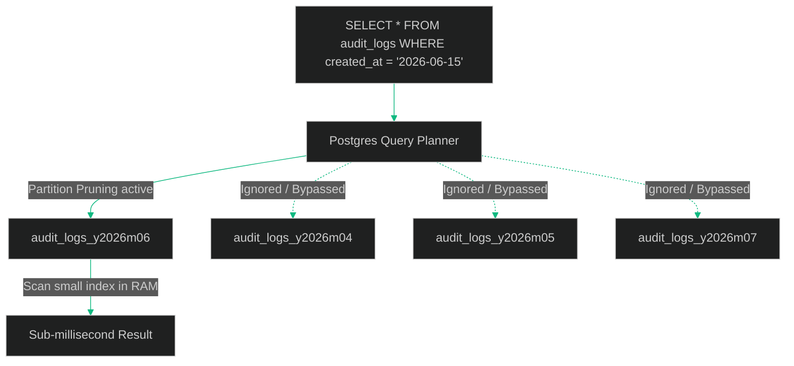

# PostgreSQL Partitioning at Scale: Architecting Declarative Table Partitioning for High-Write Loads

> [!NOTE]
> **📖 Article Overview**
> As relational database tables grow beyond 50 to 100 million rows, performance degrades. Large indexes exceed the RAM buffer pool capacity, leading to frequent disk reads. Query times increase, and operations like vacuuming block writing operations. This article covers **PostgreSQL Declarative Table Partitioning**—comparing **Range** and **Hash** strategies—and demonstrates how to configure automatic partition generation to maintain high-throughput database operations.

---

## The Scale Problem: Why Indexes Suffer

When a table is small, its indexes reside completely in RAM, allowing sub-millisecond lookup speeds. As the table scales, the index size grows. When it exceeds the database server’s memory capacity (`shared_buffers`), PostgreSQL has to swap index pages to and from disk. This results in severe latency spikes.

**Table Partitioning** solves this by splitting one large logical table into smaller physical tables (partitions). Each partition has its own isolated indexes. 



By configuring queries to filter on the partition key, the query planner executes **Partition Pruning**, completely bypassing irrelevant tables and indexing only the targeted slice of data.

---

## Partitioning Strategies

### 1. Range Partitioning
The table is partitioned into ranges defined by a key column (usually a timestamp or date).
* **Ideal for**: Time-series data, audit trails, and logs.
* **Benefit**: Older partitions can be easily detached, archived, or dropped in bulk (`DROP TABLE`) without triggering slow row-delete locks.

### 2. Hash Partitioning
The table is partitioned by specifying the modulus and remainder of a hash function applied to the partition key.
* **Ideal for**: Evenly distributing writes across a set number of tables (e.g. user records partitioned by `user_id`).
* **Benefit**: Prevents write-hotspots on single tables, distributing I/O loads.

---

## Configuring Declarative Partitioning & Auto-Maintenance

Here is a complete SQL script implementing a range-partitioned `audit_logs` table. It includes a PL/pgSQL function to automatically pre-create the next month's partition.

```sql
-- 1. Create the parent table partitioned by RANGE
CREATE TABLE audit_logs (
    id BIGSERIAL,
    event_name VARCHAR(100) NOT NULL,
    payload JSONB,
    created_at TIMESTAMP WITH TIME ZONE NOT NULL,
    PRIMARY KEY (id, created_at) -- Partition key MUST be part of the primary key
) PARTITION BY RANGE (created_at);

-- 2. Manually create initial partitions for June and July 2026
CREATE TABLE audit_logs_y2026m06 PARTITION OF audit_logs
    FOR VALUES FROM ('2026-06-01 00:00:00+00') TO ('2026-07-01 00:00:00+00');

CREATE TABLE audit_logs_y2026m07 PARTITION OF audit_logs
    FOR VALUES FROM ('2026-07-01 00:00:00+00') TO ('2026-08-01 00:00:00+00');

-- 3. Create index on the parent table (will propagate to all children)
CREATE INDEX idx_audit_logs_created_at ON audit_logs(created_at);


-- 4. Auto-maintenance: PL/pgSQL function to pre-generate next month's partition
CREATE OR REPLACE FUNCTION create_next_month_partition() 
RETURNS void AS $$
DECLARE
    next_month_start DATE;
    next_month_end DATE;
    partition_name TEXT;
    sql_query TEXT;
BEGIN
    -- Calculate start and end bounds of next month
    next_month_start := (date_trunc('month', current_date) + interval '1 month')::DATE;
    next_month_end   := (date_trunc('month', current_date) + interval '2 months')::DATE;
    
    -- Format partition table name: audit_logs_yYYYYmMM
    partition_name := 'audit_logs_y' || to_char(next_month_start, 'YYYY') || 'm' || to_char(next_month_start, 'MM');
    
    -- Build dynamic creation query
    sql_query := 'CREATE TABLE IF NOT EXISTS ' || partition_name || 
                 ' PARTITION OF audit_logs FOR VALUES FROM (' || 
                 quote_literal(next_month_start) || ') TO (' || 
                 quote_literal(next_month_end) || ');';
                 
    EXECUTE sql_query;
    
    RAISE NOTICE 'Partition % created successfully.', partition_name;
END;
$$ LANGUAGE plpgsql;

-- Execute the partition generator (usually scheduled via pg_cron monthly)
SELECT create_next_month_partition();
```

---

## Query Analysis: Verification of Pruning

To verify that partition pruning is working, always run `EXPLAIN` on your queries:

```sql
EXPLAIN SELECT * FROM audit_logs 
WHERE created_at >= '2026-06-10 00:00:00' 
  AND created_at < '2026-06-15 00:00:00';
```

The output should show a `Seq Scan` or `Index Scan` **only** on the child table `audit_logs_y2026m06`, confirming that Postgres has pruned all other partitions from the search path.

---

## 🏁 Conclusion & Takeaways

Scaling relational datasets requires structured partition management:
* [ ] **Include partition keys in constraints**: Any primary or unique index on a partitioned table must include the partition key column.
* [ ] **Automate partition creation**: Do not wait for a range boundary to expire, as writes failing to find a partition will throw a fatal error. Use `pg_cron` or migration scripts to pre-generate partition slots.
* [ ] **Keep partition counts sane**: Having too many partitions (e.g. daily partitioning on tables with low write volume) bloats the query planner's memory allocation, degrading performance. Aim for weekly or monthly splits.
* [ ] **Use DROP for archiving**: If you need to purge old records, detaching the partition (`ALTER TABLE ... DETACH PARTITION`) and dropping it is an instant metadata operation that circumvents lock escalations.
