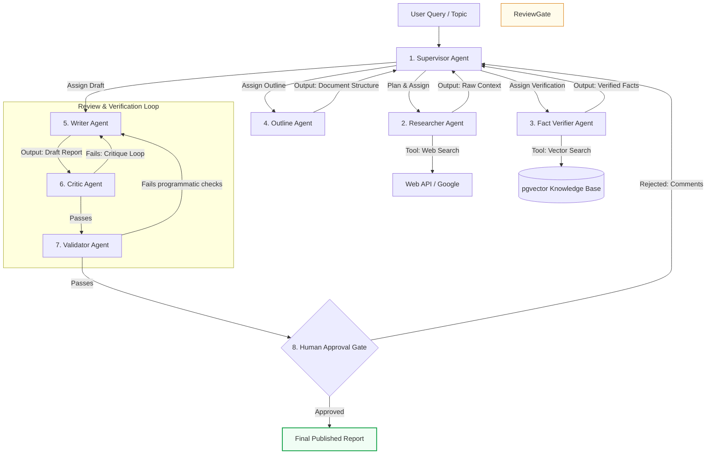

> ### 📖 Article Overview
> * **What this article is about:** This article presents a production-ready blueprint for a "Research-to-Report" multi-agent architecture that coordinates specialized agents through a shared database and human-in-the-loop gates.
> * **Why it matters:** Building multi-agent systems requires rigorous systems engineering to prevent infinite loops, control API token costs, and ensure deterministic quality in production environments.
> * **What we synthesized:** We synthesized a complete 8-stage swarm architecture—integrating supervisor coordination, parallel writing, automated verification, and programmatic validation—into a robust, scale-tested implementation blueprint.

In this final post of the series, we bring together all the architectural concepts—from state checkpointing to validator gates—to design a complete, production-ready **"Research-to-Report" Multi-Agent Application**.

This blueprint represents a robust, scale-tested architecture that can parse documents, search the web, draft reports, verify facts, and integrate human approval gates without running into infinite loops or "agent soup" drift.

---

## The Swarm Architecture

The system mimics a professional digital newsroom, dividing labor among specialized agents coordinating via a shared database:

---

## Step-by-Step Blueprint Walkthrough

### 1. The Supervisor (The Expeditor)
*   **Role**: Coordinates task cards, checks off milestone completions, and writes logs to a central database table (e.g., PostgreSQL JSONB).
*   **State**: Holds the global plan and session metadata. It does *not* read raw worker outputs directly to save context window tokens; it only reads worker JSON status receipts.

### 2. The Researcher & Fact Verifier
*   **Researcher**: Equipped with a search tool. It crawls the web, aggregates sources, normalizes HTML text, and filters out noise.
*   **Fact Verifier**: Compares the researcher’s findings with your internal knowledge base (using hybrid semantic search via `pgvector` and BM25 index). It marks claims as "Verified," "Unverified," or "Contradictory."

### 3. The Outline & Writer Agents
*   **Outliner**: Takes verified facts and builds a structured markdown index.
*   **Writer**: Takes the outline and the fact sheets to draft individual sections in parallel.

### 4. The Critic & Validator (Quality Assurance)
*   **Critic**: A model-based evaluator with a strict grading rubric checking style, formatting, and completeness. If a section is weak, it returns a critique to the writer.
*   **Validator**: Runs programmatic compile and validation tests. For example, it checks that all cited links are live, markdown formatting is correct, and no PII exists.

### 5. Human-in-the-Loop (HITL) Approval Gate
*   Once validation passes, the system issues a webhook payload containing the draft to your administrative interface and pauses the execution graph.
*   A coordinator reviews the document, adds comments or signs off.
*   Upon approval, the system resumes and publishes the report to your distribution channels.

---

## 🛠️ Implementation Rules for Production

To build this architecture on your local workspace (e.g., using FastAPI and LangGraph):
1.  **State Checkpoints**: Set up PostgreSQL checkpointers. If a step fails due to API timeouts, the graph resumes from the last completed node without re-executing previous steps.
2.  **Strict Token Budgets**: Set a hard token budget per run (e.g., maximum 100k tokens). If a run exceeds this budget, trigger an emergency shutdown to prevent runaway API billing.
3.  **Docker Sandbox**: Run all document parsing (mammoth, pdfplumber) inside isolated Docker containers to protect your host system from prompt injection or malicious files.

---

## Summary of the Series

Multi-agent AI is not about prompt engineering. It is about applying **systems engineering** and **software design principles** to probabilistic nodes. By separating concerns, defining strict input/output contracts, and placing independent validation gates, you can build autonomous systems that scale predictably and securely in production.

---

## 🏁 Conclusion & Key Takeaways

Transitioning from experimental agent prompts to a production-grade multi-agent system requires shifting from prompt engineering to robust software architecture.
1. **Decoupled Orchestration:** Utilizing a centralized supervisor agent that tracks state via lightweight JSON status receipts prevents context window bloat and keeps agent interactions predictable.
2. **Multi-Layered Validation:** Combining model-based critics, programmatic validation tests, and human-in-the-loop approval gates ensures high-quality outputs while eliminating runaway execution loops.
3. **Production Safeguards:** Implementing state checkpointing, strict token budgets, and containerized sandboxes protects your application from API failures, runaway billing, and security vulnerabilities.

*Takeaway:* *Successful multi-agent deployment is a systems engineering challenge where deterministic guardrails govern probabilistic models.*

---

## 📚 References & Further Reading

*   **VMAO Framework**: *Verified Multi-Agent Orchestration: A Plan-Execute-Verify-Replan Framework* (March 2026). Explains the detailed mathematical orchestration of verification loops. [arXiv:2603.10952](https://arxiv.org/abs/2603.10952) (Needs verification)
*   **LangGraph Multi-Agent Architecture**: [LangGraph Multi-Agent Systems](https://langchain-ai.github.io/langgraph/concepts/multi_agent/) (2024). Developer blueprints for stateful graphs.
*   **MetaGPT SOP Guidelines**: [MetaGPT Documentation](https://docs.deepwisdom.ai/main/en/) (2024). Explains role-based standard operating procedures.

*To explore complete code implementations of all 17 agent microservices in a single monorepo, check out the public [agentic-apps-portfolio](https://github.com/akmalkhaniub/agentic-apps-portfolio) repository.*