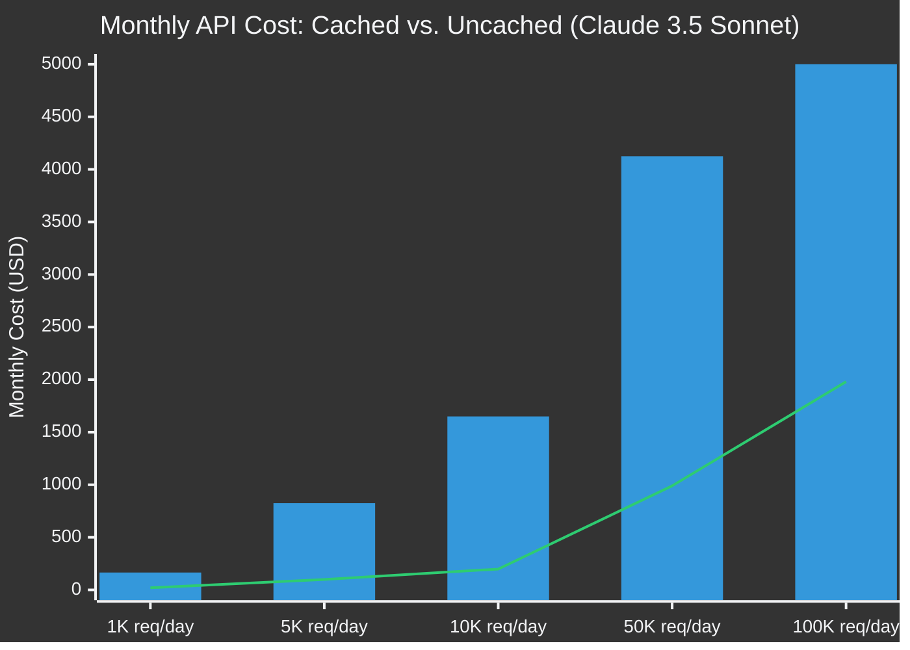

# Prompt Caching & Context Window Economics: Cutting LLM API Costs by 90%

> [!NOTE]
> **📖 Article Overview**
> As AI systems scale from prototype to production, LLM API costs grow non-linearly. A multi-step agent processing 50,000 tokens per request at 1,000 daily active users generates millions of tokens per day — invoices that quickly become unsustainable. This article dives deep into **Prompt Caching** (Anthropic's Cache Control, OpenAI's Prompt Caching), the **economics of context window sizing**, and provides concrete Python implementations to cut your input token costs by up to 90% without sacrificing response quality.

---

## The Hidden Cost of Long-Context AI Systems

Every LLM API invocation is billed on token counts — both input and output. For a standard chatbot this is manageable. For enterprise AI platforms, costs scale dramatically due to:

1.  **System Prompt Repetition**: A 4,000-token system prompt is resent on every single API call. Across 10,000 daily requests, that's 40 million redundant input tokens billed at full price.
2.  **RAG Context Injection**: Injecting retrieved documents into the prompt for every query compounds the cost. A 10-chunk RAG system with 500 tokens per chunk adds 5,000 input tokens per call.
3.  **Multi-Turn Conversation History**: Maintaining conversation context by resending the full history on each turn creates a quadratic cost growth pattern as conversation length increases.

**Prompt Caching** solves this at the infrastructure level by allowing the LLM provider to cache the KV (Key-Value) attention states of repeated prompt prefixes, billing cached tokens at a fraction of the cost of fresh tokens.

---

## Context Window Cost Topology

```mermaid
%%{init: {'theme': 'dark', 'themeVariables': { 'primaryColor': '#f59e0b', 'primaryTextColor': '#f3f4f6', 'primaryBorderColor': '#fbbf24', 'lineColor': '#f59e0b', 'secondaryColor': '#111827', 'tertiaryColor': '#0f172a'}}}%%
graph LR
    subgraph Per Request Token Breakdown
        A[System Prompt<br/>~4000 tokens] --> T[Total Input]
        B[RAG Context<br/>~5000 tokens] --> T
        C[Chat History<br/>~3000 tokens] --> T
        D[User Query<br/>~200 tokens] --> T
    end
    
    T --> E{Caching Applied?}
    
    E -->|No Cache| F[12200 tokens<br/>billed at $0.015/1K = $0.183 per call]
    E -->|With Cache| G[Cache Hit: 12000 tokens @ $0.0015/1K<br/>+ Fresh: 200 tokens @ $0.015/1K<br/>= $0.021 per call — 88% savings]
    
    style A fill:#1e293b,stroke:#f59e0b,stroke-width:2px
    style B fill:#1e293b,stroke:#f59e0b,stroke-width:2px
    style C fill:#1e293b,stroke:#f59e0b,stroke-width:2px
    style D fill:#1e293b,stroke:#10b981,stroke-width:2px
    style F fill:#7f1d1d,stroke:#ef4444,stroke-width:2px
    style G fill:#052e16,stroke:#10b981,stroke-width:2px
```



---

## What's Good & What's Not

```
+----------------------------------------------------------------------------------------------------------------------+
|                                      PROMPT CACHING TRADE-OFFS MATRIX                                                |
+----------------------------------------------------+---------------------------------------------------------------+
| What's Good (Pros)                                 | What's Not (Cons)                                             |
+----------------------------------------------------+---------------------------------------------------------------+
| * Dramatic Cost Reduction: Cached tokens billed at | * Cache TTL Constraints: Anthropic caches for 5 minutes;      |
|   10% of full input price (Anthropic: $0.003/1K    |   infrequent users won't benefit from cache hits.             |
|   cached vs. $0.015/1K fresh for Sonnet).          |                                                               |
| * Zero Latency Overhead: Cache reads are faster    | * Prefix Rigidity: The cached portion MUST be a static        |
|   than fresh token processing — sub-10ms.          |   prefix. Dynamic content must come after the cache boundary. |
| * Transparent Integration: Caching is opt-in via   | * Min Token Floor: Anthropic requires ≥1024 tokens for a      |
|   a single API flag — no architecture changes.     |   cache block; small prompts won't qualify.                   |
+----------------------------------------------------+---------------------------------------------------------------+
```

---

## Anthropic Cache Control: Complete Implementation

Anthropic's API uses a `cache_control` flag on individual message blocks. Blocks marked with `{"type": "ephemeral"}` are cached server-side for 5 minutes. Only the **prefix** of the prompt can be cached — variable user content must appear after all cached blocks.

```python
import anthropic
import json
import time
from typing import Optional

# ─────────────────────────────────────────────
# 1. Initialise Anthropic Client
# ─────────────────────────────────────────────
client = anthropic.Anthropic()

# ─────────────────────────────────────────────
# 2. Define Static Content (Cache Candidates)
# ─────────────────────────────────────────────

# A large system prompt that stays constant across requests
SYSTEM_PROMPT = """You are an expert Senior Full Stack AI Engineer specialising in enterprise RAG systems,
multi-agent orchestration, and LLM infrastructure. You always respond with production-quality insights,
include code examples where relevant, and structure your answers with clear sections.

Architecture Principles You Follow:
1. Prefer async patterns for all I/O-bound operations
2. Always include error handling and retry logic for API calls
3. Design for observability — every system should emit traces, metrics, and logs
4. Enforce typed contracts at agent boundaries using Pydantic or TypedDict
5. Default to the cheapest model capable of the task (route complexity, not convention)

When evaluating trade-offs, always structure your analysis as:
- What's Good: concrete benefits with measurable outcomes
- What's Not: concrete risks with quantified costs
- Recommendation: a clear decision with the primary reasoning factor
"""

# Simulated RAG document context (large static block)
KNOWLEDGE_BASE_CONTEXT = """
[Retrieved Knowledge Base Documents — Session Context]

Document 1: Rate Limiting Patterns
Token bucket algorithm: maintains a bucket of tokens refilling at rate R tokens/second.
Max capacity C tokens. Each request consumes T tokens. If insufficient tokens, request is queued or rejected.
Sliding window: tracks request timestamps in a circular buffer. More memory-intensive but eliminates burst edge cases.

Document 2: Redis Data Structures for Rate Limiting  
INCR + EXPIRE: atomic increment with TTL. Simple but doesn't handle sliding windows.
Sorted Sets (ZADD/ZRANGEBYSCORE): stores timestamps as scores. Enables precise sliding window with ZREMRANGEBYSCORE.
Lua scripts: atomic multi-command execution without race conditions in distributed environments.

Document 3: OpenAI & Anthropic API Rate Limits (2025)
Claude 3.5 Sonnet: 4000 RPM (requests per minute), 400K TPM (tokens per minute) on Tier 1.
GPT-4o: 10000 RPM, 2M TPM on Tier 5.
Recommended: implement exponential backoff starting at 1s, max 60s, with jitter.
"""

# ─────────────────────────────────────────────
# 3. Build Cached Message Payload
# ─────────────────────────────────────────────
def build_cached_messages(user_query: str) -> list:
    """
    Constructs messages with cache_control markers on static prefix blocks.
    The user query (dynamic) must come AFTER all cached blocks.
    """
    return [
        {
            "role": "user",
            "content": [
                # Block 1: Large static knowledge base — CACHE THIS
                {
                    "type": "text",
                    "text": f"## Knowledge Base Context\n\n{KNOWLEDGE_BASE_CONTEXT}",
                    "cache_control": {"type": "ephemeral"}  # ← Cache marker
                },
                # Block 2: Dynamic user query — DO NOT CACHE (changes every call)
                {
                    "type": "text",
                    "text": f"\n\n## User Question\n\n{user_query}"
                }
            ]
        }
    ]

# ─────────────────────────────────────────────
# 4. Make API Call with Caching
# ─────────────────────────────────────────────
def query_with_cache(user_query: str, verbose: bool = True) -> dict:
    """Execute a query with prompt caching and return usage metrics."""
    start_time = time.time()
    
    response = client.messages.create(
        model="claude-3-5-sonnet-20241022",
        max_tokens=1024,
        system=[
            {
                "type": "text",
                "text": SYSTEM_PROMPT,
                "cache_control": {"type": "ephemeral"}  # ← Cache the system prompt too
            }
        ],
        messages=build_cached_messages(user_query)
    )
    
    elapsed_ms = round((time.time() - start_time) * 1000, 2)
    
    # Extract token usage for cost analysis
    usage = response.usage
    cache_creation_tokens = getattr(usage, 'cache_creation_input_tokens', 0)
    cache_read_tokens = getattr(usage, 'cache_read_input_tokens', 0)
    fresh_input_tokens = usage.input_tokens
    output_tokens = usage.output_tokens
    
    # Calculate cost (Claude 3.5 Sonnet pricing, June 2025)
    FRESH_INPUT_PRICE = 0.015 / 1000      # $0.015 per 1K fresh input tokens
    CACHE_WRITE_PRICE = 0.01875 / 1000    # $0.01875 per 1K cache write tokens (1.25x)
    CACHE_READ_PRICE = 0.0015 / 1000      # $0.0015 per 1K cache read tokens (10%)
    OUTPUT_PRICE = 0.075 / 1000           # $0.075 per 1K output tokens
    
    actual_cost = (
        (fresh_input_tokens * FRESH_INPUT_PRICE) +
        (cache_creation_tokens * CACHE_WRITE_PRICE) +
        (cache_read_tokens * CACHE_READ_PRICE) +
        (output_tokens * OUTPUT_PRICE)
    )
    
    uncached_cost = (
        (fresh_input_tokens + cache_creation_tokens + cache_read_tokens) * FRESH_INPUT_PRICE +
        (output_tokens * OUTPUT_PRICE)
    )
    
    savings_pct = round((1 - actual_cost / uncached_cost) * 100, 1) if uncached_cost > 0 else 0
    
    if verbose:
        print(f"\n{'='*60}")
        print(f"  Query: {user_query[:60]}...")
        print(f"  Latency: {elapsed_ms}ms")
        print(f"  Fresh Input Tokens:  {fresh_input_tokens:,}")
        print(f"  Cache Write Tokens:  {cache_creation_tokens:,}")
        print(f"  Cache Read Tokens:   {cache_read_tokens:,}")
        print(f"  Output Tokens:       {output_tokens:,}")
        print(f"  Actual Cost:         ${actual_cost:.6f}")
        print(f"  Uncached Cost:       ${uncached_cost:.6f}")
        print(f"  💰 Savings:          {savings_pct}%")
        print(f"{'='*60}\n")
    
    return {
        "response": response.content[0].text,
        "cost": actual_cost,
        "savings_pct": savings_pct,
        "cache_hit": cache_read_tokens > 0,
        "latency_ms": elapsed_ms
    }

# ─────────────────────────────────────────────
# 5. Demonstrate Cache Warming + Subsequent Hits
# ─────────────────────────────────────────────
if __name__ == "__main__":
    queries = [
        "What is the best Redis data structure for sliding window rate limiting?",
        "Compare token bucket vs sliding window rate limiting algorithms.",
        "What are Anthropic's API rate limits for Claude 3.5 Sonnet?",
    ]
    
    print("🔥 First call — warms the cache (cache_creation tokens billed)")
    result1 = query_with_cache(queries[0])
    
    print("⚡ Second call — cache hit expected (cache_read tokens billed at 10%)")
    result2 = query_with_cache(queries[1])
    
    print("⚡ Third call — continued cache hits")
    result3 = query_with_cache(queries[2])
    
    avg_savings = round(sum([result1["savings_pct"], result2["savings_pct"], result3["savings_pct"]]) / 3, 1)
    print(f"\n📊 Average Cost Savings Across Session: {avg_savings}%")
```

---

## Monthly Cost Projection: Cached vs Uncached



*At 10,000 requests/day, uncached cost is ~$1,650/month vs. ~$198/month with caching — a **$1,452 monthly saving** with a single API flag change.*

---

## OpenAI Prompt Caching: Automatic & Zero Configuration

OpenAI's implementation is even simpler — **caching is automatic**. Any prompt prefix exceeding 1,024 tokens that is repeated within a session is automatically cached. No API flag changes required.

```python
from openai import OpenAI

client = OpenAI()

# OpenAI caches the prefix automatically if it's repeated
# The system prompt + any large static content at the beginning is prime cache material
def query_openai_cached(system_prompt: str, static_context: str, user_query: str):
    response = client.chat.completions.create(
        model="gpt-4o",
        messages=[
            {"role": "system", "content": system_prompt},
            {"role": "user", "content": f"{static_context}\n\nQuestion: {user_query}"}
        ]
    )
    
    usage = response.usage
    # Check for cached tokens in the prompt_tokens_details breakdown
    cached_tokens = getattr(usage.prompt_tokens_details, 'cached_tokens', 0) if hasattr(usage, 'prompt_tokens_details') else 0
    
    print(f"Total Input Tokens: {usage.prompt_tokens}")
    print(f"Cached Tokens: {cached_tokens} (billed at 50% discount)")
    print(f"Fresh Tokens: {usage.prompt_tokens - cached_tokens}")
    
    return response.choices[0].message.content
```

> **Key Difference**: OpenAI caches at **50% discount** (vs Anthropic's 90% discount), but requires no configuration. Anthropic's cache is more powerful but demands explicit prefix design.

---

## 🏁 Conclusion & Key Takeaways

Prompt Caching is the single highest-ROI optimisation available to teams running LLM applications at scale. By redesigning your prompts to front-load static content (system prompts, RAG context, tool definitions), you can cut input token costs by 80-90% with minimal engineering effort.

*   **Design for prefix stability**: Any content that changes per-request must go at the end. Reorganise your message construction pipeline accordingly.
*   **Cache your tool definitions**: For agent systems with large tool schemas (function definitions), cache these too — they repeat across every planning call.
*   **Monitor cache hit rates**: Track `cache_read_input_tokens` in your observability dashboard. A hit rate below 80% indicates your prefixes are too dynamic.

In our next article, we explore **Model Routing** — the strategy of dynamically selecting GPT-4o, Claude 3.5 Sonnet, or a local Ollama model based on task complexity, cost budget, and latency constraints.

---

### Research References & Resources
*   **Anthropic Prompt Caching Guide**: [Cache Control API Reference](https://docs.anthropic.com/en/docs/build-with-claude/prompt-caching)
*   **OpenAI Prompt Caching**: [Automatic Caching in the Chat Completions API](https://platform.openai.com/docs/guides/prompt-caching)
*   **LiteLLM**: [Unified LLM Gateway with Caching Support](https://docs.litellm.ai/)
