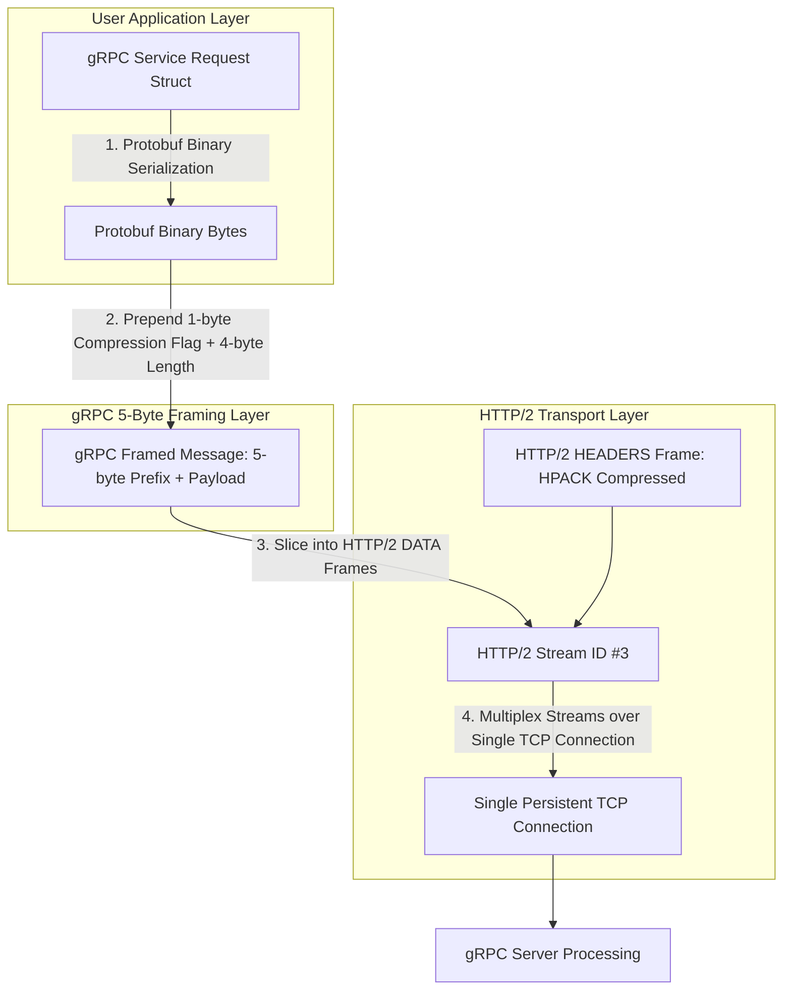

# Protocol Buffers & gRPC Streaming: Multiplexed HTTP/2 Framing Internals

Modern microservices require high-speed inter-service communication. Traditional REST APIs over HTTP/1.1 with JSON payloads present significant performance limitations:
1. **Verbose Payload Sizes**: Repeating JSON key strings (e.g. `"transaction_id": ...`) across millions of API calls inflates network bandwidth.
2. **Slow Text Parsing**: Converting JSON strings to in-memory native objects requires CPU-intensive string parsing.
3. **Head-of-Line Blocking**: HTTP/1.1 requires establishing separate TCP connections or pipelining requests serially.

To overcome these bottlenecks, enterprise platforms utilize **gRPC** and **Protocol Buffers (Protobuf)** over **HTTP/2**.

gRPC achieves up to $10\times$ higher throughput than REST/JSON by encoding data into dense binary Protobuf wire formats and multiplexing multiple concurrent streams over a single TCP connection.

This article details how Protobuf varint encoding works and how gRPC frames messages over HTTP/2.

---

## gRPC Binary Framing & HTTP/2 Stream Architecture

How gRPC packages Protobuf payloads into 5-byte framed messages over HTTP/2 streams:



### Core Serialization & Protocol Mechanics
1. **Protobuf Varint Encoding**: Variable-Length Quantity (Varint) encodes integers using 1 to 10 bytes depending on magnitude. Each byte uses the 7 least significant bits for data and the Most Significant Bit (MSB, `0x80`) as a Continuation Bit indicating if more bytes follow.
2. **Tag + Wire Type Field Header**: Fields are encoded as `(field_number << 3) | wire_type`. Wire types include `0` (Varint), `1` (64-bit fixed), `2` (Length-delimited strings/embedded messages), and `5` (32-bit fixed). Field names are never sent over the wire!
3. **gRPC 5-Byte Framing**: Every gRPC message sent over an HTTP/2 `DATA` frame is prefixed with a 5-byte header:
   * **Byte 0**: Compression Flag (`0` = Uncompressed, `1` = Compressed via Gzip/Snappy).
   * **Bytes 1–4**: 32-bit Big-Endian Unsigned Integer representing the exact length of the Protobuf payload.

---

## Python Implementation: Protobuf Varint & gRPC Framing Engine

Here is a production-grade Python implementation of Protobuf Varint encoding/decoding and the gRPC 5-byte framing protocol:

```python
import struct
from typing import Tuple, List
from pydantic import BaseModel

class ProtobufVarintCodec:
    """
    Implements Protocol Buffers 7-bit Varint encoding and decoding.
    """
    @staticmethod
    def encode_varint(number: int) -> bytes:
        """Encodes an integer into Protobuf Varint bytes."""
        buf = bytearray()
        while True:
            towrite = number & 0x7f
            number >>= 7
            if number:
                buf.append(towrite | 0x80)  # Set MSB Continuation Bit
            else:
                buf.append(towrite)
                break
        return bytes(buf)

    @staticmethod
    def decode_varint(data: bytes, offset: int = 0) -> Tuple[int, int]:
        """Decodes Varint bytes back into integer and returns (value, new_offset)."""
        res = 0
        shift = 0
        while True:
            if offset >= len(data):
                raise ValueError("Truncated Varint Buffer")
            b = data[offset]
            offset += 1
            res |= (b & 0x7f) << shift
            if not (b & 0x80):  # MSB is 0 -> Last byte of Varint
                break
            shift += 7
        return res, offset

class GRPCLengthPrefixedFramer:
    """
    Implements gRPC 5-Byte Message Framing Layer.
    [1-byte Compressed Flag] + [4-byte Big-Endian Length] + [Payload]
    """
    @staticmethod
    def frame_message(payload: bytes, compressed: bool = False) -> bytes:
        flag = b'\x01' if compressed else b'\x00'
        length_bytes = struct.pack(">I", len(payload))  # 32-bit Big-Endian UInt
        return flag + length_bytes + payload

    @staticmethod
    def unframe_message(framed_data: bytes) -> Tuple[bool, bytes, bytes]:
        """
        Unframes 5-byte header. Returns (compressed_flag, payload, remaining_buffer).
        """
        if len(framed_data) < 5:
            raise ValueError("Buffer too short for gRPC 5-byte header")

        compressed_flag = (framed_data[0] == 1)
        payload_length = struct.unpack(">I", framed_data[1:5])[0]

        if len(framed_data) < 5 + payload_length:
            raise ValueError("Incomplete gRPC message payload")

        payload = framed_data[5 : 5 + payload_length]
        remaining = framed_data[5 + payload_length :]
        return compressed_flag, payload, remaining

# Demonstration Execution
if __name__ == "__main__":
    print("🚀 Demonstrating Protocol Buffers Varint Encoding & gRPC Framing Engine...")
    print("=" * 75)

    # 1. Test Protobuf Varint Encoding
    val_to_encode = 300  # Requires 2 bytes in Varint (0xAC 0x02)
    encoded_varint = ProtobufVarintCodec.encode_varint(val_to_encode)
    decoded_val, _ = ProtobufVarintCodec.decode_varint(encoded_varint)

    print(f"\n1. Protobuf Varint Encoding Test:")
    print(f"   • Original Value:  {val_to_encode}")
    print(f"   • Varint Hex:      {encoded_varint.hex(' ')}")
    print(f"   • Decoded Value:   {decoded_val}")

    # 2. Test Protobuf Binary Field Packaging: (Field 1, Wire Type 0 = Varint)
    field_number = 1
    wire_type = 0  # Varint
    tag = (field_number << 3) | wire_type
    tag_bytes = ProtobufVarintCodec.encode_varint(tag)
    proto_payload = tag_bytes + encoded_varint

    print(f"\n2. Protobuf Field Binary Stream:")
    print(f"   • Tag (Field 1, WireType 0) Hex: {tag_bytes.hex()}")
    print(f"   • Total Protobuf Binary Payload: {proto_payload.hex(' ')} ({len(proto_payload)} bytes)")

    # 3. Test gRPC 5-Byte Framing
    grpc_frame = GRPCLengthPrefixedFramer.frame_message(proto_payload, compressed=False)
    print(f"\n3. gRPC 5-Byte Framed Message over HTTP/2 DATA Frame:")
    print(f"   • Total Framed Bytes: {len(grpc_frame)} bytes")
    print(f"   • Frame Header Hex:   {grpc_frame[:5].hex(' ')} (Flag: {grpc_frame[0]}, Len: {struct.unpack('>I', grpc_frame[1:5])[0]})")
    print(f"   • Payload Hex:        {grpc_frame[5:].hex(' ')}")

    # Unframe gRPC Message
    is_comp, rec_payload, _ = GRPCLengthPrefixedFramer.unframe_message(grpc_frame)
    print(f"\n4. gRPC Unframing Verification:")
    print(f"   • Compressed: {is_comp} | Recovered Payload Match: {rec_payload == proto_payload}")
```

---

## gRPC & Protobuf Gotchas & Best Practices

When building gRPC APIs:

> [!IMPORTANT]
> **Never Change Protobuf Field Tag Numbers**: Protobuf binary streams identify fields solely by integer tag numbers (`field_number << 3`), not field string names. You can safely rename a field in your `.proto` file, but changing a field tag number will corrupt data deserialization for existing clients.

> [!CAUTION]
> **Configure Maximum Message Sizes**: By default, gRPC limits maximum incoming message payload sizes to 4MB (`grpc.max_receive_message_length`). For streaming large file transfers, use gRPC streaming primitives (`stream Message`) rather than sending multi-megabyte monolithic payloads.

---

## Real-World Enterprise Impact
Microservice platforms migrating from REST/JSON to gRPC report:
* **70% Network Bandwidth Savings**: Binary Protobuf serialization reduces payload sizes by up to $70\%$ compared to JSON text.
* **$7\times$ Faster Deserialization**: Binary wire parsing eliminates string allocations, dramatically reducing CPU overhead on microservice API gateways.
