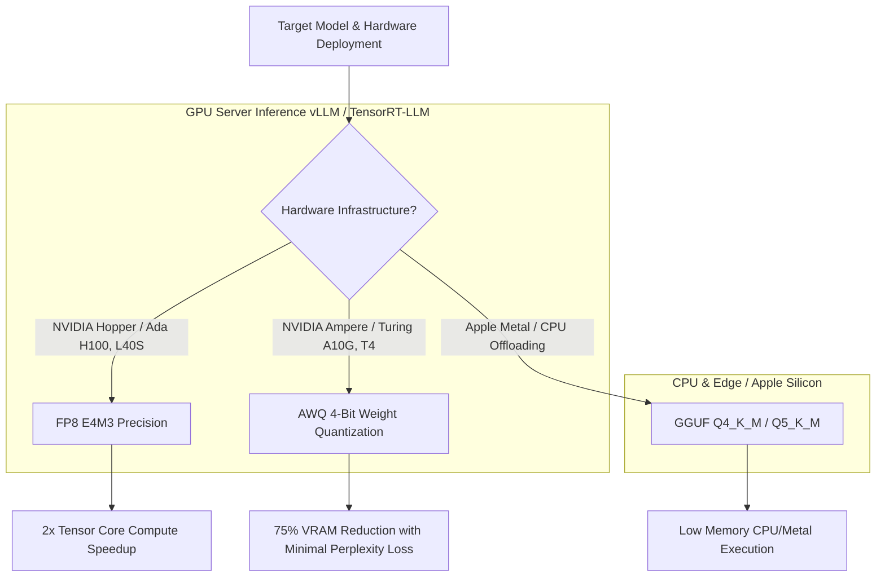

# Quantization Strategies for Local SLMs: AWQ, GGUF & FP8 Trade-offs

When deploying self-hosted Small Language Models (SLMs) in production agentic platforms, the primary hardware limit is not compute speed—it is **memory bandwidth**. During LLM generation, loading multi-gigabyte weight matrices from VRAM to Tensor Cores on every token step creates a severe memory bandwidth bottleneck.

Operating models at full 16-bit precision (FP16 or BF16) requires 2 bytes per parameter. A 7-billion parameter model requires ~14 GB of VRAM just to hold its weights, severely limiting batch size and context window depth on single GPU nodes.

To unlock high-speed inference on accessible hardware, security and systems engineers utilize **Quantization**.

Quantization compresses model weights from 16-bit floating point numbers into lower-bit representations (8-bit FP8, 4-bit AWQ, or GGUF k-quants). This article evaluates the technical trade-offs of modern quantization strategies.

---

## 📖 Quantization Strategy Decision Matrix

Choosing the optimal quantization scheme depends on your deployment target and hardware architecture:



### Technical Format Comparison

| Quantization Format | Target Hardware | Precision Bits | VRAM per 7B Model | Relative Speedup | Perplexity Loss |
| :--- | :--- | :--- | :--- | :--- | :--- |
| **FP16 / BF16 (Baseline)** | Server GPUs | 16-bit | ~14.0 GB | 1.0x (Baseline) | None (Exact) |
| **FP8 (E4M3 / E5M2)** | Hopper / Ada GPUs | 8-bit | ~7.0 GB | 1.8x–2.2x | < 0.1% (Negligible) |
| **AWQ (Activation-Aware)** | Modern NVIDIA GPUs | 4-bit | ~3.8 GB | 2.5x–3.5x | ~0.5% (Very Low) |
| **GGUF (Q4_K_M)** | CPU / Apple Metal | 4-bit (Mixed) | ~4.1 GB | CPU Optimized | ~0.8% (Acceptable) |

---

## 🛠️ Python Implementation: Quantization Memory & Throughput Calculator

Here is a production Python implementation of an engineering calculator that computes VRAM footprints, memory bandwidth requirements, and expected token generation limits across quantization formats:

```python
from typing import Dict, Any
from pydantic import BaseModel

class QuantizationProfile(BaseModel):
    format_name: str
    bits_per_param: float
    weight_memory_gb: float
    kv_cache_budget_gb: float
    max_concurrent_sequences_24gb_gpu: int
    expected_speedup_factor: float

class QuantizationStrategyEvaluator:
    """
    Calculates VRAM allocation budgets, token throughput potential,
    and sequence concurrency for LLM quantization schemes.
    """
    def __init__(self, parameter_count_billions: float = 7.0, total_vram_gb: float = 24.0):
        self.params_b = parameter_count_billions
        self.total_vram_gb = total_vram_gb

    def evaluate_format(self, format_name: str, bits_per_param: float, speedup: float) -> QuantizationProfile:
        # Calculate raw weight VRAM requirement (1 B params = 10^9 * bits / 8 bytes)
        weight_memory_gb = (self.params_b * 1e9 * (bits_per_param / 8.0)) / (1024 ** 3)
        
        # Reserve 15% VRAM overhead for CUDA context and system buffers
        reserved_overhead_gb = self.total_vram_gb * 0.15
        available_kv_vram_gb = max(0.0, self.total_vram_gb - weight_memory_gb - reserved_overhead_gb)
        
        # Estimate KV-cache memory per sequence (4K context, 7B model ~ 0.5 GB FP16 KV cache)
        kv_cache_per_seq_gb = 0.5
        max_sequences = int(available_kv_vram_gb // kv_cache_per_seq_gb)

        return QuantizationProfile(
            format_name=format_name,
            bits_per_param=bits_per_param,
            weight_memory_gb=round(weight_memory_gb, 2),
            kv_cache_budget_gb=round(available_kv_vram_gb, 2),
            max_concurrent_sequences_24gb_gpu=max_sequences,
            expected_speedup_factor=speedup
        )

# Demonstration Execution
if __name__ == "__main__":
    evaluator = QuantizationStrategyEvaluator(parameter_count_billions=7.0, total_vram_gb=24.0)

    formats = [
        ("FP16 (Baseline)", 16.0, 1.0),
        ("FP8 (Hopper Native)", 8.0, 1.9),
        ("AWQ 4-Bit", 4.0, 3.1),
        ("GGUF Q4_K_M", 4.5, 2.4)
    ]

    print("📊 Quantization Strategy Analysis for 7B Model on 24GB GPU:")
    print("=" * 70)
    for name, bits, speedup in formats:
        profile = evaluator.evaluate_format(name, bits, speedup)
        print(f"🔹 [{profile.format_name}] Weights: {profile.weight_memory_gb} GB | KV VRAM: {profile.kv_cache_budget_gb} GB | Max Concurrency: {profile.max_concurrent_sequences_24gb_gpu} seqs | Speedup: {profile.expected_speedup_factor}x")
```

---

## ⚠️ Important Quantization Engineering Guardrails

When selecting quantization strategies for agent production workloads:

> [!IMPORTANT]
> **Use AWQ over GPTQ for GPU Serving**: AWQ (Activation-aware Weight Quantization) identifies and protects the top 1% most salient weight channels based on activation magnitudes. This yields superior reasoning accuracy and tool parsing reliability compared to unweighted GPTQ quantization.

> [!CAUTION]
> **Avoid 2-Bit Quantization for Coding Agents**: Quantizing coding SLMs below 4 bits introduces severe degradation in syntax generation and AST compliance. Maintain 4-bit (AWQ) or 8-bit (FP8) precision for autonomous tool-calling workers.

---

## 📈 Real-World Enterprise Impact
Teams deploying AWQ and FP8 quantization report:
* **75% Reduction in GPU Hardware Costs**: Running 7B/14B parameter models on low-cost 24GB GPUs (RTX 4090 / L4) instead of expensive 80GB A100 nodes.
* **3x Higher Generation Latency Speedups**: Compressed weights drastically reduce VRAM bandwidth congestion, accelerating token generation speeds from 40 tok/s to 125 tok/s per stream.
