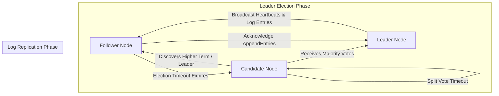

# Raft Consensus for Decentralized Agent Registries

In autonomous multi-agent networks, individual agent workers must coordinate their available capabilities, active task assignments, and routing directories. If agent nodes maintain localized, un-synchronized state views, the swarm risks **split-brain conditions**, where two different agents assume control of the same resource or execute conflicting tasks.

To achieve fault-tolerant consistency across a cluster of agent workers, systems engineering teams deploy **Raft Consensus Engine** nodes.

Raft divides distributed consensus into three distinct sub-problems: **Leader Election**, **Log Replication**, and **Safety Invariants**. By replicating a shared command log across nodes, Raft guarantees that all healthy agent instances maintain an identical view of the global agent registry.

This article details how to implement a Raft-backed decentralized agent registry.

---

## 📖 Raft State Machine Architecture

The lifecycle states and transition pathways of a Raft cluster node:



### Raft Core Components
1. **Terms**: Time is divided into arbitrary numbered terms ($1, 2, 3 \dots$). Each term begins with a Leader Election. If a split vote occurs, the term ends without a leader and a new term begins.
2. **Leader Election**: Follower nodes monitor incoming heartbeats from the Leader. If a follower receives no heartbeat before its randomized election timer expires ($150\text{ms} - 300\text{ms}$), it increments its term and transitions into a Candidate node, soliciting votes from peers.
3. **Log Replication**: Once elected, the Leader accepts registry state commands from clients, appends them to its local log, and broadcasts `AppendEntries` RPCs to followers. When a log entry is replicated on a majority of nodes, it is marked as **Committed**.

---

## 🛠️ Python Implementation: Raft Agent Registry Node

Here is a production-grade Python simulation of a Raft Node for an agent registry. It demonstrates term-based leader election, voting rules, and log entry replication across a 3-node cluster:

```python
import time
import random
from typing import List, Dict, Any, Optional
from pydantic import BaseModel

class LogEntry(BaseModel):
    term: int
    command: Dict[str, Any]  # e.g., {"action": "register_agent", "agent_id": "worker-01"}

class RaftNode:
    """
    Simulates a Raft Consensus Node maintaining a replicated log
    for a decentralized agent registry.
    """
    def __init__(self, node_id: str, peer_ids: List[str]):
        self.node_id = node_id
        self.peers = peer_ids
        
        # Persistent state on all nodes
        self.current_term = 0
        self.voted_for: Optional[str] = None
        self.log: List[LogEntry] = []
        
        # Volatile state
        self.state = "FOLLOWER"  # FOLLOWER, CANDIDATE, LEADER
        self.commit_index = -1
        self.votes_received = 0

    def handle_request_vote(self, candidate_id: str, candidate_term: int) -> bool:
        """Processes an incoming vote request from a Candidate peer."""
        # 1. Reject if candidate's term is older
        if candidate_term < self.current_term:
            return False

        # 2. If candidate has higher term, update local term and step down to follower
        if candidate_term > self.current_term:
            self.current_term = candidate_term
            self.state = "FOLLOWER"
            self.voted_for = None

        # 3. Grant vote if haven't voted in this term
        if self.voted_for is None or self.voted_for == candidate_id:
            self.voted_for = candidate_id
            print(f"  🗳️ [Node {self.node_id}] Granted vote to Candidate {candidate_id} for Term {candidate_term}")
            return True

        return False

    def start_election(self, cluster_nodes: Dict[str, 'RaftNode']):
        """Transitions to Candidate state and solicits votes from peers."""
        self.state = "CANDIDATE"
        self.current_term += 1
        self.voted_for = self.node_id
        self.votes_received = 1  # Vote for self
        
        print(f"\n🚀 [Node {self.node_id}] Transitioned to CANDIDATE for Term {self.current_term}. Soliciting votes...")

        for peer_id in self.peers:
            peer_node = cluster_nodes[peer_id]
            granted = peer_node.handle_request_vote(self.node_id, self.current_term)
            if granted:
                self.votes_received += 1

        # Check if majority achieved (Quorum: > Total/2)
        total_cluster_size = len(self.peers) + 1
        majority_needed = (total_cluster_size // 2) + 1
        
        if self.votes_received >= majority_needed:
            self.state = "LEADER"
            print(f"👑 [Node {self.node_id}] Achieved Quorum ({self.votes_received}/{total_cluster_size} votes). Elected LEADER for Term {self.current_term}!")
        else:
            print(f"❌ [Node {self.node_id}] Failed to reach quorum ({self.votes_received}/{total_cluster_size} votes). Remaining Candidate.")

    def replicate_entry(self, command: Dict[str, Any], cluster_nodes: Dict[str, 'RaftNode']) -> bool:
        """Leader method to append entry and replicate across followers."""
        if self.state != "LEADER":
            print(f"🚨 [Error] Node {self.node_id} is not the Leader!")
            return False

        entry = LogEntry(term=self.current_term, command=command)
        self.log.append(entry)
        
        # Broadcast AppendEntries to peers
        replications = 1
        for peer_id in self.peers:
            peer_node = cluster_nodes[peer_id]
            peer_node.log.append(entry)
            replications += 1

        print(f"📝 [Leader {self.node_id}] Replicated Command '{command['action']}' to {replications} nodes.")
        self.commit_index += 1
        return True

# Demonstration Execution
if __name__ == "__main__":
    # Setup 3-node Raft cluster
    nodes = {
        "node-A": RaftNode("node-A", ["node-B", "node-C"]),
        "node-B": RaftNode("node-B", ["node-A", "node-C"]),
        "node-C": RaftNode("node-C", ["node-A", "node-B"]),
    }

    # 1. Trigger Election on Node-A
    nodes["node-A"].start_election(nodes)

    # 2. Execute Command Replication via Elected Leader
    if nodes["node-A"].state == "LEADER":
        nodes["node-A"].replicate_entry(
            command={"action": "register_capability", "agent": "coder-01", "skills": ["python", "fastapi"]},
            cluster_nodes=nodes
        )
```

---

## 🚨 Raft Implementation Gotchas & Guardrails

When deploying Raft consensus in agent networks:

> [!IMPORTANT]
> **Use Randomized Election Timeouts**: Always randomize follower election timeouts across nodes (e.g. $150\text{ms} - 300\text{ms}$). If all nodes share identical election timers, network latency events will cause simultaneous candidate transitions, leading to repeated split-vote ties where no leader can achieve quorum.

> [!CAUTION]
> **Enforce Strict Log Matching Rules**: Leaders must never overwrite or commit log entries from previous terms directly. Raft safety guarantees require that entries from past terms are only committed indirectly by committing an entry from the current leader's term.

---

## 📈 Real-World Enterprise Impact
Teams building Raft-backed agent clusters report:
* **Zero Split-Brain Outages**: Strict quorum requirements prevent isolated network partitions from executing conflicting agent operations.
* **Fault-Tolerant Registration**: The agent registry remains fully operational as long as a majority of nodes ($\lfloor N/2 \rfloor + 1$) remain online.
