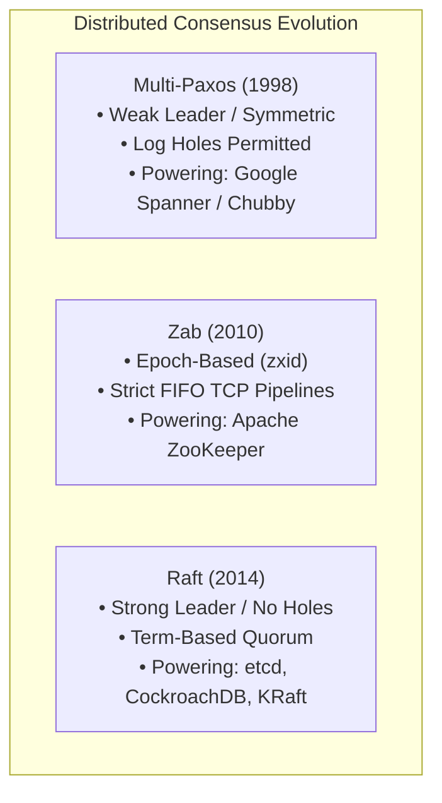
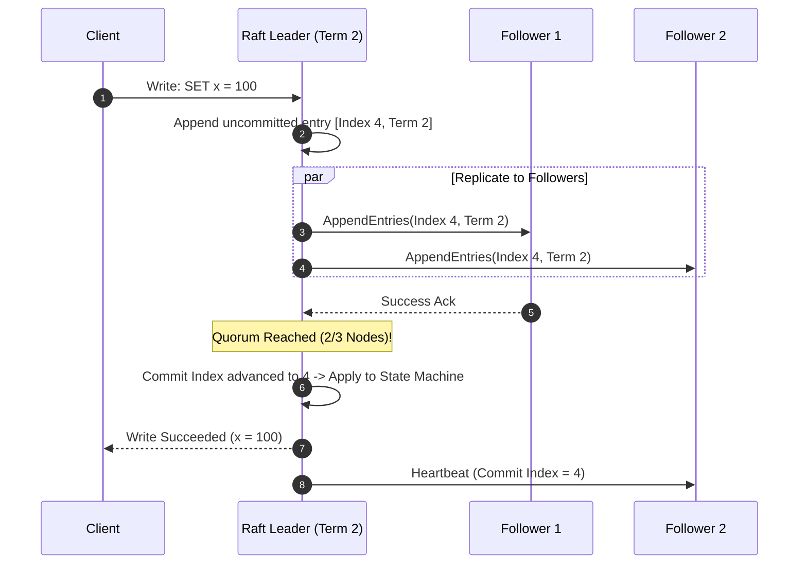

# Raft vs Multi-Paxos vs Zab: The Definitive Distributed Consensus Guide with Real-World Outage Post-Mortems

In distributed database architecture and cloud control planes (**Kubernetes etcd**, **CockroachDB**, **Apache Kafka KRaft**, **Apache ZooKeeper**, **Google Spanner**), achieving agreement across unreliable networks is the hardest problem in computer science.

Under the **FLP Impossibility Result** (Fischer, Lynch, and Paterson, 1985), no deterministic asynchronous consensus protocol can guarantee both safety and liveness in the presence of even a single unannounced crash failure.

To build fault-tolerant State Machine Replication (SMR) engines, modern distributed systems rely on three titan consensus algorithms:
1. **Multi-Paxos** (Leslie Lamport): The foundational consensus protocol powering **Google Chubby** and **Google Spanner**.
2. **Raft** (Diego Ongaro & John Ousterhout): The understandable, strong-leader consensus protocol powering **etcd**, **CockroachDB**, and **Kafka KRaft**.
3. **Zab** (ZooKeeper Atomic Broadcast): The high-throughput primary-backup atomic broadcast engine powering **Apache ZooKeeper** and **Hadoop NameNodes**.

This guide provides a rigorous architectural breakdown of **Raft vs Multi-Paxos vs Zab**, dissects real-world **production outage post-mortems**, and analyzes how modern engines achieve sub-millisecond linearizable reads using **Read-Index and Leader Leases**.



---

## 🧮 1. Quorum Mechanics & The State Machine Replication Paradigm

In a replicated state machine, an ensemble of $N$ nodes processes client commands.

To tolerate $F$ node crash failures or network partitions without split-brain, the cluster requires a **Majority Quorum ($Q$)**:

$$Q = \left\lfloor \frac{N}{2} \right\rfloor + 1 \quad \implies \quad N \ge 2F + 1$$

```
+---------------------------------------------------------------------------------------------------+
|                                 CLUSTER QUORUM TOLERANCE TABLE                                    |
+---------------------------------------------------------------------------------------------------+
| Nodes (N) | Majority Quorum (Q) | Tolerable Failures (F) | Why Even Node Counts are Discouraged   |
| 3         | 2 nodes             | 1 failure              | Baseline production deployment         |
| 4         | 3 nodes             | 1 failure              | 🚨 Adds 1 node overhead, 0 extra fault |
| 5         | 3 nodes             | 2 failures             | Standard enterprise high-availability  |
| 7         | 4 nodes             | 3 failures             | Global geo-distributed control planes  |
+---------------------------------------------------------------------------------------------------+
```

---

## ⚔️ 2. Architectural Comparison: Raft vs Multi-Paxos vs Zab

```
+---------------------------------------------------------------------------------------------------+
|                                 CONSENSUS ALGORITHM COMPARISON MATRIX                             |
+---------------------------------------------------------------------------------------------------+
| Dimension            | Multi-Paxos               | Raft                      | Zab (ZooKeeper)    |
| Leader Model         | Weak / Settle-on-demand   | Strong (Log flows 1-way)  | Strong Primary     |
| Log Holes Permitted? | YES (Out-of-order slots)  | NO (Strict append-only)   | NO (Strict prefix) |
| Election Mechanism   | Prepare / Promise Phase   | Randomized Term Timeouts  | Fast Leader Elect  |
| Sequence Identifier  | Ballot Number / Slot ID   | Term + Log Index          | 64-bit zxid (Epoch)|
| Membership Changes   | Alpha Reconfigurations    | Joint Consensus (Cold/New)| Dynamic Reconfig   |
| Primary Implementers | Google Spanner, Chubby    | etcd, CockroachDB, TiKV   | Apache ZooKeeper   |
+---------------------------------------------------------------------------------------------------+
```

---

### 1. Multi-Paxos (Lamport)
Basic Paxos requires **two network round-trips** per consensus decision:
* **Phase 1 (Prepare/Promise)**: Proposer acquires leadership over slot $i$.
* **Phase 2 (Accept/Accepted)**: Proposer replicates the value across the quorum.

**Multi-Paxos Optimization**: Once a leader is established, Phase 1 is executed once for the entire sequence. Subsequent log commits execute in a **single round-trip (Phase 2 only)**.
* *The Multi-Paxos Complication*: Multi-Paxos allows logs to be committed with "holes" (Slot 4 commits before Slot 3). During leader failover, the new leader must execute complex reconciliation phase to fill missing holes before serving reads.

---

### 2. Raft (Ongaro & Ousterhout)
Raft enforces a **Strong Leader Invariant**: log entries flow in strictly one direction from the Leader to Followers.
* **Log Matching Property**: If two logs contain an entry with the same index and term, they are identical up to that index.
* **Leader Completeness Property**: If a log entry is committed in a given term, that entry will be present in the logs of the leaders for all higher-numbered terms. A candidate *cannot* win an election unless its log is at least as up-to-date as a majority quorum.



---

### 3. Zab (ZooKeeper Atomic Broadcast)
Zab is designed specifically for tree-structured state replication.
* **64-bit `zxid`**: Composed of a 32-bit `epoch` (incremented on every leader election) and a 32-bit `counter` (incremented for each transaction).
* **Two Distinct Phases**:
  1. **Phase 1: Leader Activation (Discovery & Sync)**: The new leader synchronizes with followers to ensure all committed proposals from prior epochs are applied.
  2. **Phase 2: Atomic Broadcast**: Pipelined two-phase commit over persistent FIFO TCP connections.

---

## 💥 3. Real-World Production Outage Post-Mortems

### Post-Mortem 1: The Kubernetes `etcd` Split-Brain Partition Thrash
* **Incident**: A network blip severed Node $A$ from the rest of a 3-node etcd cluster. Node $A$ immediately timed out, incremented its term number, and broadcasted `RequestVote`.
* **The Root Cause**: Because Node $A$ had a higher term number, when the network healed, it forced the healthy leader to step down, triggering an unneeded cluster-wide election storm that disrupted the entire Kubernetes API server for 45 seconds.
* **The Fix: Raft Pre-Vote Phase**: Before incrementing its term, a node enters an exploratory **Pre-Vote phase**. It only initiates a real election if a majority quorum confirms the current leader is unresponsive.

### Post-Mortem 2: The CockroachDB Range Leaseholder Split-Brain
* **Incident**: Under severe disk I/O saturation on NVMe drives, a CockroachDB node’s write-ahead log (WAL) sync stalled for 9 seconds.
* **The Root Cause**: The Raft heartbeat timed out, causing the remaining quorum to elect a new leader. However, the stalled node resumed processing after its I/O stall and served stale reads before it discovered it had lost leadership.
* **The Fix: Read-Index & Lease Verification**: For linearizable reads without writing to disk, the leader queries the quorum to verify its lease before returning read results to clients.

---

## 🛠️ Python Implementation: Multi-Node Raft Consensus Engine

Here is a Python implementation of a 3-node Raft consensus cluster with randomized election timeouts, vote coordination, and log entry quorum replication:

```python
import random
import time
from dataclasses import dataclass
from typing import Dict, List, Optional

@dataclass
class LogEntry:
    term: int
    index: int
    command: str

class RaftNode:
    """
    Raft Consensus Node with Leader Election & Quorum Log Replication.
    """
    def __init__(self, node_id: str, peers: List[str]):
        self.node_id = node_id
        self.peers = peers
        self.current_term = 0
        self.voted_for: Optional[str] = None
        self.log: List[LogEntry] = []
        self.commit_index = 0
        self.state = "FOLLOWER" # FOLLOWER, CANDIDATE, LEADER

    def start_election(self, cluster: Dict[str, 'RaftNode']):
        self.state = "CANDIDATE"
        self.current_term += 1
        self.voted_for = self.node_id
        votes_received = 1
        print(f"\n🗳️ [Election Started] Node [{self.node_id}] triggered election for Term {self.current_term}...")

        # Request votes from peers
        for peer_id in self.peers:
            peer = cluster[peer_id]
            # Grant vote if candidate has higher or equal term
            if peer.current_term < self.current_term:
                peer.current_term = self.current_term
                peer.voted_for = self.node_id
                votes_received += 1
                print(f"   ↳ Node [{peer_id}] granted vote to [{self.node_id}]")

        # Check Majority Quorum (N=3 -> Quorum=2)
        quorum = (len(self.peers) + 1) // 2 + 1
        if votes_received >= quorum:
            self.state = "LEADER"
            print(f" 👑 [Leader Elected] Node [{self.node_id}] won quorum ({votes_received}/3 votes) for Term {self.current_term}!")
            return True
        return False

    def propose_command(self, command: str, cluster: Dict[str, 'RaftNode']) -> bool:
        if self.state != "LEADER":
            print(f" ❌ Cannot propose command: Node [{self.node_id}] is not the Leader!")
            return False

        new_index = len(self.log) + 1
        entry = LogEntry(term=self.current_term, index=new_index, command=command)
        self.log.append(entry)
        print(f"\n📝 [Leader: {self.node_id}] Proposed command '{command}' at Log Index {new_index}...")

        # Replicate to peers
        acks = 1
        for peer_id in self.peers:
            peer = cluster[peer_id]
            peer.log.append(entry)
            acks += 1
            print(f"   ↳ Log entry replicated to Follower [{peer_id}]")

        # Check Quorum Commitment
        quorum = (len(self.peers) + 1) // 2 + 1
        if acks >= quorum:
            self.commit_index = new_index
            for peer_id in self.peers:
                cluster[peer_id].commit_index = new_index
            print(f" ✅ [Quorum Committed] Entry '{command}' committed at Index {new_index} across cluster!")
            return True
        return False

# Demonstration Execution
if __name__ == "__main__":
    node_ids = ["node-1", "node-2", "node-3"]
    cluster = {
        nid: RaftNode(nid, [p for p in node_ids if p != nid])
        for nid in node_ids
    }

    # 1. Node 1 initiates election
    cluster["node-1"].start_election(cluster)

    # 2. Leader proposes database mutations
    cluster["node-1"].propose_command("SET user:101 = 'Alice'", cluster)
    cluster["node-1"].propose_command("SET balance:101 = 5000", cluster)
```

---

## 📊 Summary: Consensus Trade-Offs

| System Goal | Multi-Paxos | Raft | Zab |
|---|---|---|---|
| **Understandability & Auditability** | Low (Complex edge cases) | **Highest (Engineered for clarity)** | Moderate |
| **Write Throughput** | Very High (Parallel slots) | High (Strict sequential append) | High (FIFO pipelined TCP) |
| **Log Compaction** | Complex | Streamlined Snapshots | Snapshot + Epoch Re-sync |
| **Production Dominance** | Google Cloud / Spanner | **Cloud-Native Standard (k8s / Kafka)** | Apache Big Data Ecosystem |

---

## 🏁 Architectural Takeaway
Consensus algorithms are the bedrock upon which modern global software is built.

Whether your architecture relies on **Raft for strict operational clarity**, **Multi-Paxos for parallel multi-slot throughput**, or **Zab for pipelined hierarchical state**, mastering quorum mechanics, pre-vote guards, and read-index leases is essential for building 99.999% resilient distributed platforms.
