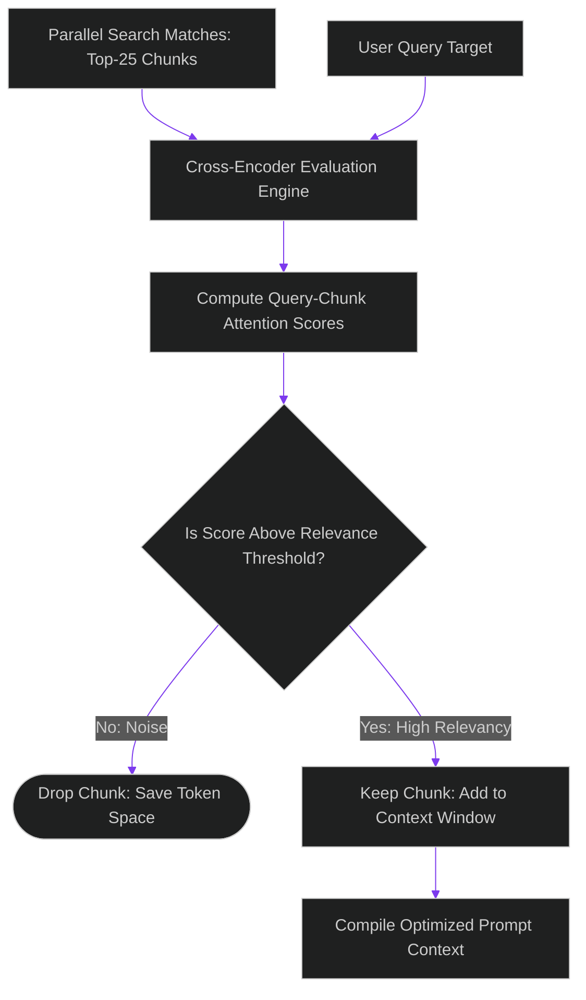

# Cross-Encoder Reranking: Optimizing Context Relevancy under Token Limits

> [!NOTE]
> **📖 Article Overview**
> While Retrieval-Augmented Generation (RAG) pipelines help minimize model hallucinations, stuffing raw search results directly into the prompt context creates secondary issues. If your vector database returns irrelevant or noisy text segments, the model's recall drops—a phenomenon known as the "lost in the middle" effect. To optimize context windows, teams must implement **Cross-Encoder Reranking**. By passing candidate chunks through a secondary reranker model, we score relevance and drop noise. In this article, we design a reranking pipeline and implement a context compressor class in Python.

---

## The "Lost in the Middle" Recall Deficit

Bi-encoder embedding models calculate document coordinates independently from the user query. This is fast but less accurate:
* **The Relevance Gap**: Similarity search scores indicate semantic proximity, but do not guarantee that the text chunk contains the direct answer to the user's question.
* **Context Overload**: Stuffing 20 raw search chunks into a prompt pollutes the model's context window, increasing latency and token costs.
* **The Solution**: **Cross-Encoder Reranking**. We retrieve a larger pool of candidate chunks (e.g. top 25) and feed them along with the query into a cross-encoder model. The model computes a precise query-document attention score, allowing us to select only the top 3-5 most relevant chunks.



---

## 1. Bi-Encoders vs. Cross-Encoders

Understanding the model architectures is key:
* **Bi-Encoders (Embeddings)**: Compute vector embeddings for queries and documents separately, matching them using cosine similarity. Ideal for fast initial retrievals.
* **Cross-Encoders**: Process the query and document together through self-attention layers, capturing deep semantic interactions. Much more accurate but computationally slower.

---

## 2. Compressing Context Budgets

Integrating a rerank step inside the agent pipeline:
1. **Retrieve Wide**: Fetch a broad set of candidate document chunks (e.g., $K=20$) using fast vector similarity.
2. **Filter Narrow**: Run the cross-encoder over the candidate set, sorting results by relevance and retaining only the top-scoring records.

---

## Code Demo: Cross-Encoder Reranking Simulator

Below is a Python implementation of a context compressor. It evaluates query-document pairs, calculates simulated attention scores, filters out low-relevancy segments, and returns an optimized prompt context block.

```python
from typing import Dict, List, Tuple

class CrossEncoderRerankCompressor:
    def __init__(self, relevance_threshold: float = 0.70):
        self.relevance_threshold = relevance_threshold

    def simulate_cross_attention_score(self, query: str, document_text: str) -> float:
        # Normalize and tokenize strings for a simple simulation
        # In production, a Cross-Encoder model (e.g., BGE-Reranker) performs this computation
        query_words = set(query.lower().split())
        doc_words = set(document_text.lower().split())
        
        intersection = query_words.intersection(doc_words)
        if not query_words:
            return 0.0
        
        # Calculate matching ratios (simulating self-attention interaction)
        return len(intersection) / len(query_words)

    def rerank_and_compress(self, query: str, candidates: List[Dict[str, str]]) -> List[Dict[str, Any]]:
        scored_candidates = []

        for chunk in candidates:
            text = chunk["text"]
            score = self.simulate_cross_attention_score(query, text)
            
            scored_candidates.append({
                "id": chunk["id"],
                "text": text,
                "score": score
            })

        # 1. Sort by cross-encoder score in descending order
        scored_candidates.sort(key=lambda x: x["score"], reverse=True)

        # 2. Filter out chunks falling below the relevance threshold
        compressed_set = [c for c in scored_candidates if c["score"] >= self.relevance_threshold]

        return compressed_set

if __name__ == "__main__":
    compressor = CrossEncoderRerankCompressor(relevance_threshold=0.60)
    search_query = "secure agent tool execution"

    # Raw candidate chunks returned from vector database (bi-encoder search)
    raw_chunks = [
        {
            "id": "chunk_1",
            "text": "To secure agent tool execution, implement dynamic RBAC and token validation gates."
        },
        {
            "id": "chunk_2",
            "text": "Databases handle transactions using lock timeouts to prevent system deadlocks."
        },
        {
            "id": "chunk_3",
            "text": "Configure tool execution parameters using secure scopes and directory isolation."
        }
    ]

    print("🤖 Running Cross-Encoder Context Compressor...")
    print("-----------------------------------------------")

    # Execute reranking
    optimized_context = compressor.rerank_and_compress(search_query, raw_chunks)

    print("\n--- Reranked Context Results ---")
    for rank, chunk in enumerate(optimized_context, 1):
        print(f"Rank {rank}: {chunk['id']} (Score: {chunk['score']:.4f})")
        print(f"   Text: '{chunk['text']}'\n")
```

---

## Deployment Takeaways for Team Leads

* **Retrieve Wide, Filter Narrow**: Configure RAG pipelines to fetch a broad pool of vector matches, then use a rerank model to select the top matches.
* **Filter with Relevance Thresholds**: Discard document chunks with relevance scores below `0.60` to protect model context space.
* **Monitor Latency Trade-offs**: While cross-encoders improve query accuracy, they add latency. Use small, optimized reranker models to keep step times under 100 milliseconds.
