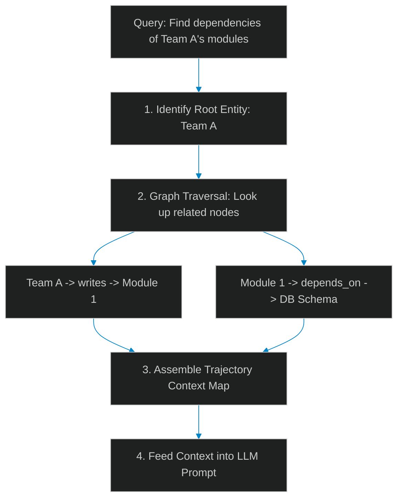

# Entity-Graph RAG: Resolving Document Context with Knowledge Graphs

> [!NOTE]
> **📖 Article Overview**
> Traditional Retrieval-Augmented Generation (RAG) relies on vector similarity searches to locate document chunks. While this is effective for matching specific keywords or concepts, it fails on complex, multi-hop relational queries (such as "What are the dependencies of the modules written by Team A?"). To resolve these queries, leads must transition from naive vector searches to **Entity-Graph RAG (GraphRAG)**. By structuring document entities as graph nodes and relationships as edges, we perform semantic traversals to assemble unified context. In this article, we map GraphRAG pipelines and implement a context graph traversal script in Python.

---

## The Limitations of Vector-Only Retrieval

Naive vector retrieval divides documents into static text chunks and converts them into embeddings:
* **Missing Relational Context**: If information about an entity is scattered across multiple pages, a similarity search returns disjointed chunks, missing the underlying connections.
* **The Multi-Hop Failure**: Queries that require joining facts across different modules fail because the vector search cannot traverse dependencies.
* **The Solution**: **Entity-Graph RAG**. We extract key entities (e.g. classes, authors, modules) and their relationships, compile them into a knowledge graph, and perform multi-hop traversals to gather comprehensive context.



---

## 1. Structuring Graph Datasets

A knowledge graph context is built of three main elements:
* **Nodes (Entities)**: Representing concepts, modules, schemas, or contributors.
* **Edges (Relationships)**: Describing how nodes connect (e.g. `DEPENDS_ON`, `WRITTEN_BY`).
* **Attributes**: Storing metadata profiles, content strings, and creation stamps.

---

## 2. Setting up Multi-Hop Traversals

To execute query resolutions:
1. **Locate Root Nodes**: Run semantic vector lookups to find the initial entry point entities.
2. **Execute Walk Rules**: Traverse edges to retrieve adjacent entity attributes, compiling the resulting paths into a unified text prompt.

---

## Code Demo: Entity-Graph Context Traverser

Below is a Python implementation of a GraphRAG context builder. It structures nodes and edges, executes a multi-hop traversal to resolve a relational query, and compiles a clean context payload.

```python
import json
from typing import Dict, List, Set, Tuple

class EntityGraphRAG:
    def __init__(self):
        # In-memory graph nodes (entities) and edges (relations)
        self.nodes: Dict[str, Dict[str, str]] = {
            "Team_A": {"type": "Team", "desc": "Handles core data pipelines."},
            "Module_1": {"type": "Module", "desc": "Processes API requests and transforms logs."},
            "Postgres_DB": {"type": "Database", "desc": "Stores active user records and audit tables."}
        }
        self.edges: List[Tuple[str, str, str]] = [
            ("Team_A", "writes", "Module_1"),
            ("Module_1", "depends_on", "Postgres_DB")
        ]

    def resolve_multihop_context(self, root_node: str, max_depth: int = 2) -> str:
        if root_node not in self.nodes:
            return "Root entity not found."

        visited: Set[str] = {root_node}
        context_parts = [f"Root Entity: {root_node} ({self.nodes[root_node]['desc']})"]

        # Run multi-hop breath-first search traversal
        queue = [(root_node, 0)]
        while queue:
            current, depth = queue.pop(0)
            if depth >= max_depth:
                continue

            # Find all outgoing edges
            for source, relation, target in self.edges:
                if source == current and target not in visited:
                    visited.add(target)
                    target_desc = self.nodes[target]["desc"]
                    context_parts.append(
                        f" -> Relation: {source} --[{relation}]--> {target} ({target_desc})"
                    )
                    queue.append((target, depth + 1))

        # Join into unified text context block
        return "\n".join(context_parts)

if __name__ == "__main__":
    graph_rag = EntityGraphRAG()
    query_root = "Team_A"

    print("🕸️ Compiling GraphRAG Multi-Hop Context Map...")
    print(f"   Query Target: '{query_root}'")
    print("---------------------------------------------")

    # Traverse graph and extract relational context
    resolved_context = graph_rag.resolve_multihop_context(query_root, max_depth=2)

    print("\n--- Compiled Relational Context ---")
    print(resolved_context)
```

---

## Architectural Takeaways

* **Structure Relational Data**: Use graph databases (e.g. Neo4j) or network-graph models to map code dependencies and document hierarchies.
* **Combine Vector and Graph**: Use vector similarity searches to locate entry-point nodes, then use graph traversals to extract surrounding context.
* **Enforce Traversal Limits**: Set strict search depth limits (e.g. `max_depth = 2`) to prevent graphs from returning overly large context maps.
