Two years is an eternity in Generative AI. 

In early 2024, building a Retrieval-Augmented Generation (RAG) system was a weekend scripting project. You wrote a simple parser, split documents into static 500-character chunks, generated embeddings, and queried a vector database using Cosine Similarity. 

If you deploy that same architecture today in 2026, it is considered obsolete. 

Over the last two years, RAG has evolved from a naive, linear lookup script into a highly sophisticated, modular, and agentic software ecosystem. The industry has realized that pure vector similarity is not enough to solve real-world search problems.

This article traces the architectural journey of RAG from 2024 to 2026, mapping the key transitions in ingestion, retrieval, context engineering, and query orchestration.

---

## 📊 The RAG Paradigm Shift: 2024 vs. 2026

The transition can be summarized as a shift from **passive, linear text matching** to **active, multi-tier structured reasoning**.

```mermaid
graph TD
    subgraph Year2024 [2024: Linear Naïve RAG]
        Q1[User Query] -->|Cosine Similarity| V1[(Vector DB)]
        V1 -->|Top K Chunks| G1[LLM Generator]
        G1 -->|Response| U1[User]
    end

    subgraph Year2026 [2026: Adaptive Agentic Ecosystem]
        Q2[User Query] -->|1. Route & Decompose| Route{Agent Router}
        Route -->|2a. Keywords| Lex[(Sparse Index)]
        Route -->|2b. Vectors| Vec[(pgvector HNSW)]
        Route -->|2c. Entities| Graph[(GraphRAG Knowledge Base)]
        
        Lex -->|3. Merge & Score| RRF[Reciprocal Rank Fusion]
        Vec -->|3. Merge & Score| RRF
        
        RRF -->|4. Rerank Chunks| CE[Cross-Encoder Reranker]
        Graph -->|4. Pull Entity Subgraphs| CE
        
        CE -->|5. Structured Context| Cache[Prompt Cache / KV Store]
        Cache -->|6. Reason & Synthesize| G2[LLM Engine]
        G2 -->|7. Self-Verify| Val{Relevance Grader}
        
        Val -->|Failed Check| Rewrite[Query Rewriter]
        Rewrite --> Route
        Val -->|Passed Check| U2[Grounded Response]
    end

    style Year2024 fill:#f8fafc,stroke:#94a3b8,stroke-width:2px
    style Year2026 fill:#ecfeff,stroke:#0ea5e9,stroke-width:2px
```

---

## 🏛️ Tracing the Core Transformations

### 1. Ingestion: From Static Chunks to Semantic Layouts
* **The 2024 Approach**: Developers split text using arbitrary token or character counts (e.g., *"every 256 tokens"*). This frequently bisected critical tables, sentences, and code blocks, destroying the retrieval context.
* **The 2026 Standard**: We use **Semantic Layout-Aware Ingestion**. Documents are parsed into structural trees (Markdown headers, tables, sections). Systems also leverage **Late Chunking**—where the document is passed through the embedding model in its entirety first, retaining global contextual references inside individual chunk representations.

### 2. Retrieval: From Pure Vector Search to Hybrid Fusion
* **The 2024 Approach**: Systems relied entirely on vector similarity. While excellent at capturing general conceptual similarities, vector search struggled with exact keywords, serial numbers, dates, or product codes.
* **The 2026 Standard**: **Hybrid Retrieval** is mandatory. We merge dense vector search (via high-speed indices like HNSW in `pgvector`) with sparse lexical indexes (like PostgreSQL `tsvector` or BM25) using **Reciprocal Rank Fusion (RRF)**. 
* To filter out the remaining noise, we route results through a **Cross-Encoder Reranking model** (e.g. `bge-reranker-large`). This acts as a secondary deep learning classifier, evaluating the precise relevance of the query-document pair, trimming the candidate list to only the absolute most valuable chunks.

### 3. Knowledge Mapping: The Rise of GraphRAG
* **The 2024 Approach**: Naive RAG could not answer global questions over an entire database (e.g., *"What are the primary recurring findings in all audit logs?"*). Because vectors only retrieve localized snippets, the system was blind to global document relationships.
* **The 2026 Standard**: **GraphRAG** (systematized by Microsoft Research) maps unstructured data into structured knowledge graphs, identifying entities, relationships, and semantic clusters. By combining vector chunks with entity-relationship subgraphs, GraphRAG generates global summaries that vector-only RAG misses entirely.

### 4. Telemetry & Context Engineering: Prompt Caching
* **The 2024 Approach**: Every user query forced the API to re-ingest, re-tokenize, and re-parse the entire prompt and retrieved context. This created massive Time to First Token (TTFT) latency and bloated API bills.
* **The 2026 Standard**: We design for **Prompt Caching** (KV-cache preservation). By placing static system instructions, tool definitions, and primary reference documents at the front of the prompt prefix, we ensure that the model retains the Key-Value cache across subsequent user turns. This cuts token input charges by up to **90%** and slashes TTFT from seconds to milliseconds.

### 5. Orchestration: From Linear Pipelines to Agentic Loops
* **The 2024 Approach**: Retrieval was executed in a single shot. If the search returned junk, the generator generated junk.
* **The 2026 Standard**: **Agentic Retrieval**. The agent acts as an active search coordinator. It generates search query expansions, dynamically selects different retrieval tools (keyword lookup vs database queries), grades the relevancy of returned documents, and rewrites the query if the initial results are insufficient to answer the question.

---

## 💻 Case Study: Hybrid Ingestion and Retrieval

In our enterprise repository [healthcare-audit-vault](https://github.com/akmalkhaniub/healthcare-audit-vault), we consolidate these lessons by maintaining a single **PostgreSQL** backend that manages:
1. **Semantic Arrays**: Storing 1536-dimensional vectors indexed with `HNSW` for conceptual queries.
2. **Lexical Tokens**: Storing pre-computed `tsvector` tokens for exact medical code queries.
3. **Structured Metadata**: Applying relational SQL constraints to filter chunks by department or date *before* running vector operations.

By keeping all layers inside PostgreSQL, we avoid the latency overhead of network hops between separate application and vector databases, representing a major operational consolidation compared to 2024.

---

## 📚 References & Further Reading

* **GraphRAG Foundation**: *From Local to Global: A Graph RAG Approach to Query-Focused Summarization*. Introduces entity-relation mapping to resolve global queries. [arXiv:2404.16130](https://arxiv.org/abs/2404.16130)
* **Late Chunking**: *Late Chunking: Context-Aware Document Embedding*. Details how to retain global text relationships inside localized chunk vectors. [arXiv:2409.04701](https://arxiv.org/abs/2409.04701)

*To explore how these hybrid systems are engineered in practice, examine the public database configurations in our [healthcare-audit-vault](https://github.com/akmalkhaniub/healthcare-audit-vault) repository.*
