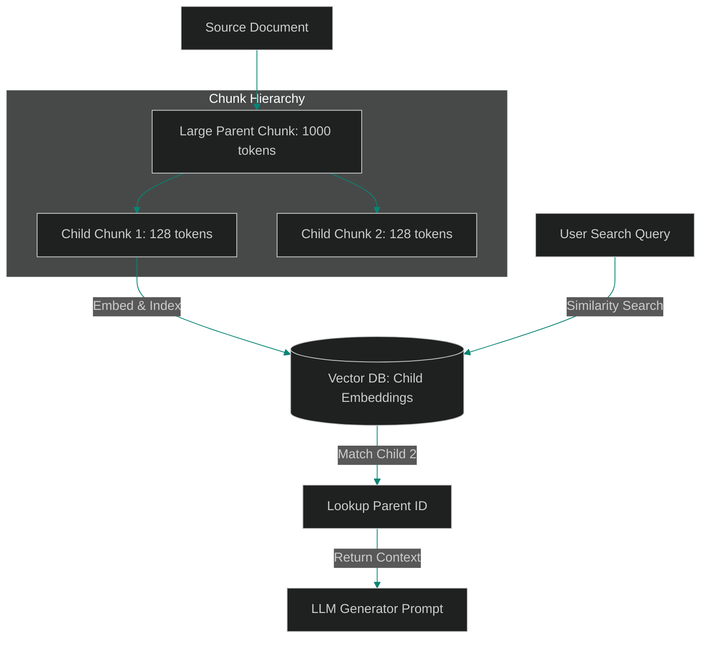

# Hierarchical Indexing: Designing Parent-Child Vector Scopes

> [!NOTE]
> **📖 Article Overview**
> Designing retrieval mechanisms in RAG pipelines involves a constant trade-off. Large text chunks (e.g. 1000 tokens) capture broad context but dilute semantic vector representations. Conversely, small text chunks (e.g. 100 tokens) yield highly focused embeddings, but lack the contextual details required for LLMs to generate accurate answers. To solve this, advanced pipelines use **Hierarchical Parent-Child Indexing**. We split documents into large parent chunks, divide those parents into small child segments, embed and index *only* the children, but return the *parent's* text content to the model. In this article, we construct a hierarchical parent-child retriever in Python.

---

## The Limitations of Single-Scale Chunking

In flat vector databases:
* **Embedding Dilution**: High-dimensional vector search struggles to match specific facts when they are buried inside large paragraphs.
* **Context Deprivation**: Matching small sentences directly yields high similarity scores, but the model cannot answer questions because it lacks the surrounding paragraphs.
* **The Solution**: **Parent-Child Scoping**. We decouple the retrieval index from the context generation index. We run vector searches on child nodes, identify matches, and retrieve their parent records to supply context.



---

## 1. Segmenting Hierarchical Relationships

To construct parent-child relationships:
* **Define Parents**: Split raw files into blocks containing ~1000 tokens (e.g. sections or pages). Store them with a unique `parent_id`.
* **Sub-partition Children**: Generate sub-chunks of ~100 tokens from each parent block, tagging each child entry with its corresponding `parent_id`.

---

## 2. Resolving Parent Chunks on Match

The retrieval coordinator handles context resolution:
1. **Query Child Vectors**: Search the vector index for the top-N closest child chunks.
2. **De-duplicate Parents**: Extract the `parent_id` keys from matching child chunks and compile a unique list of parent records, resolving context data.

---

## Code Demo: Parent-Child Retriever

Below is a Python implementation of a hierarchical parent-child retriever. It generates child/parent chunks, indexes child segments, and resolves parent blocks on lookup.

```python
import uuid
from typing import List, Dict, Any

class HierarchicalParentChildRetriever:
    def __init__(self):
        # Database simulating storage for parent texts
        self.parent_store: Dict[str, str] = {}
        # Database simulating child vector index metadata
        self.child_index: List[Dict[str, Any]] = []

    def ingest_document(self, parent_text: str, child_size_chars: int = 150):
        parent_id = str(uuid.uuid4())
        self.parent_store[parent_id] = parent_text

        # Segment parent text into overlapping child chunks
        start = 0
        step = child_size_chars - 30 # Apply overlap
        child_idx = 1
        
        while start < len(parent_text):
            child_text = parent_text[start:start + child_size_chars]
            self.child_index.append({
                "child_id": f"{parent_id}_c{child_idx}",
                "parent_id": parent_id,
                "text": child_text
            })
            start += step
            child_idx += 1

        print(f"📦 [Ingestion] Split parent block into {child_idx - 1} child chunks (Parent ID: {parent_id[:8]})")

    def retrieve_context(self, search_query: str) -> List[str]:
        matched_parents: List[str] = []
        unique_parent_ids = set()

        # Simulate vector similarity search by checking string matches
        print(f"🔍 [Search] Query: '{search_query}'...")
        
        for child in self.child_index:
            if search_query.lower() in child["text"].lower():
                pid = child["parent_id"]
                if pid not in unique_parent_ids:
                    unique_parent_ids.add(pid)
                    # Resolve parent context text from store
                    matched_parents.append(self.parent_store[pid])
                    print(f"   🎯 Match found in child '{child['child_id'][-4:]}'. Resolved Parent Context.")

        return matched_parents

if __name__ == "__main__":
    retriever = HierarchicalParentChildRetriever()

    # Ingest mock financial report text block (Parent)
    report_text = (
        "Operating revenue increased by 15% due to SaaS product sales. "
        "Conversely, marketing expenses grew to $4.2M because of global events. "
        "We plan to expand our local engineering team to 50 developers by Q4 2026."
    )

    retriever.ingest_document(parent_text=report_text, child_size_chars=80)

    print("\n--- Running Retrieval Scenarios ---")
    
    # Retrieve context matching specific term inside a child chunk
    context_blocks = retriever.retrieve_context(search_query="marketing expenses")
    
    print("\n--- Resolved Context Provided to LLM ---")
    for block in context_blocks:
        print(block)
```

---

## Hierarchical Indexing Takeaways

* **Decouple Matching from Context**: Run vector similarity matches on small child chunks while providing large parent blocks to the LLM.
* **Apply Chunk Overlaps**: Implement overlapping character windows on child chunks to prevent key facts from being cut off.
* **De-duplicate Matches**: Keep track of matching parent IDs to avoid sending redundant text blocks to the LLM.
