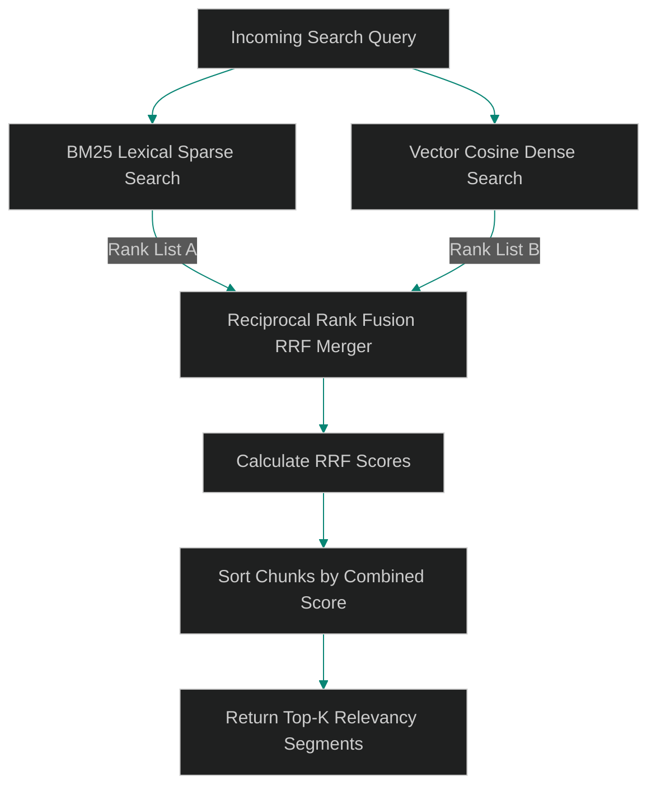

# Hybrid Retrieval: Merging Sparse BM25 and Dense Vector Search with Reciprocal Rank Fusion (RRF)

> [!NOTE]
> **📖 Article Overview**
> Vector similarity search is a powerful tool for matching semantic concepts, but it struggles with exact keyword lookups (like querying class names, error codes, or function names like `ASTSafetyScanner`). Conversely, sparse keyword searches (like BM25) excel at exact matching but miss semantic intent. To build a robust search pipeline, teams must implement **Hybrid Retrieval**. By running sparse and dense searches in parallel and merging their rankings using Reciprocal Rank Fusion (RRF), we get the best of both worlds. In this article, we map the hybrid search pipeline and implement an RRF rank-merger in Python.

---

## Semantic vs. Lexical Match Bottlenecks

A production-grade documentation search must handle:
* **The Synonym Problem**: A user searches for "database updates," but the documentation uses the term "schema migrations." Vector search excels here.
* **The Exact ID Problem**: A user searches for a specific error code like `ERR_CODE_502`. Vector search might return general gateway articles, whereas lexical search instantly matches the exact string.
* **The Solution**: **Hybrid Retrieval with RRF**. We retrieve target documents using both BM25 (sparse) and vector (dense) models, then run RRF to merge and sort the result lists.



---

## 1. Under the Hood: Reciprocal Rank Fusion (RRF)

RRF is a simple yet effective rank-merging algorithm:
$$RRF\_Score(d \in D) = \sum_{m \in M} \frac{1}{k + r_m(d)}$$
* $M$: The set of retrieval systems (e.g. BM25 and Vector).
* $r_m(d)$: The rank of document $d$ in system $m$ (1-indexed).
* $k$: A constant parameter (typically set to `60`) that controls how heavily top-ranked documents are prioritized.

---

## 2. Decoupling the Search Pipeline

To prevent latency bottlenecks:
1. **Parallel Execution**: Execute the sparse and dense search queries concurrently using asynchronous threads.
2. **Standardize Document IDs**: Ensure both index stores use unified document keys to merge scores correctly.

---

## Code Demo: Reciprocal Rank Fusion Merger

Below is a Python implementation of a hybrid search rank-merger. It takes mock search result lists from BM25 and vector retrievers, calculates RRF scores, and returns a sorted list of top matches.

```python
import json
from typing import Dict, List, Tuple

class ReciprocalRankFusionMerger:
    def __init__(self, constant_k: int = 60):
        self.k = constant_k

    def merge_rankings(self, sparse_results: List[str], dense_results: List[str]) -> List[Tuple[str, float]]:
        rrf_scores: Dict[str, float] = {}

        # 1. Process sparse (BM25) rankings (1-indexed)
        for rank, doc_id in enumerate(sparse_results, 1):
            score = 1.0 / (self.k + rank)
            rrf_scores[doc_id] = rrf_scores.get(doc_id, 0.0) + score

        # 2. Process dense (Vector) rankings
        for rank, doc_id in enumerate(dense_results, 1):
            score = 1.0 / (self.k + rank)
            rrf_scores[doc_id] = rrf_scores.get(doc_id, 0.0) + score

        # 3. Sort document targets based on combined scores in descending order
        sorted_results = sorted(rrf_scores.items(), key=lambda x: x[1], reverse=True)
        return sorted_results

if __name__ == "__main__":
    merger = ReciprocalRankFusionMerger(constant_k=60)

    # Simulated query: "Fix ASTSafetyScanner OS command exploit"
    # BM25 finds exact matching document strings
    bm25_matches = [
        "doc_ast_scanner_spec",   # Rank 1: Lexical match
        "doc_os_command_exploit",  # Rank 2: Lexical match
        "doc_gateway_setup"        # Rank 3
    ]

    # Vector search finds semantic concept matches
    vector_matches = [
        "doc_os_command_exploit",  # Rank 1: Semantic match
        "doc_sandbox_isolation",   # Rank 2: Semantic match
        "doc_ast_scanner_spec"     # Rank 3
    ]

    print("🛰️ Merging Hybrid Search Results with RRF...")
    print("---------------------------------------------")

    merged_ranks = merger.merge_rankings(bm25_matches, vector_matches)

    print("\n--- Sorted RRF Search Rankings ---")
    for rank, (doc_id, score) in enumerate(merged_ranks, 1):
        print(f"Rank {rank}: {doc_id} (RRF Combined Score: {score:.5f})")
```

---

## Architectural Guidelines

* **Set Constant k**: Configure your RRF constant $k$ near `60` to balance scores between high lexical matches and semantic matches.
* **Isolate Query Runtimes**: Run sparse and dense queries concurrently using async task wrappers to minimize search latencies.
* **Standardize Document Keys**: Maintain consistent document ID indexing patterns across your BM25 and vector stores to ensure accurate rank merging.
