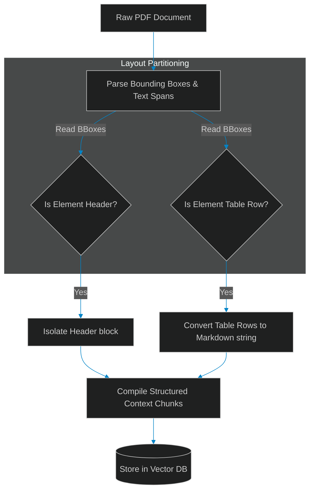

# Layout-Aware PDF Ingestion: Coordinate-Based Text and Table Extraction

> [!NOTE]
> **📖 Article Overview**
> Standard Retrieval-Augmented Generation (RAG) pipelines rely on basic text splitting algorithms that split text at set character counts. While this works for continuous plain text, it breaks down completely when parsing complex business documents like PDFs containing multi-column text, styled headers, and tables. If a table row is split in half, the relationship between data fields is lost. To build robust production RAG apps, developers must transition to **Layout-Aware PDF Ingestion**. By analyzing bounding boxes, we reconstruct tables and segment headers into cohesive JSON blocks. In this article, we build a layout-aware document parser in Python.

---

## The Chaos of Layout-Blind Chunking

In typical document chunking setups:
* **Table Scrambling**: Monolithic text parsers read tables row-by-row but output them as a flat stream of text, mixing columns together.
* **Header Mismatch**: Sub-sections lose their context when headers are split from the body paragraphs they describe.
* **The Solution**: **Layout-Aware Parsing**. We leverage page bounding coordinates (X, Y, Width, Height) to partition layout blocks, preserving tables as clean Markdown strings.



---

## 1. Extracting Document Bounding Boxes

To partition PDF layouts:
* **Detect Layout Boxes**: Map the exact coordinates of text elements (`top`, `bottom`, `left`, `right`).
* **Isolate Table Boundaries**: Tables occupy distinct visual regions. Group text blocks sharing identical horizontal column baselines.

---

## 2. Converting Tabular Rows to Markdown

The layout engine formats data logically:
1. **Identify Headers**: The first row in a table boundary is parsed as the table header.
2. **Reconstruct Columns**: Group rows sharing vertical bounds, separating cells using pipe (`|`) boundaries to construct a clean Markdown table.

---

## Code Demo: Layout-Aware Document Parser

Below is a Python implementation of a coordinate-based document layout segmenter. It isolates header text and converts tabular rows into search-friendly Markdown blocks.

```python
import json
from typing import List, Dict, Any

class LayoutAwarePDFParser:
    def __init__(self):
        # Configure thresholds for segmenting layouts
        self.header_font_size_threshold = 16
        self.table_row_proximity_threshold = 15

    def parse_document_elements(self, raw_elements: List[Dict[str, Any]]) -> List[Dict[str, Any]]:
        structured_chunks: List[Dict[str, Any]] = []
        active_table_rows: List[Dict[str, Any]] = []

        # Sort elements by vertical offset (top coordinate)
        raw_elements.sort(key=lambda x: x["top"])

        for el in raw_elements:
            # 1. Detect and isolate Header elements
            if el.get("font_size", 0) >= self.header_font_size_threshold:
                # Flush existing table buffer before adding a new header
                if active_table_rows:
                    structured_chunks.append(self._flush_table(active_table_rows))
                    active_table_rows.clear()
                
                structured_chunks.append({
                    "type": "header",
                    "text": el["text"],
                    "bbox": [el["left"], el["top"], el["width"], el["height"]]
                })
            
            # 2. Detect elements belonging to Tabular structures
            elif el.get("is_table_cell", False):
                active_table_rows.append(el)
            
            # 3. Detect standard paragraph body copy
            else:
                if active_table_rows:
                    structured_chunks.append(self._flush_table(active_table_rows))
                    active_table_rows.clear()
                
                structured_chunks.append({
                    "type": "paragraph",
                    "text": el["text"],
                    "bbox": [el["left"], el["top"], el["width"], el["height"]]
                })

        # Final table buffer flush
        if active_table_rows:
            structured_chunks.append(self._flush_table(active_table_rows))

        return structured_chunks

    def _flush_table(self, table_cells: List[Dict[str, Any]]) -> Dict[str, Any]:
        # Group cells by horizontal rows based on top offsets
        rows: Dict[int, List[Dict[str, Any]]] = {}
        for cell in table_cells:
            # Simple grouping by rounding coordinate threshold
            row_y = round(cell["top"] / self.table_row_proximity_threshold) * self.table_row_proximity_threshold
            if row_y not in rows:
                rows[row_y] = []
            rows[row_y].append(cell)

        # Build Markdown Table representation
        markdown_table = ""
        sorted_row_coords = sorted(rows.keys())
        
        for idx, y in enumerate(sorted_row_coords):
            # Sort row cells from left to right
            row_cells = sorted(rows[y], key=lambda x: x["left"])
            row_text = " | ".join(cell["text"] for cell in row_cells)
            markdown_table += f"| {row_text} |\n"
            
            # Insert markdown header separator after first row
            if idx == 0:
                separator = " | ".join("---" for _ in row_cells)
                markdown_table += f"| {separator} |\n"

        return {
            "type": "table",
            "text": markdown_table.strip(),
            "bbox": [
                min(c["left"] for c in table_cells),
                min(c["top"] for c in table_cells),
                max(c["left"] + c["width"] for c in table_cells),
                max(c["top"] + c["height"] for c in table_cells)
            ]
        }

if __name__ == "__main__":
    parser = LayoutAwarePDFParser()

    # Mock page elements representing header, table data, and paragraph
    mock_pdf_elements = [
        {"text": "Quarterly Financial Performance", "top": 20, "left": 50, "width": 400, "height": 22, "font_size": 18},
        
        # Row 1 (Header row)
        {"text": "Metric", "top": 60, "left": 50, "width": 80, "height": 12, "is_table_cell": True},
        {"text": "Q1 Value", "top": 60, "left": 150, "width": 80, "height": 12, "is_table_cell": True},
        {"text": "Q2 Value", "top": 60, "left": 250, "width": 80, "height": 12, "is_table_cell": True},
        
        # Row 2 (Data row)
        {"text": "Revenue", "top": 78, "left": 50, "width": 80, "height": 12, "is_table_cell": True},
        {"text": "$12.4M", "top": 78, "left": 150, "width": 80, "height": 12, "is_table_cell": True},
        {"text": "$14.8M", "top": 78, "left": 250, "width": 80, "height": 12, "is_table_cell": True},
        
        {"text": "The above table outlines the company's financial growth.", "top": 120, "left": 50, "width": 500, "height": 14}
    ]

    print("🌲 Parsing Document Layout Structures...")
    print("------------------------------------------")

    chunks = parser.parse_document_elements(mock_pdf_elements)
    for idx, chunk in enumerate(chunks):
        print(f"\n[Chunk {idx + 1}] Type: {chunk['type'].upper()} | Bounding Box: {chunk['bbox']}")
        print(chunk["text"])
```

---

## Document Ingestion Takeaways

* **Avoid Layout-Blind Splits**: Simple character-count text chunking corrupts structured lists and tables.
* **Isolate Tabular Columns**: Detect coordinate boundaries to format tables as clean Markdown.
* **Maintain Structural Context**: Group headings alongside related body text to preserve context for vector indexing.
