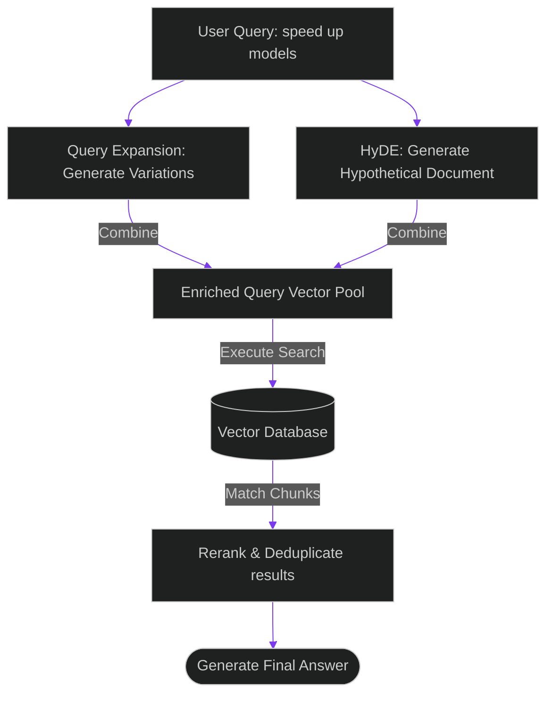

# Query Expansion & HyDE: Deconstructing Query Variations to Optimize Recall

> [!NOTE]
> **📖 Article Overview**
> When users query search interfaces, they often use shorthand or alternate terminology (e.g. searching "speed optimization" when a document describes "reducing TTFT latency"). This mismatch leads to poor search results. To resolve vocabulary gaps, advanced retrieval pipelines implement **Query Expansion** and **Hypothetical Document Embeddings (HyDE)**. Instead of embedding raw user inputs directly, we generate a hypothetical answer first, embedding *that* answer to perform the vector search. In this article, we build a query expansion and HyDE search coordinator in Python.

---

## The Vocabulary Mismatch Challenge

In basic semantic search systems:
* **Literal Word Dependency**: While embeddings parse semantics, queries like "how to fix memory issues" might not match document chunks explaining "VRAM KV Cache budgeting policies" due to keyword gaps.
* **Short Query Limitations**: Three-word queries generate compact embedding profiles that contain insufficient semantic detail to query complex databases.
* **The Solution**: **HyDE and Query Expansion**. We expand raw queries into multiple variations and generate a hypothetical response (HyDE) to construct a richer vector profile.



---

## 1. Implementing Hypothetical Document Embeddings (HyDE)

To improve document matching:
* **Generate Synthetic Responses**: Prompt a fast model to answer the query, creating a hypothetical paragraph.
* **Query Using the Answer**: Embed the synthetic response. The vector representation of an *answer* matches actual document answers much closer than a user's *question*.

---

## 2. Generating Query Variations

The query expansion pipeline generates alternatives:
1. **Apply Synonyms**: Expand keywords into related technical terms (e.g., "throughput", "latency", "concurrency").
2. **Execute Multi-Query Search**: Match all query variations against the vector database, combining results to maximize recall.

---

## Code Demo: HyDE & Query Expansion Coordinator

Below is a Python implementation of a query engineering engine. It simulates generating query variations, compiles hypothetical responses, and queries a mock vector database.

```python
import json
from typing import List, Dict, Any

class SearchRecallEnhancer:
    def __init__(self):
        # Mock vector database contents
        self.vector_database = [
            {"id": "doc_1", "content": "Implementing vLLM prefix cache reuse reduces time-to-first-token latency."},
            {"id": "doc_2", "content": "Adjusting KV Cache offloading parameters optimizes GPU VRAM usage footprints."},
            {"id": "doc_3", "content": "Headless Chromium browser automation is sandboxed inside isolated Docker containers."}
        ]

    def generate_query_variations(self, raw_query: str) -> List[str]:
        # Simulate query expansion variations
        variations = [raw_query]
        if "speed up" in raw_query.lower() or "latency" in raw_query.lower():
            variations.append("optimize TTFT and reduce time-to-first-token latency")
            variations.append("vLLM prefix caching performance optimization")
        return variations

    def generate_hypothetical_document(self, raw_query: str) -> str:
        # Simulate a HyDE response generated by an LLM
        if "speed up" in raw_query.lower():
            return "To speed up model generation, developers configure prefix caching and chunked prefill queue gates."
        return f"This document details information related to {raw_query}."

    def execute_enhanced_retrieval(self, raw_query: str) -> List[Dict[str, Any]]:
        # 1. Expand query to variations
        query_variations = self.generate_query_variations(raw_query)
        print(f"📊 [Expansion] Generated Query Variations: {query_variations}")

        # 2. Compile hypothetical document (HyDE)
        hyde_doc = self.generate_hypothetical_document(raw_query)
        print(f"📄 [HyDE] Compiled Hypothetical Response: '{hyde_doc}'")

        # 3. Simulate vector matches (checking overlap between queries/HyDE and database docs)
        matched_docs: Dict[str, Dict[str, Any]] = {}
        search_terms = query_variations + [hyde_doc]

        for term in search_terms:
            words = set(term.lower().replace(".", "").split())
            for doc in self.vector_database:
                doc_words = set(doc["content"].lower().replace(".", "").split())
                # Count matching keywords as similarity score representation
                overlap = len(words.intersection(doc_words))
                if overlap > 1:
                    doc_id = doc["id"]
                    if doc_id not in matched_docs or overlap > matched_docs[doc_id]["score"]:
                        matched_docs[doc_id] = {"doc": doc, "score": overlap}

        # Sort matches by coordinate scoring overlap
        sorted_matches = sorted(matched_docs.values(), key=lambda x: x["score"], reverse=True)
        return [match["doc"] for match in sorted_matches]

if __name__ == "__main__":
    enhancer = SearchRecallEnhancer()

    print("🛡️ Initializing Search Recall Enhancer...")
    print("------------------------------------------")

    user_query = "speed up my model serving"
    results = enhancer.execute_enhanced_retrieval(user_query)

    print("\n📈 --- Matching Document Search Results ---")
    for idx, doc in enumerate(results):
        print(f"    [Match {idx + 1}] ID: {doc['id']} | Content: '{doc['content']}'")
```

---

## Query Engineering Takeaways

* **Expand Short Queries**: Generate query variations using synonyms to capture alternate phrasing.
* **Leverage Answer Patterns (HyDE)**: Embed a hypothetical answer rather than the raw question to increase similarity matches.
* **Rerank & Deduplicate**: Merge multi-query results and apply reranking models to isolate the most relevant context blocks.
