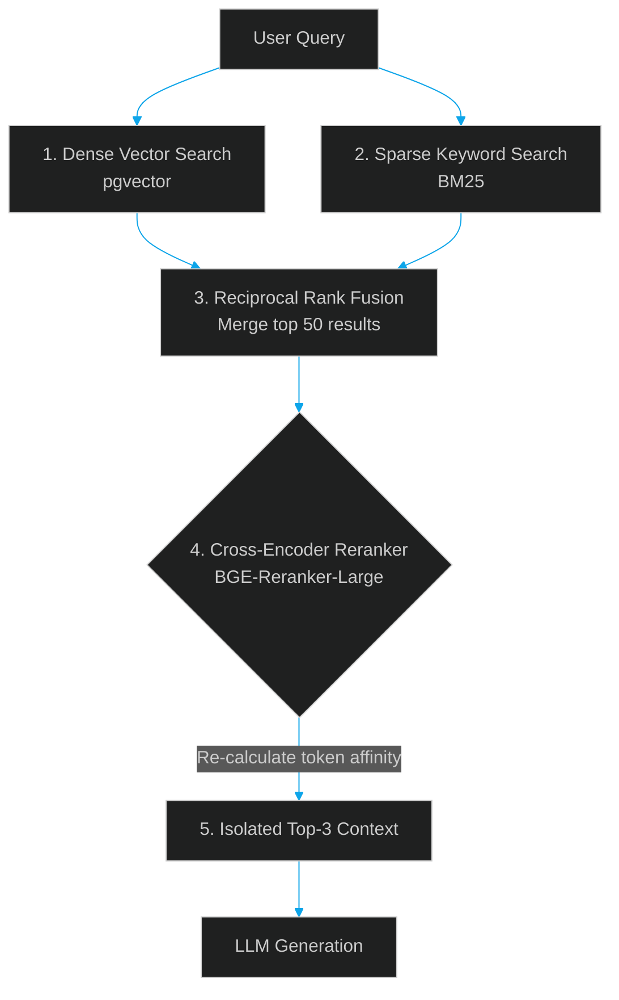

# Beyond Simple Vector Search: Why Cohere/BGE Rerankers are Non-Negotiable

> [!NOTE]
> **📖 Article Overview**
> Most basic Retrieval-Augmented Generation (RAG) tutorials stop at cosine similarity vector search. In production, however, raw vector search often fails to find the exact information needed. Because embedding models (Bi-encoders) represent whole documents as single coordinates, they prioritize general semantic context over specific, granular answers. This article explains why neural **Rerankers (Cross-encoders)** are essential for accurate RAG pipelines and demonstrates how to build a hybrid search, Reciprocal Rank Fusion (RRF), and BGE Reranker pipeline in Python.

---

## The Limits of Bi-Encoders (Vector Embeddings)

Embedding models are **Bi-encoders**. They process the user query and the database documents independently, converting them into vectors to measure distance. While fast, this means the model cannot capture token-to-token interactions between the query and the candidate documents. 

A **Cross-encoder** (Reranker) takes the query and a document *together* as a single input, executing full self-attention across both. This produces a highly accurate relevancy score, but is too computationally expensive to run on millions of documents.



By using both, we get the best of both worlds:
1. Use fast Bi-encoders (vector/keyword search) to retrieve the top 50 candidate documents.
2. Use a slow Cross-encoder (Reranker) to evaluate only those top 50 and sort them, passing the top 3 to the LLM.

---

## Step-by-Step Implementation: Hybrid Search + RRF + BGE Reranker

Here is the Python implementation of this pipeline using the `SentenceTransformers` library.

```python
import numpy as np
from sentence_transformers import CrossEncoder

# 1. Initialize the BGE Cross-Encoder Reranker
# This model is small enough to run on CPU with ~50ms latency
reranker = CrossEncoder("BAAI/bge-reranker-large", revision="main")

# Dummy Mock Results from Vector Search
vector_results = [
    {"id": 1, "text": "PostgreSQL uses Write-Ahead Logging (WAL) to ensure data integrity.", "rank": 1},
    {"id": 2, "text": "Database backups can be scheduled using pg_dump and cron jobs.", "rank": 2},
    {"id": 3, "text": "Redis maintains data in memory and supports snapshotting for persistence.", "rank": 3}
]

# Dummy Mock Results from Keyword Search (BM25)
keyword_results = [
    {"id": 2, "text": "Database backups can be scheduled using pg_dump and cron jobs.", "rank": 1},
    {"id": 1, "text": "PostgreSQL uses Write-Ahead Logging (WAL) to ensure data integrity.", "rank": 2},
    {"id": 4, "text": "Write-Ahead Logging writes changes to disk before updating pages.", "rank": 3}
]

def reciprocal_rank_fusion(dense_runs, sparse_runs, k=60):
    """
    Combines ranks from vector and keyword search using RRF formula:
    score = sum(1 / (k + rank))
    """
    scores = {}
    documents = {}
    
    for run in [dense_runs, sparse_runs]:
        for doc in run:
            doc_id = doc["id"]
            documents[doc_id] = doc["text"]
            rank = doc["rank"]
            if doc_id not in scores:
                scores[doc_id] = 0.0
            scores[doc_id] += 1.0 / (k + rank)
            
    # Sort documents by RRF score
    sorted_ids = sorted(scores, key=scores.get, reverse=True)
    return [{"id": doc_id, "text": documents[doc_id]} for doc_id in sorted_ids]

def rerank_documents(query: str, candidates: list[dict]) -> list[dict]:
    """
    Reranks candidate documents using BGE Cross-Encoder
    """
    # Prepare query-document pairs for the cross-encoder
    pairs = [[query, doc["text"]] for doc in candidates]
    
    # Compute relevance scores (higher = more relevant)
    scores = reranker.predict(pairs)
    
    # Attach scores to documents
    for i, doc in enumerate(candidates):
        doc["rerank_score"] = float(scores[i])
        
    # Sort by rerank score descending
    candidates.sort(key=lambda x: x["rerank_score"], reverse=True)
    return candidates

# Execution Pipeline
if __name__ == "__main__":
    query = "How does PostgreSQL ensure data integrity?"
    
    # 1. Merge Vector & Keyword search results using RRF
    merged_candidates = reciprocal_rank_fusion(vector_results, keyword_results)
    print("Merged Candidates (RRF):", [doc["id"] for doc in merged_candidates])
    
    # 2. Run BGE Reranker on the merged set
    reranked_docs = rerank_documents(query, merged_candidates)
    
    print("\n--- Reranked Context Results ---")
    for doc in reranked_docs[:2]:
        print(f"ID: {doc['id']}, Score: {doc['rerank_score']:.4f}")
        print(f"Text: {doc['text']}\n")
```

---

## 🏁 Conclusion & Takeaways

Rerankers are one of the most effective ways to boost your RAG system's accuracy:
* [ ] **Combine dense and sparse search**: Use hybrid search (vector similarity + keyword matching) as your initial retrieval pass.
* [ ] **Use Reciprocal Rank Fusion (RRF)**: Blend results from different search indexes fairly before reranking.
* [ ] **Deploy a Cross-encoder**: Place a reranker (like BGE-Reranker or Cohere V3) in front of your LLM call.
* [ ] **Measure latency tradeoffs**: Keep your candidate list size (retrieval pool) limited to 50–100 documents to ensure reranking completes within 100ms.
