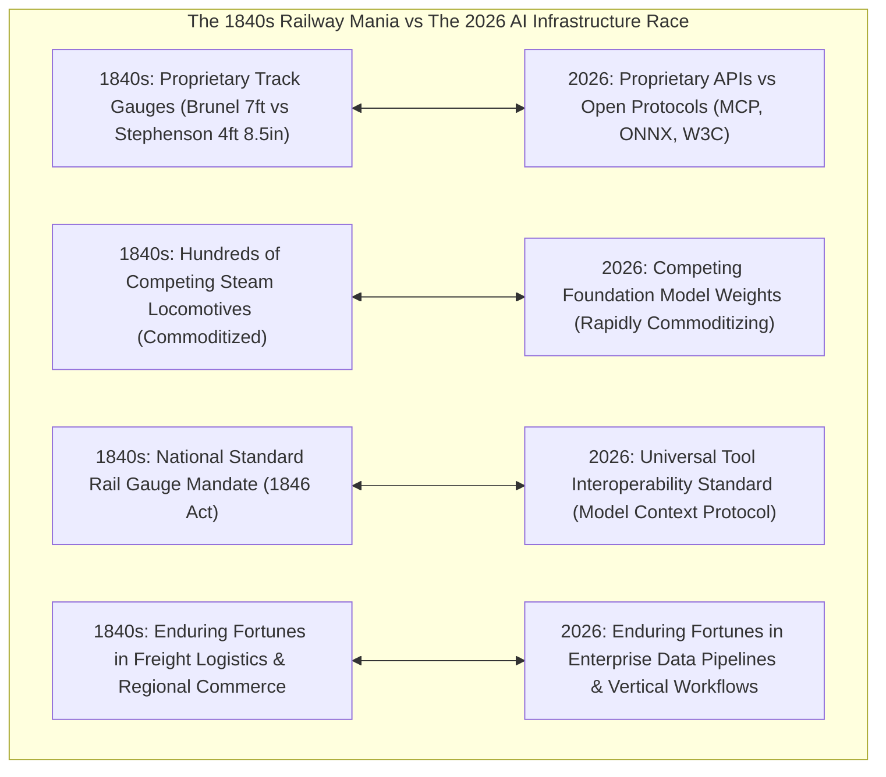
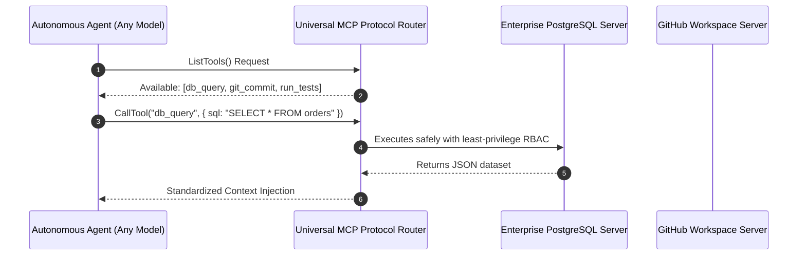
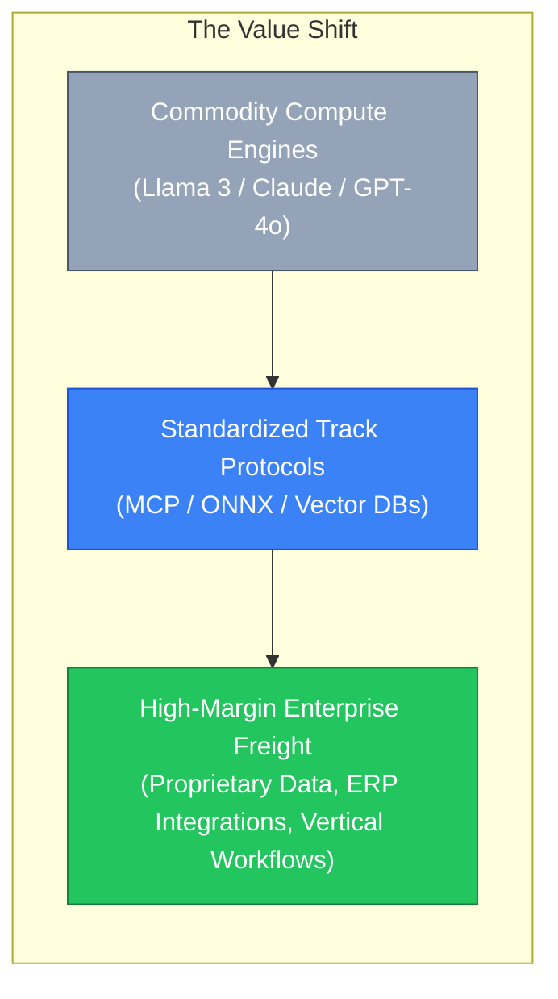

# The 1840s Railway Mania & The Model Commoditization Trap: Why Standardized Protocols (MCP & ONNX) Outlast Proprietary Steam Engines

In the mid-1840s, Great Britain was gripped by **Railway Mania**—a speculative frenzy where Parliament authorized over 8,000 miles of new railway lines and investors poured the equivalent of billions of dollars into hundreds of competing locomotive and rail companies.

During this boom, an intense architectural battle emerged known as **The Battle of the Gauges**:
* Chief Engineer **Isambard Kingdom Brunel** championed the massive **7-foot Broad Gauge** for the Great Western Railway, arguing it offered superior speed, stability, and carrying capacity.
* **George Stephenson** championed the narrower **4-foot 8.5-inch Standard Gauge**, focusing on lower construction costs and network interoperability.

By 1846, Parliament passed the *Regulating the Gauge of Railways Act*, mandating the standard gauge across the nation.

Brunel’s technically superior broad-gauge locomotives were dismantled at enormous expense.

The lesson was definitive: **In large-scale network infrastructure, open interoperable standards always defeat proprietary hardware advantages.**

Today, the artificial intelligence landscape is reenacting the 1840s Railway Mania.



---

## 1. The Foundation Model Commoditization Curve

Over the past three years, frontier AI labs spent hundreds of millions of dollars training proprietary frontier models.

Yet, empirical industry data reveals an unmistakable economic trend: **the capability half-life of closed-source model moats is shrinking toward zero.**

```
> **MODEL CAPABILITY CATCH-UP TIMELINE**
|  Frontier Release (Closed)        : $100M+ Training Run (T = 0 months)                             |
|  Open-Weights Parity (Llama/DeepSeek): Within 3 to 6 months at 1/10th the inference cost          |
|  Quantized Edge Execution (GGUF/ONNX): Within 9 months running locally on consumer hardware       |

```

When a $\$100\text{M}$ proprietary model's performance on standard benchmarks (MMLU, HumanEval, SWE-bench) is matched within months by open-weight community models, **the model itself becomes a commodity compute utility**—analogous to the steam locomotive.

Building a defensible business solely around calling an undifferentiated foundation model API is the modern equivalent of betting on a single locomotive manufacturer in 1845.

---

## 2. The Standard Tracks of the AI Era

In the railroad era, the network value was unlocked not by individual locomotives, but by the **tracks that connected factories, farms, and ports**.

In the agentic AI era, value is consolidating around three open, standardized protocols:

```
> **THE 3 OPEN TRACK STANDARDS OF MODERN AI**
| 1. Model Context Protocol (MCP)   : Standardized tool, data, and prompt interchange across agents |
| 2. ONNX & TensorRT Runtimes       : Standardized neural network compilation across GPU hardware   |
| 3. OpenTelemetry (W3C Tracing)    : Standardized distributed tracing and token metrics            |

```

### The Model Context Protocol (MCP) as the "Standard Gauge"
Before MCP, every AI framework implemented bespoke tool definitions: LangChain had its syntax, OpenAI had custom JSON function schemas, and Anthropic had XML tags.

This created "break-of-gauge" friction: integrating an agent with an enterprise PostgreSQL database or Salesforce CRM required re-writing tool wrappers for every specific model.

The **Model Context Protocol (MCP)** solves this by establishing a universal JSON-RPC client-server standard:
* Any MCP-compliant tool (e.g. Git repository browser, database query executor) can be seamlessly mounted by any LLM (Claude, Llama 3, Gemini) without modifying a single line of backend code.



---

## 3. Where Enduring Economic Value Accrues: Freight Over Engines

In 1850, the enduring fortunes were not in manufacturing steam boilers, but in operating **freight logistics networks** (transporting coal, grain, and manufactured goods across standardized lines).

In AI, the "freight" is **proprietary enterprise data** and **domain-specific workflows**:



### The 3 Enterprise Value Pillars:
1. **System of Record Ownership**: An agent is only as good as the live context it accesses. Platforms embedded in enterprise ERPs, CAD databases, and electronic health records (EHR) hold the true moat.
2. **Deterministic Workflow Orchestration**: Translating chaotic business intent into validated, multi-step execution graphs with human-in-the-loop checkpoints.
3. **Model Interchangeability**: Enterprises that build against open MCP interfaces can swap their underlying LLM backend from Model $A$ to Model $B$ overnight to capitalize on price drops, with zero architectural rewrites.

---

## Python Implementation: Universal Protocol Interchange Engine

Here is a Python implementation demonstrating how an enterprise application leverages an **Interchangeable Model Gateway over Universal MCP-Style Tool Schemas**:

```python
from typing import Any, Callable, Dict, List, Optional

class UniversalMCPTool:
    """
    Standard Gauge Protocol: Unified tool definition independent of LLM vendor.
    """
    def __init__(self, name: str, description: str, parameters: Dict[str, Any], handler: Callable[..., Any]):
        self.name = name
        self.description = description
        self.parameters = parameters
        self.handler = handler

    def execute(self, arguments: Dict[str, Any]) -> Any:
        print(f" ⚙️ [MCP Execution] Invoking tool '{self.name}' with args: {arguments}")
        return self.handler(**arguments)

class UniversalProtocolGateway:
    """
    Model Interchange Gateway: Dynamically routes prompts to any backend engine
    while preserving standardized tool interoperability.
    """
    def __init__(self):
        self.registered_tools: Dict[str, UniversalMCPTool] = {}

    def register_tool(self, tool: UniversalMCPTool):
        print(f" 🛤️ [MCP Registry] Mounted tool '{tool.name}' on standard gauge.")
        self.registered_tools[tool.name] = tool

    def dispatch_agent_turn(self, model_engine: str, prompt: str, tool_call: Optional[Dict[str, Any]] = None) -> str:
        print(f"\n🚂 [Dispatch] Running turn via Locomotive Engine: [{model_engine}]")
        print(f"   Prompt Context: '{prompt}'")

        if tool_call:
            tool_name = tool_call.get("name")
            if tool_name in self.registered_tools:
                result = self.registered_tools[tool_name].execute(tool_call.get("arguments", {}))
                return f"Tool [{tool_name}] output processed: {result}"
            else:
                return f"Error: Tool '{tool_name}' not found."

        return f"Response generated successfully by {model_engine}."

# Demonstration Execution
if __name__ == "__main__":
    gateway = UniversalProtocolGateway()

    # 1. Register Standard MCP Tools
    def query_database(query: str) -> str:
        return f"ResultSet(rows=42 for '{query}')"

    gateway.register_tool(UniversalMCPTool(
        name="sql_query",
        description="Executes read-only SQL queries against enterprise analytics DB",
        parameters={"query": "string"},
        handler=query_database
    ))

    # 2. Execute with Model A (e.g. Proprietary Frontier Engine)
    turn_1 = gateway.dispatch_agent_turn(
        model_engine="Frontier-Claude-3.5",
        prompt="Analyze Q3 regional shipping delays",
        tool_call={"name": "sql_query", "arguments": {"query": "SELECT * FROM shipments WHERE delay > 3"}}
    )
    print(f" ↳ Result: {turn_1}")

    # 3. Swap instantly to Model B (e.g. Self-Hosted Open Weights Engine) with ZERO rewrite
    print("\n🔄 [Seamless Model Swap] Switching underlying engine to Open-Source Llama-3-70B...")
    turn_2 = gateway.dispatch_agent_turn(
        model_engine="Local-Llama-3-70B",
        prompt="Summarize customer churn risk",
        tool_call={"name": "sql_query", "arguments": {"query": "SELECT user_id FROM churn_flags"}}
    )
    print(f" ↳ Result: {turn_2}")
```

---

## Summary: The Industrial Comparison Matrix

| Industrial Dimension | 1840s British Railway Mania | 2026 AI Agent Revolution |
|---|---|---|
| **Capital Influx** | Thousands of competing rail line schemes | Massive VC and corporate funding in foundation models |
| **The Battle of the Gauges** | Brunel Broad Gauge vs Stephenson Standard Gauge | Proprietary Vendor APIs vs Open MCP / ONNX Protocols |
| **Outcome of Gauge Battle** | 1846 National Standard Gauge Act mandated interoperability | MCP adopted as the universal standard for AI tool calling |
| **Commoditized Layer** | Raw steam locomotive engines | Raw foundation model weights and inference tokens |
| **Enduring Moat** | Freight logistics, passenger hubs & regional trade networks | Proprietary data assets, enterprise ERP workflows & vertical platforms |

---

## Architectural Takeaway
The lesson of the 1840s Railway Mania is clear: **do not build your enterprise on proprietary track gauges**.

By architecting systems around open, model-agnostic protocols like **MCP**, **ONNX**, and **OpenTelemetry**, engineering teams insulate themselves against foundation model commoditization and ensure their software assets remain agile, interoperable, and enduring.
