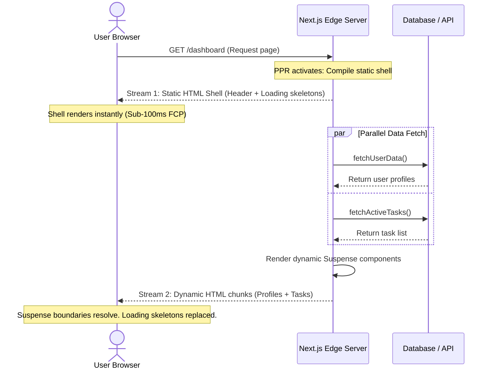

The full-stack Javascript ecosystem is undergoing a dramatic consolidation. In 2026, the boundary between client-side rendering and server-side operations has completely dissolved. 

With the stabilization of the **React Compiler**, **React 19 Server Actions**, and Next.js features like **Partial Prerendering (PPR)** and the **`after()` API**, full-stack development is now cleaner, faster, and more unified.

This article reviews these architectural features and details how to build a production-grade, form-handling component that leverages optimistic updates, server mutations, and post-response background execution.

---

## 🛠️ The Partial Prerendering (PPR) Request Lifecycle

Traditional rendering models forced a binary choice: either build a page statically at build time (fast, but static) or render it dynamically on every request (slow, since the user waits for data fetching). 

Next.js resolves this with **Partial Prerendering (PPR)**. PPR streams a static HTML shell (containing page navigation, headers, and loading skeletons) immediately, while keeping dynamic zones open as active server-side streams that resolve and stream down as soon as their data resolves.



1. **Static Stream**: The browser receives and renders the static page outline in under 100ms.
2. **Dynamic Resolution**: Suspense boundaries fetch database data on the server in parallel.
3. **Chunk Injection**: As the server fetches complete datasets, it streams down the resolved HTML chunks, replacing the loading skeletons seamlessly.

---

## 💡 Key Architectural Transformations in 2026

### 1. The React Compiler: The End of `useMemo`
Historically, developers spent hours debugging rendering cycles, wrapping functions in `useCallback` and objects in `useMemo` to prevent unnecessary re-renders. 

The **React Compiler** solves this at build time. It analyzes JavaScript semantics and dependency flows, automatically compiling memoization gates into the output bundle. The compiler guarantees optimal rendering paths, allowing developers to write standard JavaScript without manual render tuning.

### 2. Full-Stack Data Mutations: Server Actions
Server Actions standardize how client components submit data to server handlers. Instead of writing Express controllers, routing middleware, and client fetch requests, a Server Action lets you define an asynchronous server function that can be imported and executed directly from a client form event.

React 19 couples Server Actions with dedicated hooks:
*   `useActionState`: Manages action states (returned payload, error structures, and pending loading states).
*   `useOptimistic`: Updates the client UI immediately with expected data while the server mutation resolves, keeping interfaces snappy.

### 3. Granular Caching: The `use cache` Directive
Instead of configuring complex global caching headers or fetch revalidation objects, Next.js introduces the `use cache` directive. This directive can be placed at the top of any asynchronous function or component, telling the bundler to cache the return payload at the edge, simplifying cache invalidation.

### 4. Post-Response Execution: The `after()` API
Many operations (like sending log metrics to databases, recording analytics, or triggering audit events) do not need to block the client's screen load. The `after()` API allows developers to schedule asynchronous tasks to execute *after* Next.js has finished writing the response body to the client.

---

## 💻 Building a Server-Action Form in Next.js

Here is a full TSX component demonstrating these features. It mutates database values, manages state via `useActionState`, updates the client instantly using `useOptimistic`, and schedules a logging task using `after()`. This mimics form controls used in frontend dashboards like [portfolio-ai-rota-manager](https://github.com/akmalkhaniub/portfolio-ai-rota-manager).

### 1. Server Actions Controller (`actions.ts`)
```typescript
"use server";

import { revalidatePath } from "next/cache";
import { unstable_after as after } from "next/server";

interface TaskState {
  success: boolean;
  message: string;
}

export async function createTask(prevState: TaskState, formData: FormData): Promise<TaskState> {
  const title = formData.get("title")?.toString();

  if (!title) {
    return { success: false, message: "Title is required" };
  }

  // Simulate database write latency
  await new Promise((resolve) => setTimeout(resolve, 1000));
  console.log(`Database write complete: Task "${title}" created.`);

  // Trigger post-response logging asynchronously
  after(async () => {
    console.log(`[Background Log]: Scheduled task telemetry written for: "${title}"`);
    // Send telemetry to analytical databases...
  });

  revalidatePath("/dashboard");
  return { success: true, message: "Task created successfully!" };
}
```

### 2. Client Task Component (`TaskForm.tsx`)
```tsx
"use client";

import React, { useActionState, useOptimistic, useRef } from "react";
import { createTask } from "./actions";

interface TaskItem {
  id: string;
  title: string;
  sending?: boolean;
}

interface TaskFormProps {
  initialTasks: TaskItem[];
}

export default function TaskForm({ initialTasks }: TaskFormProps) {
  const formRef = useRef<HTMLFormElement>(null);
  
  // 1. Manage form response and pending loading status
  const [state, formAction, isPending] = useActionState(createTask, {
    success: false,
    message: "",
  });

  // 2. Optimistic UI state management
  const [optimisticTasks, setOptimisticTasks] = useOptimistic(
    initialTasks,
    (state, newTitle: string) => [
      ...state,
      { id: Date.now().toString(), title: newTitle, sending: true },
    ]
  );

  const handleFormSubmit = async (formData: FormData) => {
    const title = formData.get("title")?.toString() || "";
    formRef.current?.reset();
    
    // Trigger client-side optimistic append immediately
    setOptimisticTasks(title);
    
    // Execute server action mutation
    await formAction(formData);
  };

  return (
    <div style={{ padding: "2rem", maxWidth: "400px" }}>
      <form ref={formRef} action={handleFormSubmit} style={{ display: "flex", flexDirection: "column", gap: "1rem" }}>
        <input 
          type="text" 
          name="title" 
          placeholder="New Task Title" 
          required 
          disabled={isPending}
          style={{ padding: "0.5rem", borderRadius: "4px", border: "1px solid #ccc" }}
        />
        <button 
          type="submit" 
          disabled={isPending}
          style={{ padding: "0.5rem", background: "#0ea5e9", color: "#fff", border: "none", borderRadius: "4px", cursor: "pointer" }}
        >
          {isPending ? "Saving Task..." : "Add Task"}
        </button>
      </form>

      {state.message && (
        <p style={{ marginTop: "1rem", color: state.success ? "green" : "red" }}>
          {state.message}
        </p>
      )}

      <ul style={{ marginTop: "2rem" }}>
        {optimisticTasks.map((task) => (
          <li key={task.id} style={{ opacity: task.sending ? 0.6 : 1, padding: "0.5rem 0" }}>
            {task.title} {task.sending && <small>(syncing...)</small>}
          </li>
        ))}
      </ul>
    </div>
  );
}
```

---

## 📋 Implementation Guardrails

* **Server Action Security**: Always sanitize input parameters within server action scopes. Attackers can execute actions directly, bypassing client forms.
* **Suspense Fallbacks**: Always provide meaningful skeletons or placeholders for components bounded by Suspense to ensure Partial Prerendering renders an elegant static shell.
* **Error Boundaries**: Wrap your React components in local Error Boundaries to capture and handle any streaming-chunk failures without crashing the entire page context.

---

## 📚 References & Further Reading

* **React 19 Actions**: [React Core Team Updates](https://react.dev/blog/2024/04/25/react-19). Specifications on action states, optimistic state hooks, and compile-time memoization.
* **Next.js 15 Features**: [Next.js Documentation](https://nextjs.org/blog/next-15). Specifications on Partial Prerendering, server actions, and post-response execution (`after()`).

*To inspect how complex data flows are managed in our frontend dashboards, examine the codebase of our [portfolio-ai-rota-manager](https://github.com/akmalkhaniub/portfolio-ai-rota-manager) repository.*
