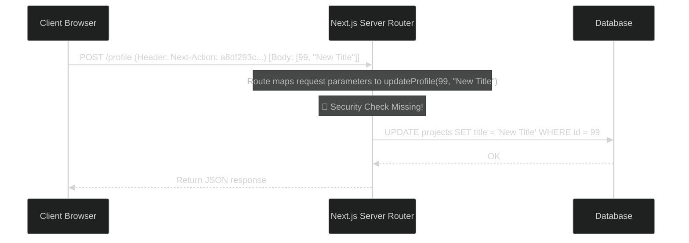

# React Server Actions Security: Avoiding Hidden API Vulnerabilities

> [!NOTE]
> **📖 Article Overview**
> Next.js Server Actions are one of the most exciting features in React 19, allowing developers to invoke server-side operations directly from client-side buttons and forms without writing custom API routes. However, this convenience masks a serious architectural risk: **every Server Action is compiled under the hood into a public HTTP POST endpoint**. If you write Server Actions without the security controls you would apply to traditional REST/GraphQL routes, your application will suffer from authorization bypasses, SQL injections, and parameters tampered by clients. This article details these security gotchas and how to fix them.

---

## Under the Hood: Server Actions are Public Endpoints

In Next.js, when you define `"use server"` at the top of a file or function, Next.js compiles that function into a unique API path during build time. 

When a button in the client calls `updateProfile(data)`, the browser doesn't execute the function directly. Instead, it fires an HTTP POST request to your page route with a header `Next-Action: <action-id>` containing serialized arguments.



If you don't validate authorization inside the action itself, **any client can invoke this function** by generating a POST request with arbitrary IDs.

---

## Three Server Action Vulnerabilities (and How to Fix Them)

### 1. Broken Object-Level Authorization (BOLA)
Because Server Actions look like standard local functions, developers often pass database record IDs directly from the client:

```typescript
// ❌ VULNERABLE: Anyone can call this and update arbitrary project IDs
'use server'

export async function deleteProject(projectId: string) {
  await db.project.delete({ where: { id: projectId } });
}
```

#### Secure Pattern: Enforce Authentication & Encrypted ID checks
Always query the authenticated user session from within the Server Action using a secure server utility, and verify ownership of the resource before making mutations:

```typescript
'use server'
import { getSession } from '@/lib/auth';
import { z } from 'zod';

const deleteSchema = z.object({
  projectId: z.string().uuid()
});

export async function deleteProject(rawData: unknown) {
  // 1. Verify Authentication
  const session = await getSession();
  if (!session || !session.user) {
    throw new Error('Unauthorized');
  }

  // 2. Validate Inputs Schema
  const parsed = deleteSchema.safeParse(rawData);
  if (!parsed.success) {
    throw new Error('Invalid inputs');
  }

  // 3. Verify Authorization/Ownership before mutating database
  const project = await db.project.findUnique({
    where: { id: parsed.data.projectId }
  });

  if (!project || project.ownerId !== session.user.id) {
    throw new Error('Forbidden: You do not own this project');
  }

  await db.project.delete({ where: { id: parsed.data.projectId } });
  return { success: true };
}
```

---

### 2. Parameter Injection (Schema Validation)
Form inputs are easily manipulated in the browser dev tools. A malicious user can append hidden fields or input strings that cause database indexing failures or SQL injection risks.

#### Fix: Always parse inputs via Zod
Never trust the payload shape. Parse raw data objects immediately using a schema parser like Zod, and only pass the structured output keys to your database driver.

---

### 3. Missing CSRF / Double Submit Cookie Protections
Traditional Next.js API routes require custom CORS/CSRF configurations. Next.js Server Actions include built-in protection against CSRF by validating the `Origin` header against the host header. However, if your application runs behind multiple proxies or has custom domain mapping, this origin validation can be accidentally disabled or bypassed.

#### Fix: Enforce Strict Header Checks
Ensure your deployment gateway or reverse proxy correctly forwards `Host` and `X-Forwarded-Host` headers, and verify that Next.js's native CORS/CSRF middleware is active in your configuration.

---

## Conclusion & Takeaways

Next.js Server Actions make data fetching and mutation incredibly clean, but you must treat them with the same security parameters as standard API endpoints:
* [ ] **Never trust client-passed IDs directly**: Validate ownership of the target record using the user context retrieved on the server.
* [ ] **Enforce schema validation on all inputs**: Always validate incoming arguments using Zod, Yup, or ArkType schemas.
* [ ] **Verify session details server-side**: Query session data within the action, never pass session arguments down from the client component.
* [ ] **Limit rate actions**: Put throttling rules on actions that write data or invoke external APIs (like payment processors or email dispatchers).
