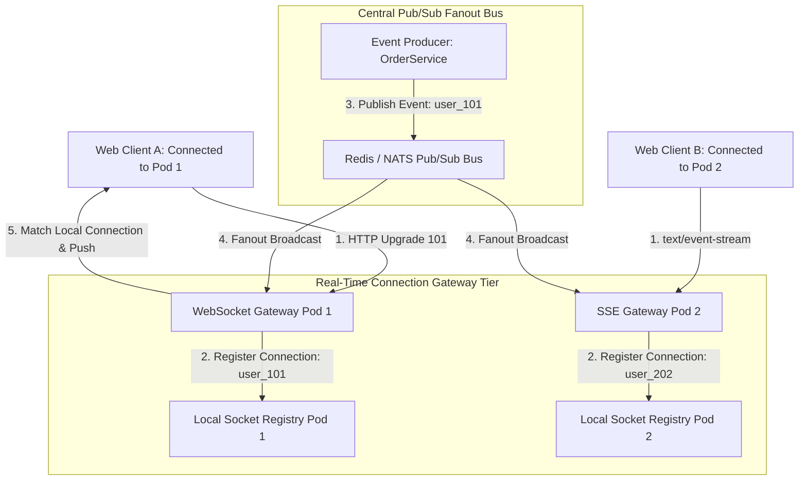

# Real-Time Communication Engines: WebSockets, SSE & Pub/Sub Gateways

Modern web applications—such as collaborative document editors, live financial trading dashboards, multiplayer games, and notification feeds—demand instant, sub-millisecond data updates. Traditional HTTP polling (`setInterval` polling every 2 seconds) wastes vast amounts of bandwidth and creates heavy CPU load on backend servers.

To support instant push updates to millions of concurrent users, backend engineers build **Real-Time Communication Engines**.

These engines maintain long-lived TCP socket connections using **WebSockets** or **Server-Sent Events (SSE)**.

Because a single backend server can only hold a finite number of TCP sockets open simultaneously, scalable architectures deploy stateless **Connection Gateways** backed by a high-throughput **Pub/Sub Message Bus (Redis / NATS)** to fan out events across distributed gateway clusters.

This article details how to design and build scalable real-time communication gateways.

---

## Real-Time WebSocket/SSE Gateway Architecture

How a Pub/Sub message bus fans out real-time events across stateless connection gateway pods:



### Real-Time Protocol Protocols & Architecture
1. **WebSockets vs Server-Sent Events (SSE)**:
   * **WebSockets**: Full-duplex bidirectional communication over a single TCP connection. Ideal for interactive applications requiring client-to-server and server-to-client messaging (e.g. live chat, gaming).
   * **Server-Sent Events (SSE)**: Lightweight, unidirectional server-to-client streaming over standard HTTP (`Content-Type: text/event-stream`). Ideal for notification feeds, live ticker updates, and LLM streaming responses.
2. **Stateless Gateway Fanout Pattern**: Clients establish long-lived TCP connections with any available Gateway Pod behind a load balancer. When a backend microservice emits an event for a user (`user_101`), it publishes the message to a central Pub/Sub topic (`events:user_101`). All Gateway Pods receive the message, but only the specific Pod holding `user_101`'s active socket delivers the message down the wire.

---

## Python Implementation: Real-Time Gateway & Pub/Sub Engine

Here is a production-grade Python simulation of a Real-Time Connection Gateway with local socket registration and Pub/Sub fanout broadcasting:

```python
import time
import queue
import threading
from typing import Dict, List, Any, Optional
from pydantic import BaseModel

class ConnectionSocket(BaseModel):
    connection_id: str
    user_id: str
    protocol: str  # WEBSOCKET, SSE
    connected_at: float

class RealTimeGatewayPod:
    """
    Stateless Connection Gateway Pod maintaining long-lived client TCP sockets.
    """
    def __init__(self, pod_id: str):
        self.pod_id = pod_id
        # user_id -> List[ConnectionSocket]
        self.active_sockets: Dict[str, List[ConnectionSocket]] = {}
        self.lock = threading.Lock()

    def register_client(self, connection_id: str, user_id: str, protocol: str = "WEBSOCKET"):
        with self.lock:
            sock = ConnectionSocket(
                connection_id=connection_id,
                user_id=user_id,
                protocol=protocol,
                connected_at=time.time()
            )
            if user_id not in self.active_sockets:
                self.active_sockets[user_id] = []
            self.active_sockets[user_id].append(sock)
            print(f" 🔌 [{self.pod_id}] Client '{user_id}' Connected via {protocol} (ConnID: {connection_id})")

    def handle_pubsub_event(self, target_user_id: str, event_payload: Dict[str, Any]):
        """
        Receives broadcasted event from Pub/Sub bus and delivers to local socket if present.
        """
        with self.lock:
            sockets = self.active_sockets.get(target_user_id, [])
            if not sockets:
                return  # Target client is not connected to this specific Pod instance

            for sock in sockets:
                print(f" 📲 [{self.pod_id} -> PUSH to {sock.protocol}] User '{target_user_id}' (ConnID: {sock.connection_id}): {event_payload['message']}")

class CentralPubSubBus:
    """
    Simulates a high-throughput Redis / NATS Pub/Sub Message Bus.
    """
    def __init__(self):
        self.subscribers: List[RealTimeGatewayPod] = []

    def subscribe(self, gateway_pod: RealTimeGatewayPod):
        self.subscribers.append(gateway_pod)

    def publish_user_event(self, target_user_id: str, event_data: Dict[str, Any]):
        print(f"\n 📢 [Pub/Sub Bus] Broadcasting Event for User '{target_user_id}' to all Gateway Pods...")
        for pod in self.subscribers:
            pod.handle_pubsub_event(target_user_id, event_data)

# Demonstration Execution
if __name__ == "__main__":
    pubsub_bus = CentralPubSubBus()

    # Create 2 Connection Gateway Pods behind a Load Balancer
    pod_a = RealTimeGatewayPod("Gateway-Pod-A")
    pod_b = RealTimeGatewayPod("Gateway-Pod-B")

    pubsub_bus.subscribe(pod_a)
    pubsub_bus.subscribe(pod_b)

    print("🚀 Demonstrating Real-Time Communication Engine & Pub/Sub Gateway...")
    print("=" * 75)

    # 1. Connect Clients across Gateway Pods
    pod_a.register_client("conn-101", user_id="user_alice", protocol="WEBSOCKET")
    pod_b.register_client("conn-202", user_id="user_bob", protocol="SSE")
    pod_a.register_client("conn-303", user_id="user_bob", protocol="WEBSOCKET")  # Bob has a second connection on Pod A

    # 2. Publish Backend Event for Alice (Delivered by Pod A)
    pubsub_bus.publish_user_event(
        target_user_id="user_alice",
        event_data={"message": "You received a new payment of $150.00!", "timestamp": time.time()}
    )

    # 3. Publish Backend Event for Bob (Delivered by BOTH Pod A and Pod B)
    pubsub_bus.publish_user_event(
        target_user_id="user_bob",
        event_data={"message": "Order #8801 has shipped!", "timestamp": time.time()}
    )
```

---

## Real-Time Gateway Gotchas & Best Practices

When engineering real-time WebSocket and SSE gateways:

> [!IMPORTANT]
> **Implement TCP Keep-Alive & Ping/Pong Heartbeats**: Intermediate firewalls, cloud load balancers, and NAT gateways silently drop idle TCP sockets after 60 to 120 seconds. Implement periodic WebSocket Ping/Pong frame heartbeats (every 30 seconds) to maintain open socket connections.

> [!CAUTION]
> **Set Bounds on Outbound Buffer Sizes**: If a client mobile device enters a tunnel and stops reading socket data, the gateway server's outbound buffer memory will grow continuously. Enforce maximum outbound buffer capacities per connection and disconnect slow readers (`Slow Consumer Eviction`).

---

## Real-World Enterprise Impact
Teams deploying real-time Pub/Sub communication gateways report:
* **Sub-50ms Real-Time Push Latency**: Eliminating HTTP polling delivers instant updates to end users while reducing network bandwidth by up to 80%.
* **Horizontal Scalability to Millions of Connections**: Decoupling socket connections into stateless Gateway Pods allows scaling connection capacity seamlessly by adding container instances.
