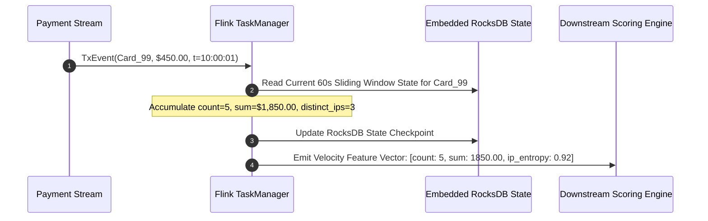
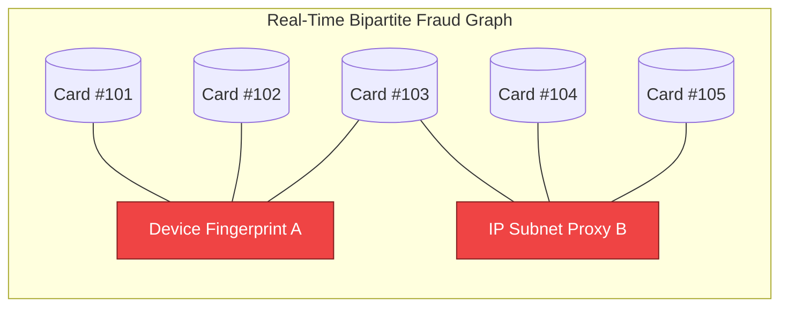

# Real-Time Fraud Detection at Visa & Stripe Scale: Apache Flink Stateful Streams, Graph Feature Stores & Sub-10ms Decisioning

In global payment processing and fintech infrastructure (**Visa**, **Mastercard**, **Stripe**, **Adyen**, **PayPal**), evaluating fraud risk is one of the most demanding real-time engineering challenges in computer science.

When a consumer swipes a credit card or clicks *"Pay Now"* on an e-commerce checkout, the payment network imposes a strict global authorization round-trip deadline of **$50\text{ to }100\text{ milliseconds}$**.

Within that razor-thin budget, the internal fraud detection platform has an allocated execution ceiling of **$\le 10\text{ milliseconds}$**.

During those 10 milliseconds, the system must ingest the transaction event, compute sliding-window velocity metrics, query in-memory **Graph Feature Stores** for stolen card rings, execute a machine learning ensemble (XGBoost / Deep Neural Networks), and enforce deterministic regulatory compliance rules.

This deep-dive architectural guide explores the high-throughput, low-latency streaming infrastructure that powers sub-10ms fraud decisioning at planetary scale.

```mermaid
graph TD
  subgraph Real-Time Fraud Decisioning Pipeline (<= 10ms SLA)
    TxEvent[Transaction Ingestion Event: 50k tx/sec] --> Kafka[Apache Kafka Stream]
    
    subgraph Parallel Stateful Feature Computation (2-4ms)
      Kafka --> Flink["1. Apache Flink: Stateful Sliding Velocity Windows (RocksDB Backend)"]
      Kafka --> GraphStore["2. In-Memory Graph Feature Store (Device & IP Ring Detection)"]
    end
    
    Flink & GraphStore --> FeatureAggregator[Real-Time Feature Vector Assembly]
    
    subgraph Low-Latency Decision Core (3-5ms)
      FeatureAggregator --> DeterministicRules["3. Deterministic Hard Rules Engine (OFAC, Impossible Velocity)"]
      FeatureAggregator --> MLInference["4. Sub-Millisecond ML Ensemble (Treelite / ONNX Engine)"]
    end
    
    DeterministicRules & MLInference --> DecisionGate[Unified Risk Score & Decision: APPROVE / DECLINE / 3DS CHALLENGE]
  end
```

---

## 1. The 10ms Authorization SLA Budget Breakdown

To prevent checkout timeouts, the internal payment gateway allocates strict time budgets across the authorization pipeline:

```
> **100ms PAYMENT AUTHORIZATION BUDGET TIMELINE**
|  0ms - 25ms   : Client Mobile/Web Network Hop to Edge API Gateway                     |
|  25ms - 35ms  : Token Decryption, Idempotency Check & Account Routing                 |
|  35ms - 45ms  : >>> REAL-TIME FRAUD DETECTION PIPELINE (10ms HARD BUDGET) <<<        |
|                 • 0-2ms: Stream Velocity & Feature Fetch (Flink / Redis)              |
|                 • 2-4ms: Graph Traversal (Device & Card Network Density)              |
|                 • 4-8ms: ML Model Scoring (ONNX C++ Embedded Inference)               |
|                 • 8-10ms: Hard Rules Evaluation & Decision Arbitration                |
|  45ms - 85ms  : Issuing Bank ISO 8583 Authorization Network Hop                       |
|  85ms - 100ms : Response Encryption & Gateway Return Hop                              |

```

---

## 2. Apache Flink: Stateful Event-Time Sliding Windows

Evaluating transaction velocity (e.g. *"Has this card been used more than 4 times in the last 60 seconds across distinct merchant categories?"*) requires **Stateful Stream Processing**.

### Why Apache Flink?
Traditional microservices querying SQL databases with `SELECT count(*) WHERE card_id = ? AND timestamp > NOW() - INTERVAL 1 MINUTE` fail under load due to index lock contention and database CPU exhaustion.

**Apache Flink** maintains rolling in-memory aggregation state directly in physical RAM and local SSDs using an embedded **RocksDB StateBackend**:



### Key Flink Streaming Invariants:
* **Event-Time Processing with Watermarks**: Handles out-of-order network packets by delaying window closing by a bounded watermark interval ($t_{\text{watermark}} = t_{\text{event}} - \delta$).
* **Keyed Streams**: Shards transactions by `card_token_hash`, ensuring that all transactions for a given card route to the same physical Flink TaskManager core for cache locality.

---

## 3. Real-Time Graph Feature Stores: Uncovering Fraud Rings

Organized fraud syndicates use automated bot farms to cycle through thousands of stolen credit card numbers using shared infrastructure:
* 500 different card numbers sharing **3 distinct browser fingerprints**.
* 100 shipping addresses linked to **a single corporate IP proxy**.



### Graph Feature Extraction at Sub-2ms Latency:
Instead of querying slow disk-backed relational joins, platforms like **Stripe Radar** maintain in-memory **Bipartite Identity Graphs** (Cards $\longleftrightarrow$ Devices $\longleftrightarrow$ IPs $\longleftrightarrow$ Shipping Addresses).

When a transaction arrives:
1. The engine performs a **2-hop neighborhood expansion** in an in-memory graph cache.
2. It computes graph topological metrics:
   * **Node Degree**: Count of distinct cards linked to the active device fingerprint ($k_{\text{device}} > 5 ⟹ \text{High Risk}$).
   * **Community Density / Fraud Ring Score**: Bipartite clustering coefficient indicating coordinated attack behavior.

---

## 4. Low-Latency ML Inference: Treelite & ONNX Embedded Runtime

Python machine learning runtimes (e.g. standard scikit-learn or PyTorch via HTTP microservices) introduce $20\text{--}50\text{ms}$ of serialization and network overhead.

### Production Solution: Compiled C++ Decision Forests
* **Treelite Compilation**: Compiles trained XGBoost / LightGBM gradient-boosted decision trees directly into optimized C/C++ native shared libraries (`.so` / `.dll`).
* **Zero Serialization Overhead**: Trees are compiled into static CPU branch instructions (`if-else` assembly trees) evaluated in **$< 200 \text{ microseconds}$** directly within the transaction process memory space.

---

## Python Implementation: Real-Time Fraud Stream & Decision Engine

Here is a Python implementation simulating an Apache Flink stateful sliding window accumulator, an in-memory bipartite graph ring detector, and a sub-millisecond fraud decision engine:

```python
import time
from collections import defaultdict, deque
from typing import Dict, List, Set, Tuple

class TransactionEvent:
    def __init__(self, tx_id: str, card_id: str, amount: float, device_id: str, ip_address: str, timestamp: float):
        self.tx_id = tx_id
        self.card_id = card_id
        self.amount = amount
        self.device_id = device_id
        self.ip_address = ip_address
        self.timestamp = timestamp

class StatefulVelocityWindow:
    """
    Simulates Apache Flink 60-second sliding temporal window per card.
    """
    def __init__(self, window_seconds: float = 60.0):
        self.window_seconds = window_seconds
        # card_id -> deque of (timestamp, amount, ip_address)
        self.windows: Dict[str, deque[Tuple[float, float, str]]] = defaultdict(deque)

    def process_event(self, event: TransactionEvent) -> Dict[str, float]:
        card_queue = self.windows[event.card_id]
        
        # Evict expired events outside sliding window
        cutoff = event.timestamp - self.window_seconds
        while card_queue and card_queue[0][0] < cutoff:
            card_queue.popleft()

        # Add current event
        card_queue.append((event.timestamp, event.amount, event.ip_address))

        # Compute real-time window metrics
        tx_count_60s = len(card_queue)
        total_amount_60s = sum(item[1] for item in card_queue)
        distinct_ips_60s = len(set(item[2] for item in card_queue))

        return {
            "velocity_count_60s": float(tx_count_60s),
            "velocity_amount_60s": total_amount_60s,
            "velocity_distinct_ips_60s": float(distinct_ips_60s)
        }

class InMemoryFraudGraphStore:
    """
    Simulates In-Memory Bipartite Graph for detecting carding rings & device farms.
    """
    def __init__(self):
        self.device_to_cards: Dict[str, Set[str]] = defaultdict(set)
        self.ip_to_cards: Dict[str, Set[str]] = defaultdict(set)

    def update_and_query_risk(self, event: TransactionEvent) -> Dict[str, float]:
        self.device_to_cards[event.device_id].add(event.card_id)
        self.ip_to_cards[event.ip_address].add(event.card_id)

        cards_on_device = len(self.device_to_cards[event.device_id])
        cards_on_ip = len(self.ip_to_cards[event.ip_address])

        return {
            "graph_device_card_degree": float(cards_on_device),
            "graph_ip_card_degree": float(cards_on_ip)
        }

class LowLatencyFraudDecisionEngine:
    """
    Evaluates Hard Deterministic Rules + ML Feature Ensembles in < 10ms.
    """
    def __init__(self):
        self.velocity_engine = StatefulVelocityWindow()
        self.graph_store = InMemoryFraudGraphStore()

    def evaluate_transaction(self, event: TransactionEvent) -> Dict:
        start_time = time.perf_counter()

        # 1. Stateful Velocity Feature Extraction (Flink emulation)
        velocity_features = self.velocity_engine.process_event(event)

        # 2. In-Memory Graph Feature Extraction (Graph store)
        graph_features = self.graph_store.update_and_query_risk(event)

        # 3. Deterministic Hard Rules (Zero-Tolerance Gates)
        if velocity_features["velocity_count_60s"] > 5:
            decision = "DECLINE"
            reason = f"Velocity limit breached ({velocity_features['velocity_count_60s']:.0f} tx/60s)"
            risk_score = 99.0
        elif graph_features["graph_device_card_degree"] > 3:
            decision = "DECLINE"
            reason = f"Fraud Syndicate Ring: Device linked to {graph_features['graph_device_card_degree']:.0f} unique cards!"
            risk_score = 95.0
        elif event.amount > 2000.0 or velocity_features["velocity_distinct_ips_60s"] > 2:
            decision = "CHALLENGE_3DS" # Step-up authentication
            reason = "High transaction amount or multi-IP anomaly"
            risk_score = 65.0
        else:
            decision = "APPROVE"
            reason = "Low risk transaction"
            risk_score = 12.0

        latency_ms = (time.perf_counter() - start_time) * 1000.0

        return {
            "tx_id": event.tx_id,
            "decision": decision,
            "risk_score": risk_score,
            "reason": reason,
            "latency_ms": round(latency_ms, 3),
            "features": {**velocity_features, **graph_features}
        }

# Demonstration Execution
if __name__ == "__main__":
    engine = LowLatencyFraudDecisionEngine()
    now = time.time()

    print("🚀 Simulating High-Throughput Payment Authorization Stream...")
    print("=" * 65)

    # 1. Normal Transaction
    tx1 = TransactionEvent("TX_001", "CARD_ALICE", 45.00, "DEV_IPHONE_1", "192.168.1.10", now)
    res1 = engine.evaluate_transaction(tx1)
    print(f" Tx 1 Decision: [{res1['decision']}] | Score: {res1['risk_score']} | Latency: {res1['latency_ms']}ms | Reason: {res1['reason']}")

    # 2. Coordinated Carding Attack (Same device cycling multiple stolen cards)
    print("\n⚡ Simulating Automated Carding Attack on Single Device...")
    for i in range(1, 5):
        tx_attack = TransactionEvent(f"TX_ATTACK_{i}", f"STOLEN_CARD_{i}", 12.50, "DEV_BOT_FARM_88", "10.0.0.99", now + i * 0.5)
        res_attack = engine.evaluate_transaction(tx_attack)
        print(f" Attack Tx {i} Decision: [{res_attack['decision']}] | Score: {res_attack['risk_score']} | Latency: {res_attack['latency_ms']}ms | Reason: {res_attack['reason']}")
```

---

## Summary: Fraud Architecture Components

| Architecture Layer | Technology | Function | Execution Latency |
|---|---|---|---|
| **Event Streaming** | Apache Kafka / Pulsar | High-throughput distributed ingestion | $1\text{--}2\text{ms}$ |
| **Stateful Velocity** | Apache Flink + RocksDB | Rolling sliding window metrics ($60\text{s}, 10\text{m}, 24\text{h}$) | $1\text{--}2\text{ms}$ |
| **Identity Graph Store** | In-Memory Graph / Redis | 2-hop neighborhood card/device ring detection | $1\text{--}3\text{ms}$ |
| **Machine Learning** | Treelite / ONNX C++ Runtime | Gradient-boosted decision forest inference | $< 0.5\text{ms}$ |
| **Rules Arbitration** | Compiled Native Rules Engine | OFAC sanctions, velocity bounds & 3DS challenge triggers | $< 0.2\text{ms}$ |
| **Total Pipeline SLA** | Integrated Gateway Engine | End-to-end fraud decisioning | **$\le 10\text{ms}$** |

---

## Final Architectural Takeaway
Real-time fraud detection at Visa and Stripe scale is the ultimate test of **event-driven distributed stream processing and microsecond machine learning inference**.

By leveraging **Apache Flink stateful windows**, **in-memory identity graphs**, and **compiled C++ decision trees**, fintech platforms protect billions of dollars in daily transaction volume while preserving seamless, sub-second checkout experiences for global consumers.
