# Real-Time Token Streaming: Designing SSE and WebSocket Gateways in Node/Hono

> [!NOTE]
> **📖 Article Overview**
> In generative systems, perceived latency is everything. Waiting 10 seconds for an agent to compile a complete response is a frustrating user experience. By streaming outputs token-by-token, we reduce the Time-to-First-Token (TTFT) to milliseconds. This article evaluates the architectural choices for token delivery—**Server-Sent Events (SSE)** vs. **WebSockets**—and provides a complete TypeScript gateway implementation using **Hono**.

---

## The Latency Illusion: Optimizing Perceived Speed

Large Language Models generate text sequentially (token-by-token). When querying an API (like Claude or OpenAI), the backend receives these tokens as a stream. 

If your backend waits for the model to finish generating the entire response before returning it to the client, you introduce massive latency:
*   **Time-to-First-Token (TTFT)**: With streaming, the user sees the model start typing within 200ms–500ms.
*   **Full Delivery**: Without streaming, a 500-token response forces the user to stare at a loading spinner for 8 to 12 seconds.

To build responsive frontends, we must establish a persistent connection that streams these tokens from the backend model output to the browser in real-time.

---

## SSE vs. WebSockets: Protocol Comparison

When designing a token gateway, two protocols dominate: **Server-Sent Events (SSE)** and **WebSockets**.

```mermaid
%%{init: {'theme': 'dark', 'themeVariables': { 'primaryColor': '#0ea5e9', 'primaryTextColor': '#f3f4f6', 'primaryBorderColor': '#38bdf8', 'lineColor': '#0ea5e9', 'secondaryColor': '#111827', 'tertiaryColor': '#111827'}}}%%
graph TD
    subgraph Server-Sent Events SSE
        A[Client Browser] -->|HTTP GET Request / Keep-Alive| B[Hono API Gateway]
        B -->|Keep Connection Open| A
        B -->|Stream Data Chunk 1| A
        B -->|Stream Data Chunk 2| A
        B -->|Stream End Event| A
    end
    
    subgraph WebSockets
        C[Client Browser] -->|HTTP Upgrade Handshake| D[Node.js Server]
        D -->|Establish TCP Socket| C
        C <-->|Bidirectional Data Frame: Send Input| D
        D <-->|Bidirectional Data Frame: Stream Output| C
    end

    style A fill:#1e293b,stroke:#0ea5e9,stroke-width:2px
    style B fill:#0f172a,stroke:#38bdf8,stroke-width:2px
    style C fill:#1e293b,stroke:#0ea5e9,stroke-width:2px
    style D fill:#0f172a,stroke:#38bdf8,stroke-width:2px
```



*   **Server-Sent Events (SSE)**: Runs over standard HTTP using the `text/event-stream` mime-type. It is **unidirectional** (server to client) and lightweight, making it ideal for standard chatbot outputs.
*   **WebSockets**: Establishes a full-duplex, **bidirectional** TCP connection. Ideal for complex agent runs where the user must provide real-time inputs mid-execution (Human-in-the-loop gates).

---

## What's Good & What's Not

```
+---------------------------------------------------------------------------------------------------------------------+
|                                              STREAMING PROTOCOLS MATRIX                                             |
+---------------------+-------------------------------------------------+---------------------------------------------+
| Protocol Option     | What's Good (Pros)                              | What's Not (Cons)                           |
+---------------------+-------------------------------------------------+---------------------------------------------+
| Server-Sent Events  | * Easy Setup: Runs over standard HTTP/2.        | * Unidirectional: Cannot send client inputs |
| (SSE)               | * Auto-Reconnect: Native browser reconnection.  |   over the same stream connection.          |
|                     | * Clean Firewall Pass: Uses port 80/443.        | * Connection limits under HTTP/1.1 (max 6). |
+---------------------+-------------------------------------------------+---------------------------------------------+
| WebSockets          | * Full Bidirectional: Supports client inputs.  | * Complex Setup: Demands sticky sessions    |
|                     | * Binary Support: Streams images/audio easily.  |   and load balancer state sync.             |
|                     | * Sub-millisecond latency.                      | * No native reconnect/retry mechanism.      |
+---------------------+-------------------------------------------------+---------------------------------------------+
```

---

## Technical Implementation: Streaming SSE Gateways with Hono

Below is a complete TypeScript implementation using the **Hono** web framework. It defines an endpoint that calls an LLM generator and streams the tokens to the client using Server-Sent Events.

```typescript
import { Hono } from 'hono';
import { stream } from 'hono/streaming';

const app = new Hono();

// 1. Define SSE Token Streaming Route
app.get('/api/agent/stream/:jobId', async (c) => {
  const jobId = c.req.param('jobId');

  // Enforce HTTP headers for SSE keep-alive
  c.header('Content-Type', 'text/event-stream');
  c.header('Cache-Control', 'no-cache');
  c.header('Connection', 'keep-alive');

  return stream(c, async (streamInstance) => {
    console.log(`[*] Client connected to stream for Job: ${jobId}`);

    // Register stream termination abort signal
    streamInstance.onAbort(() => {
      console.log(`[-] Stream connection aborted by client for Job: ${jobId}`);
    });

    // Simulate reading token chunks from a model or queue generator
    const mockTokens = [
      "Analyzing ", "system ", "logs...\n",
      "Found: ", "DB_LOCK_CONTENTION ", "on ", "transaction ", "T-4091.\n",
      "Resolution: ", "Applied ", "advisory ", "lock ", "optimizations."
    ];

    for (const token of mockTokens) {
      // 2. Format payload according to the SSE standard: "data: <string>\n\n"
      const payload = `data: ${JSON.stringify({ token })}\n\n`;
      
      // Write token to HTTP connection
      await streamInstance.write(payload);
      
      // Simulate token generation latency
      await new Promise((r) => setTimeout(r, 150));
    }

    // 3. Send final close block signaling stream completion
    await streamInstance.write("data: [DONE]\n\n");
    console.log(`[+] Stream complete for Job: ${jobId}`);
  });
});

export default app;
```

---

## 🏁 Conclusion & Key Takeaways

Token streaming is essential for any modern AI platform user interface. When picking a protocol:

*   **Default to SSE**: If your agent only streams answers and logs to the user, Server-Sent Events are simpler to implement, proxy, and maintain.
*   **Upgrade to WebSockets**: If your pipeline requires human-in-the-loop interventions (e.g., asking the user to approve a code patch before executing it), deploy a full WebSocket connection.

In our next article, [Local LLM Fallback: Scaling Bulk Document Processing with Local vLLM & Ollama Runtimes](file:///G:/ReplitProjects/akmalkhaniub.github.io/blog/local-llm-scaling-runtimes-vllm-ollama.html), we will discuss how to set up local inference servers to handle batch operations without paying cloud API token fees.

---

### Research References & Resources
*   **Hono Streaming Guide**: [Streaming API documentation for Hono](https://hono.dev/)
*   **SSE Specification**: W3C Server-Sent Events standard — [HTML Living Standard](https://html.spec.whatwg.org/)
*   **MDN Web Docs**: [Using server-sent events guide](https://developer.mozilla.org/)
