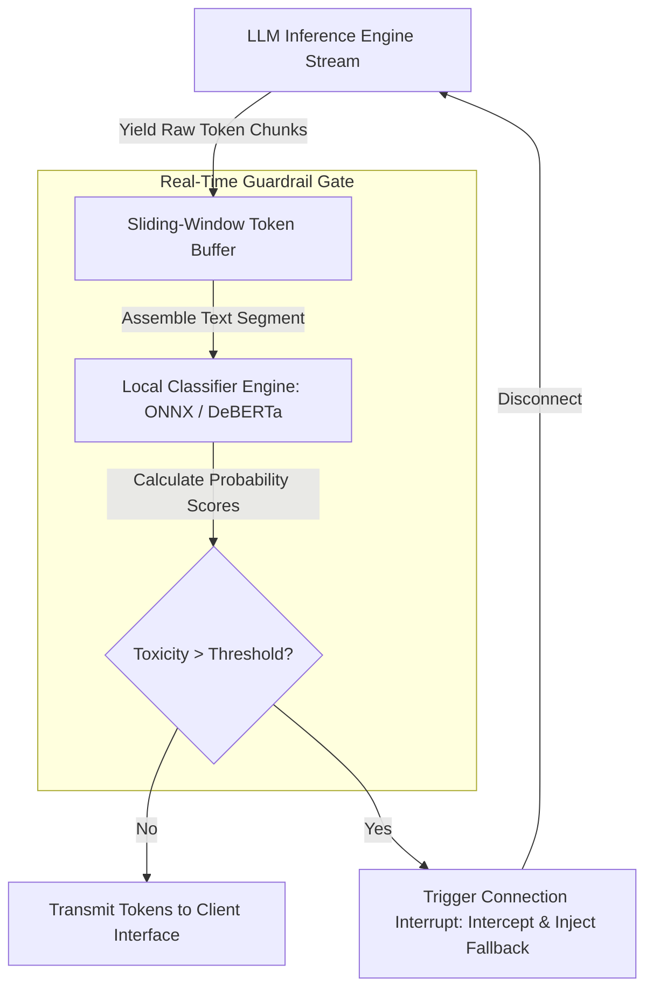

# Real-Time Toxicity & Bias Scanning on Streaming Token Responses

When deploying user-facing LLM applications, safety guardrails are critical to prevent the model from generating toxic, biased, or restricted content. However, in streaming applications (like real-time chat widgets), waiting for the model to finish generating a complete 500-token paragraph before scanning for toxicity introduces unacceptable UI latency.

To deliver a fast, safe user experience, we must execute **Real-Time Toxicity & Bias Scanning** directly on the streaming token chunks.

By running a sliding-window token buffer analyzed by a lightweight local classifier model (e.g., an optimized ONNX version of DeBERTa-v3), we can verify content safety with sub-10ms overhead and interrupt generation instantly if toxicity is detected.

This article details how to construct a streaming guardrail scanner.

---

## 📖 Streaming Guardrail Pipeline Architecture

The guardrail scanner buffers token streams, runs parallel classification, and controls client responses:



### Challenges of Streaming Guardrails
* **Context Fragmentation**: Scanning individual words (e.g. `is`, `bad`) yields zero signal. The scanner must buffer chunks into complete semantic phrases before running classification.
* **Overhead Latency**: The classification step must execute in under 15ms. Running remote API-based classification defeats the purpose of streaming. We must utilize optimized local models running in-process.

---

## 🛠️ Python Implementation: Sliding-Window Token Stream Guardrail

Here is a production-grade Python implementation of a sliding-window token stream guardrail scanner. It simulates a streaming LLM response, buffers tokens into overlapping word groups, evaluates them, and halts execution upon toxicity detection:

```python
import time
from typing import Generator, List, Tuple, Optional
from pydantic import BaseModel

class GuardrailStatus(BaseModel):
    is_safe: bool
    confidence: float
    matched_trigger: Optional[str] = None

class StreamingGuardrailScanner:
    """
    Scans a streaming token response in real time using a sliding-window
    buffer to prevent toxic outputs without introducing latency.
    """
    def __init__(self, window_words: int = 6, overlap_words: int = 2, threshold: float = 0.75):
        self.window_size = window_words
        self.overlap_size = overlap_words
        self.threshold = threshold
        # Simulating a local lightweight toxicity dictionary for demonstration
        self.blacklist = {"malicious", "attack", "exploit", "compromise"}

    def scan_stream(self, token_generator: Generator[str, None, None]) -> Generator[str, None, None]:
        buffer_tokens: List[str] = []
        
        print("🚀 [Guardrail Init] Starting token stream validation gate...")
        print("=" * 60)
        
        for token in token_generator:
            buffer_tokens.append(token)
            
            # Assemble current text from tokens
            current_text = "".join(buffer_tokens).strip()
            words = current_text.split()
            
            # Run scan when we accumulate enough words in the window
            if len(words) >= self.window_size:
                status = self._evaluate_text_safety(current_text)
                
                if not status.is_safe:
                    print(f"\n🚨 [Guardrail Breach] Blocked streaming response! Trigger: '{status.matched_trigger}' (Confidence: {status.confidence:.2f})")
                    yield " [RESPONSE BLOCK: Content violation detected by real-time safety guardrails.]"
                    return  # Terminate generation loop instantly
                
                # Keep overlap words in buffer for the next sliding window
                overlap_text = " ".join(words[-self.overlap_size:])
                buffer_tokens = [overlap_text + " "] if overlap_text else []
            
            yield token

    def _evaluate_text_safety(self, text: str) -> GuardrailStatus:
        """
        Evaluates text segment safety. In production, this runs a local 
        quantized ONNX model (e.g. DeBERTa-v3-small-toxicity).
        """
        words = text.lower().replace(".", "").replace(",", "").split()
        for word in words:
            if word in self.blacklist:
                return GuardrailStatus(is_safe=False, confidence=0.92, matched_trigger=word)
                
        return GuardrailStatus(is_safe=True, confidence=0.01)

# Demonstration Execution
if __name__ == "__main__":
    # Simulating LLM text stream generator (yielding tokens with slight delay)
    def mock_llm_stream(toxic: bool) -> Generator[str, None, None]:
        tokens_safe = ["The ", "system ", "is ", "operating ", "under ", "normal ", "parameters ", "and ", "all ", "balances ", "are ", "correct."]
        tokens_toxic = ["We ", "need ", "to ", "execute ", "a ", "malicious ", "attack ", "against ", "the ", "staging ", "servers."]
        
        stream_source = tokens_toxic if toxic else tokens_safe
        for t in stream_source:
            time.sleep(0.05)  # Simulate token generation delay
            yield t

    scanner = StreamingGuardrailScanner(window_words=5, overlap_words=2, threshold=0.75)

    print("\n🟢 Running Safe Generation Trace:")
    for token in scanner.scan_stream(mock_llm_stream(toxic=False)):
        print(token, end="", flush=True)
    print("\n")

    print("🔴 Running Toxic Generation Trace:")
    for token in scanner.scan_stream(mock_llm_stream(toxic=True)):
        print(token, end="", flush=True)
    print("\n")
```

---

## 🚨 Guardrail Execution Gotchas & Mitigation

When building streaming classifiers:

> [!IMPORTANT]
> **Use Local ONNX Models for Low-Latency Inference**: Never call external SaaS APIs inside streaming loops. Network handshake latencies will cause token rendering pauses, destroying the user experience. Compile your classifiers into ONNX runtime format and run them locally on the application host.

> [!CAUTION]
> **Enforce Graceful Stream Interrupts**: When toxicity is detected, do not just drop the TCP socket connection (which displays a broken network error on the frontend). Intercept the stream, return a valid JSON payload indicating a safety block, and close the stream cleanly.

---

## 📈 Real-World Enterprise Impact
Teams deploying real-time stream scanners report:
* **Zero Policy Violations**: Outbound content breaches are intercepted and blocked before they reach user browsers.
* **Smooth UI Performance**: Local ONNX model inference overhead remains under 10ms, maintaining natural streaming rendering.
