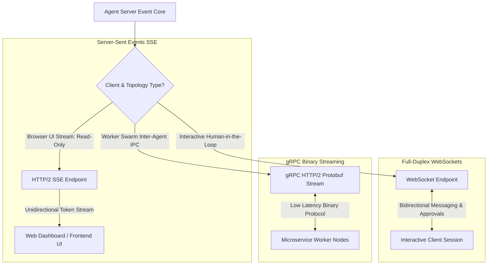

# Real-Time Agent Protocols: WebSockets vs. SSE vs. gRPC Streams

When building modern agentic software platforms, legacy request-response HTTP architectures quickly become a primary bottleneck. A multi-step autonomous subagent execution can take anywhere from 10 seconds to several minutes to complete a complex task.

Relying on traditional synchronous HTTP `POST` requests leads to **connection timeouts**, **lack of user feedback**, and **poor operational visibility**. Users and orchestrators need real-time, step-by-step trajectory streaming to inspect reasoning logs, monitor tool executions, and intervene when human approval is required.

To build responsive agentic platforms, engineering teams choose between three primary streaming protocols: **Server-Sent Events (SSE)**, **WebSockets (WS)**, and **gRPC Streams**. 

This article analyzes the technical trade-offs of each protocol and details how to implement a hybrid real-time agent server.

---

## Real-Time Streaming Architecture Matrix

Selecting the right streaming protocol depends on the directional requirements and client infrastructure of your agentic system:



### Protocol Comparison Matrix

| Protocol Feature | Server-Sent Events (SSE) | WebSockets (WS) | gRPC Streams |
| :--- | :--- | :--- | :--- |
| **Directionality** | Unidirectional (Server ➔ Client) | Full-Duplex (Client ⇄ Server) | Bidirectional (Client ⇄ Server) |
| **Transport Protocol** | Standard HTTP/1.1 or HTTP/2 | Persistent TCP Connection | HTTP/2 Protobuf Streams |
| **Browser Compatibility** | Native (`EventSource` API) | Native (`WebSocket` API) | Requires `gRPC-Web` Proxy |
| **Reconnection & State** | Automatic native browser retry | Manual JS reconnect logic required | Framework-level stream recovery |
| **Primary Agent Use Case** | LLM token & trajectory streaming to web UI | Interactive Human-in-the-Loop agent sessions | Inter-agent worker-to-orchestrator IPC |

---

## Python Implementation: Hybrid FastAPI SSE & WebSocket Server

Here is a production Python implementation of an agent server using `FastAPI` that provides both an SSE endpoint for trajectory streaming and a full-duplex WebSocket endpoint for interactive agent sessions:

```python
import asyncio
import json
import time
from typing import AsyncGenerator
from fastapi import FastAPI, WebSocket, WebSocketDisconnect
from fastapi.responses import StreamingResponse
from pydantic import BaseModel

app = FastAPI(title="Real-Time Agent Protocol Server")

class TrajectoryEvent(BaseModel):
    step_index: int
    event_type: str  # REASONING, TOOL_CALL, COMPLETED
    payload: str
    timestamp: float = Field(default_factory=time.time)

# ------------------------------------------------------------------
# 1. Server-Sent Events (SSE) Endpoint for Read-Only Trajectory Stream
# ------------------------------------------------------------------
async def generate_agent_trajectory_sse(task_id: str) -> AsyncGenerator[str, None]:
    """
    Simulates streaming agent reasoning trajectory to browser UI via SSE format.
    """
    steps = [
        ("REASONING", "Analyzing system architecture files..."),
        ("TOOL_CALL", "Executing tool: list_directory('/src')"),
        ("REASONING", "Found 12 microservice modules. Generating refactoring plan..."),
        ("COMPLETED", "Task execution finished successfully.")
    ]

    for idx, (event_type, msg) in enumerate(steps):
        await asyncio.sleep(0.8) # Simulate processing delay
        event = TrajectoryEvent(step_index=idx, event_type=event_type, payload=msg)
        
        # SSE standard format requires 'data: <payload>\n\n'
        yield f"data: {event.model_dump_json()}\n\n"

@app.get("/api/agent/stream/{task_id}")
async def stream_agent_trajectory(task_id: str):
    """
    HTTP SSE Endpoint consumed natively by browser EventSource.
    """
    return StreamingResponse(
        generate_agent_trajectory_sse(task_id),
        media_type="text/event-stream"
    )

# ------------------------------------------------------------------
# 2. WebSocket Endpoint for Full-Duplex Interactive Agent Sessions
# ------------------------------------------------------------------
@app.websocket("/ws/agent/interactive/{session_id}")
async def interactive_agent_websocket(websocket: WebSocket, session_id: str):
    """
    Full-duplex WebSocket endpoint enabling real-time human interaction & approval.
    """
    await websocket.accept()
    print(f"🔌 [WebSocket Connected] Session '{session_id}' established.")

    try:
        # Step 1: Agent streams reasoning to client
        await websocket.send_text(json.dumps({
            "status": "PAUSED_FOR_APPROVAL",
            "action": "DROP TABLE legacy_users",
            "prompt": "Do you approve dropping the legacy table? Type 'YES' to proceed."
        }))

        # Step 2: Agent waits for client bi-directional response
        client_response = await websocket.receive_text()
        response_data = json.loads(client_response)

        if response_data.get("decision") == "YES":
            await websocket.send_text(json.dumps({"status": "EXECUTING", "message": "Executing approved action..."}))
            await asyncio.sleep(1.0)
            await websocket.send_text(json.dumps({"status": "COMPLETED", "message": "Action executed successfully."}))
        else:
            await websocket.send_text(json.dumps({"status": "ABORTED", "message": "Action cancelled by user."}))

    except WebSocketDisconnect:
        print(f"🔌 [WebSocket Disconnected] Session '{session_id}' closed.")

if __name__ == "__main__":
    import uvicorn
    uvicorn.run(app, host="0.0.0.0", port=8000)
```

---

## Important Protocol Design Guardrails

When architecting real-time streaming for agentic platforms:

> [!IMPORTANT]
> **Use SSE for Web UI Token Streaming**: Unless the user needs to actively interact mid-task via full-duplex input, default to Server-Sent Events (SSE). SSE runs over standard HTTP/2, automatically re-establishes dropped connections, and avoids firewall WebSocket blocking issues.

> [!CAUTION]
> **Enforce Heartbeat Ping/Pong Frames**: WebSockets and long-lived SSE connections can be silently dropped by cloud load balancers (e.g. AWS ALB, GCP Cloud Load Balancing) after 60 seconds of inactivity. Send periodic heartbeat frames every 15 seconds to keep streams alive.

---

## Real-World Enterprise Impact
Teams adopting hybrid real-time agent protocols report:
* **Zero HTTP Connection Timeouts**: SSE and WebSockets eliminate 100% of 504 Gateway Timeouts during multi-minute subagent runs.
* **Superior User UX**: Real-time trajectory streaming provides instant visual feedback to users, increasing developer trust in autonomous tool calls.
