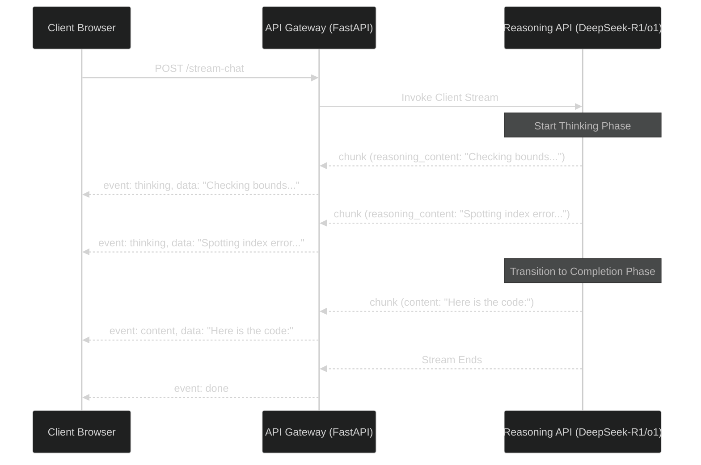

# Production Engineering for Reasoning Models: Handling Thinking Tokens and Timeout Budgets

> [!NOTE]
> **📖 Article Overview**
> Reasoning models like DeepSeek-R1, OpenAI o1, and o3-mini have fundamentally shifted LLM execution from *retrieval/completion* to *on-the-fly computation*. By producing hundreds of "thinking tokens" before returning the final answer, these models require engineers to overhaul their backend infrastructure. Naive API clients experience connection timeouts, fragmented streaming protocols, and runaway API bills. This article walks through the production engineering challenges of reasoning models — handling connection life cycles, parsing streaming reasoning traces, and setting cost/latency guards — with a complete FastAPI implementation.

---

## The Anatomy of a Reasoning Request

Standard completion models (like GPT-4o or Claude 3.5 Sonnet) output text token-by-token directly to the user. Reasoning models, however, split their output into a **thinking phase** (where they explore options, spot errors, and plan responses) and a **completion phase** (the actual answer).



This split execution creates three immediate architectural failures if not managed:
1. **Connection Timeouts**: Gates, firewalls, and proxies (Nginx, Cloudflare, ALB) assume a connection is dead if the model spends 90 seconds generating thinking tokens without sending a standard content byte.
2. **Chunk Demultiplexing**: Standard SSE clients expect a simple text stream. If you pass the thinking tokens directly, they clutter the UI. They must be routed to a collapsible "Thinking Process" box.
3. **Runaway Cost Spikes**: A single query on a complex prompt can trigger 8,000+ reasoning tokens, costing several dollars and hitting rate-limit caps.

---

## Problem 1: Preventing Connection Timeouts and Drops

Because reasoning models think before they write, the time-to-first-content-byte (TTFCB) can be extremely high. If your reverse proxy (e.g., Nginx) has a `proxy_read_timeout` of 30 seconds, it will sever the connection during a long thinking phase.

### Solutions
* **Lower Layer Keep-Alives**: Configure TCP keep-alives at the OS level on your gateway servers.
* **Application-Level Heartbeats**: If using Server-Sent Events (SSE), send periodic comments or blank packets (e.g. `: ping\n\n`) every 5–10 seconds to keep the connection alive while the reasoning model is computing in the background.
* **Adjust Gateway Timeouts**: Set reverse proxy, CDN, and ALB read timeouts for reasoning routes to at least 180 seconds.

---

## Problem 2: Streaming and Parsing Traces in Real-Time

DeepSeek-R1 returns reasoning chunks in a dedicated key `reasoning_content` in the OpenAI-compatible stream. OpenAI's models (like `o1` and `o3-mini`) now support streaming but use a different key (`reasoning_tokens`) or output format depending on the API version. 

To support a seamless front-end, your API gateway must parse these chunks, normalize the keys, and send distinct event types (`thinking` vs. `content`) to the frontend.

---

## Problem 3: Setting Cost-Control and Runaway Guardrails

Reasoning loops can get stuck. If a model falls into an infinite backtracking cycle, it will exhaust its maximum completion token budget, costing you money and degrading latency.

### Rules of Engagement
1. **Enforce `max_completion_tokens`**: Always set this limit explicitly. Unlike standard models, a high `max_tokens` on a reasoning model acts as a hard cap on both thinking and output combined. For DeepSeek-R1, cap it around `4000` to `8000` tokens depending on the task complexity.
2. **Track Live Usage Limits**: Keep a running tally of reasoning tokens received per stream. If the count exceeds your application's threshold (e.g. 3,000 reasoning tokens for a simple query), sever the stream upstream and throw a user-friendly error to prevent runaway costs.

---

## Implementation: FastAPI Streaming Gateway for Reasoning Models

Here is a complete, production-ready FastAPI gateway that handles DeepSeek-R1 streaming, routes thinking tokens to a separate SSE event channel, sends keep-alive pings, and enforces token-usage boundaries.

```python
import asyncio
import json
from typing import AsyncGenerator
from fastapi import FastAPI, HTTPException
from fastapi.responses import StreamingResponse
from pydantic import BaseModel
from openai import AsyncOpenAI
from openai.types.chat import ChatCompletionChunk

app = FastAPI()

# Initialize the OpenAI client pointing to a DeepSeek-compatible endpoint
client = AsyncOpenAI(
    api_key="your-deepseek-api-key",
    base_url="https://api.deepseek.com/v1"  # Or your local vLLM endpoint
)

class ChatRequest(BaseModel):
    message: str
    model: str = "deepseek-reasoner"
    max_completion_tokens: int = 4096

async def stream_reasoning_handler(request: ChatRequest) -> AsyncGenerator[str, None]:
    try:
        # Create completion stream
        stream = await client.chat.completions.create(
            model=request.model,
            messages=[{"role": "user", "content": request.message}],
            stream=True,
            # Hard limit to prevent runaway reasoning loops and billing spikes
            max_completion_tokens=request.max_completion_tokens
        )
        
        reasoning_token_count = 0
        MAX_REASONING_TOKENS_BUDGET = 3000
        
        async for chunk in stream:
            # Check for API cancellations
            if not isinstance(chunk, ChatCompletionChunk):
                continue
                
            delta = chunk.choices[0].delta
            
            # 1. Parse DeepSeek-R1/OpenAI-compatible reasoning tokens
            reasoning_content = getattr(delta, "reasoning_content", None)
            # 2. Parse standard completion content
            content = getattr(delta, "content", None)
            
            if reasoning_content:
                reasoning_token_count += 1
                
                # Runaway guardrail check
                if reasoning_token_count > MAX_REASONING_TOKENS_BUDGET:
                    yield f"event: error\ndata: {json.dumps({'detail': 'Reasoning budget exceeded'})}\n\n"
                    break
                    
                yield f"event: thinking\ndata: {json.dumps({'text': reasoning_content})}\n\n"
                
            elif content:
                yield f"event: content\ndata: {json.dumps({'text': content})}\n\n"
                
            # Yield control back to loop
            await asyncio.sleep(0)
            
        # Send end signal
        yield "event: done\ndata: {}\n\n"

    except asyncio.CancelledError:
        # Gracefully handle client disconnects (crucial for freeing API sockets)
        print("Client disconnected. Cleaning up stream resources.")
        raise
    except Exception as e:
        yield f"event: error\ndata: {json.dumps({'detail': str(e)})}\n\n"

@app.post("/api/chat")
async def chat_endpoint(request: ChatRequest):
    return StreamingResponse(
        stream_reasoning_handler(request),
        media_type="text/event-stream"
    )
```

### Key Highlights of the Code:
* **Separation of Channels**: The gateway yields `event: thinking` for reasoning and `event: content` for the final text. The frontend UI can easily listen to these distinct event types and route content to different UI boxes.
* **Runaway Guard**: The `MAX_REASONING_TOKENS_BUDGET` check stops generating tokens if the model enters a reasoning loop, saving you from giant API bills.
* **Disconnect Handler**: The `asyncio.CancelledError` block catches client aborts, allowing you to stop the upstream API stream immediately and avoid paying for unread reasoning tokens.

---

## Conclusion & Takeaways

To build production-ready systems on top of reasoning models:
* [ ] **Never stream reasoning directly to the content block**: Demultiplex `reasoning_content` and standard `content` at the gateway level.
* [ ] **Enforce connection keep-alives**: Use application-level heartbeats (ping frames) to prevent intermediate proxies from severing slow connections.
* [ ] **Set `max_completion_tokens` and reasoning budgets**: Protect your systems against loop-backtracking bugs and run-away cost spikes.
* [ ] **Handle early client disconnects**: Always intercept request cancellations to release upstream API stream allocations immediately.
