# Redis in Production: The Hard Lessons

> [!NOTE]
> **📖 Article Overview**
> Redis is the workhorse of AI infrastructure — caching LLM responses, managing BullMQ job queues, storing session state, and acting as a pub/sub broker for agent coordination. It looks simple: set a key, get a key. But production Redis clusters fail in ways that are expensive and hard to debug: eviction policies silently deleting your job queue, Lua scripts running non-atomically in cluster mode, SCAN causing latency spikes in large keyspaces, connection pool exhaustion under bursty AI workloads, and persistence configurations that guarantee data loss on restart. This article covers **7 hard production Redis lessons** with Python (`redis-py` / `redis.asyncio`) and TypeScript (`ioredis`) implementations.

---

## Redis Fails Quietly — That's the Danger

Unlike Postgres, which throws errors and rolls back, Redis's failure modes are often silent:

- **Eviction deletes your BullMQ jobs** — worker silently loses tasks with no exception
- **`KEYS *` blocks your server** — one admin command freezes all Redis operations for seconds
- **Wrong persistence config** — Redis restarts after OOM and loses all data, logging a single `INFO` level message

```mermaid
%%{init: {'theme': 'dark', 'themeVariables': { 'primaryColor': '#ef4444', 'primaryTextColor': '#f3f4f6', 'primaryBorderColor': '#f87171', 'lineColor': '#ef4444', 'secondaryColor': '#111827', 'tertiaryColor': '#0f172a'}}}%%
flowchart TD
    R[Redis Server] --> L1{Memory Limit<br/>Reached?}
    L1 -->|Yes + allkeys-lru| E1[💥 Lesson 1: LRU silently<br/>evicts job queue keys]
    L1 -->|No| L2{KEYS or<br/>SMEMBERS on<br/>huge set?}
    L2 -->|Yes| E2[💥 Lesson 2: O-n commands<br/>block entire server]
    L2 -->|No| L3{Cluster Mode?}
    L3 -->|Lua across slots| E3[💥 Lesson 3: Lua not<br/>atomic across nodes]
    L3 -->|Wrong keyslot| E4[💥 Lesson 4: MGET fails<br/>on different slots]
    L3 -->|No| L4{Persistence<br/>Config?}
    L4 -->|No AOF or RDB| E5[💥 Lesson 5: All data<br/>lost on restart]
    L4 -->|OK| L5{Connection<br/>Pool?}
    L5 -->|No pool / wrong size| E6[💥 Lesson 6: Connection<br/>exhaustion under load]
    L5 -->|OK| L6{TTL Strategy?}
    L6 -->|No TTL on sessions| E7[💥 Lesson 7: Memory<br/>grows without bound]

    style E1 fill:#7f1d1d,stroke:#ef4444,stroke-width:2px
    style E2 fill:#7f1d1d,stroke:#ef4444,stroke-width:2px
    style E3 fill:#78350f,stroke:#f59e0b,stroke-width:2px
    style E4 fill:#78350f,stroke:#f59e0b,stroke-width:2px
    style E5 fill:#7f1d1d,stroke:#ef4444,stroke-width:2px
    style E6 fill:#1e3a5f,stroke:#3b82f6,stroke-width:2px
    style E7 fill:#1e3a5f,stroke:#3b82f6,stroke-width:2px
```



---

## Lesson 1: The `allkeys-lru` Eviction Policy Eats Your Job Queue

**Symptom**: BullMQ jobs disappear without being processed. No worker errors. Workers show as active. Jobs simply never complete.

**Root cause**: By default, many managed Redis instances (AWS ElastiCache, Redis Cloud) configure `maxmemory-policy allkeys-lru`. Under memory pressure, Redis evicts **any key** using LRU — including your BullMQ job keys, agent session state, and rate limiter counters.

```bash
# Check current eviction policy
redis-cli CONFIG GET maxmemory-policy
# "maxmemory-policy"
# "allkeys-lru"  ← DANGER for job queues

# ✅ Correct policy for mixed cache + persistent data workloads
redis-cli CONFIG SET maxmemory-policy volatile-lru
# Evicts only keys WITH an expiry set — leaves keys without TTL (job queues!) untouched
```

```python
import redis

r = redis.Redis(host='localhost', decode_responses=True)

def audit_redis_config(client: redis.Redis) -> dict:
    """Audit critical Redis configuration for production safety."""
    config = {}
    
    # Check eviction policy
    policy = client.config_get('maxmemory-policy')['maxmemory-policy']
    config['eviction_policy'] = {
        'value': policy,
        'safe': policy in ('volatile-lru', 'volatile-ttl', 'volatile-lfu', 'noeviction'),
        'risk': 'CRITICAL' if policy == 'allkeys-lru' else 'OK',
        'recommendation': 'Use volatile-lru if mixing cache and persistent data'
    }
    
    # Check max memory
    maxmem = client.config_get('maxmemory')['maxmemory']
    config['maxmemory'] = {
        'value': maxmem,
        'configured': maxmem != '0',
        'risk': 'HIGH' if maxmem == '0' else 'OK',
        'recommendation': 'Always set maxmemory to prevent OS OOM killer'
    }
    
    # Check persistence
    save_config = client.config_get('save')['save']
    aof = client.config_get('appendonly')['appendonly']
    config['persistence'] = {
        'rdb_enabled': bool(save_config),
        'aof_enabled': aof == 'yes',
        'risk': 'CRITICAL' if not save_config and aof != 'yes' else 'OK',
        'recommendation': 'Enable AOF for durable queues, RDB for cache-only workloads'
    }
    
    return config

print(audit_redis_config(r))
```

**The rule**: Use `volatile-lru` for any Redis instance storing both cache data (with TTL) and durable data (no TTL, like job queues). Reserve `allkeys-lru` only for pure cache deployments.

---

## Lesson 2: `KEYS *` and `SMEMBERS` Block Everything

**Symptom**: Once per day, your entire application freezes for 3-10 seconds. Redis latency spikes to thousands of milliseconds. The timing correlates with a cron job or admin script.

**Root cause**: Redis is single-threaded. `KEYS *` on a keyspace with 1 million keys takes 500ms–2s — during which **no other command can execute**. Same for `SMEMBERS` on a very large set.

```python
# ❌ NEVER in production — blocks Redis for all clients during scan
all_keys = redis_client.keys("agent:session:*")     # O(N) — dangerous
all_members = redis_client.smembers("all_user_ids")  # O(N) — dangerous

# ✅ Use SCAN — cursor-based, non-blocking, runs in small O(1) batches
def scan_keys_safe(client: redis.Redis, pattern: str, count: int = 100):
    """Iterates keys without blocking the server. Safe for production."""
    cursor = 0
    while True:
        cursor, keys = client.scan(cursor=cursor, match=pattern, count=count)
        yield from keys
        if cursor == 0:
            break

# Usage
for key in scan_keys_safe(r, "agent:session:*"):
    print(key)

# ✅ For sets: use SSCAN instead of SMEMBERS
def scan_set_safe(client: redis.Redis, key: str, count: int = 100):
    cursor = 0
    while True:
        cursor, members = client.sscan(key, cursor=cursor, count=count)
        yield from members
        if cursor == 0:
            break

# ✅ Async version for FastAPI / asyncio contexts
import redis.asyncio as aioredis

async def scan_keys_async(client: aioredis.Redis, pattern: str):
    async for key in client.scan_iter(match=pattern, count=100):
        yield key
```

---

## Lesson 3: Lua Scripts Are NOT Atomic in Cluster Mode

**Symptom**: Rate limiter that works perfectly in single-instance Redis starts double-counting or skipping increments when deployed to Redis Cluster.

**Root cause**: Lua scripts ARE atomic in single-instance Redis. In **Cluster mode**, a Lua script that accesses keys in **different hash slots** (different cluster nodes) is NOT atomic — the script runs across multiple nodes sequentially, with no cross-node transaction guarantees.

```python
# This Lua rate-limiter works on single Redis but NOT in cluster mode
# if 'ratelimit:{user}:count' and 'ratelimit:{user}:window' hash to different slots

RATE_LIMIT_SCRIPT = """
local count = redis.call('INCR', KEYS[1])
if count == 1 then
    redis.call('EXPIRE', KEYS[1], ARGV[1])
end
return count
"""

# ❌ In cluster mode: KEYS[1] might be on node A, KEYS[2] on node B
# result = client.eval(script, 2, key1, key2, ttl)  # CROSSSLOT error or non-atomic

# ✅ Fix: Use hash tags {} to force keys to the same slot
# All keys with the same {tag} hash to the same slot — guaranteed co-location
def get_rate_limit_keys(user_id: str) -> tuple[str, str]:
    # {user_id} forces both keys to the same hash slot
    return f"{{rl:{user_id}}}:count", f"{{rl:{user_id}}}:window"

# ✅ Atomic sliding window rate limiter — cluster-safe
SLIDING_WINDOW_SCRIPT = """
local key = KEYS[1]
local now = tonumber(ARGV[1])
local window = tonumber(ARGV[2])
local limit = tonumber(ARGV[3])

-- Remove entries outside the window
redis.call('ZREMRANGEBYSCORE', key, 0, now - window)

-- Count remaining entries
local count = redis.call('ZCARD', key)

if count < limit then
    redis.call('ZADD', key, now, now .. math.random())
    redis.call('EXPIRE', key, window)
    return 1  -- Allowed
end
return 0  -- Rate limited
"""

import time
import redis

def check_rate_limit(
    client: redis.Redis,
    user_id: str,
    limit: int = 100,
    window_seconds: int = 60
) -> bool:
    """Cluster-safe sliding window rate limiter."""
    key = f"{{rl:{user_id}}}:sliding"  # ← Hash tag ensures cluster slot co-location
    now_ms = int(time.time() * 1000)
    
    allowed = client.eval(
        SLIDING_WINDOW_SCRIPT,
        1, key,
        now_ms, window_seconds * 1000, limit
    )
    return bool(allowed)
```

---

## Lesson 4: MGET / MSET Fail Across Cluster Slots

**Symptom**: `MGET user:1 user:2 user:3` raises `CROSSSLOT Keys in request don't hash to the same slot` in Redis Cluster.

**Root cause**: Multi-key commands (`MGET`, `MSET`, `DEL` with multiple keys) require all keys to reside on the same cluster node. Arbitrary keys hash to different slots.

```python
# ❌ Fails in cluster mode if keys hash to different slots
values = client.mget(["user:1", "user:2", "user:3"])  # CROSSSLOT error

# ✅ Option A: Pipeline individual GETs — same performance, cluster-safe
def cluster_safe_mget(client: redis.Redis, keys: list[str]) -> list:
    pipeline = client.pipeline()
    for key in keys:
        pipeline.get(key)
    return pipeline.execute()

# ✅ Option B: Force to same slot with hash tags
# Use {user} tag if you know these keys logically belong together
def get_user_fields(client: redis.Redis, user_id: str) -> dict:
    keys = {
        "profile": f"{{user:{user_id}}}:profile",
        "session": f"{{user:{user_id}}}:session",
        "prefs":   f"{{user:{user_id}}}:prefs",
    }
    values = client.mget(list(keys.values()))  # ← All same slot now
    return dict(zip(keys.keys(), values))
```

---

## Lesson 5: No Persistence = Total Data Loss on Restart

**Symptom**: Redis server restarts (OOM kill, deployment, crash). All job queues, session state, and rate limit counters are gone. Your application starts in a completely blank state.

**Root cause**: Redis is an in-memory database. By default, `save ""` disables RDB persistence. `appendonly no` disables AOF. A restart means total data loss.

```bash
# redis.conf — production persistence settings

# Option A: RDB snapshots (acceptable data loss window = snapshot interval)
save 900 1      # Save if at least 1 key changed in 900 seconds
save 300 10     # Save if at least 10 keys changed in 300 seconds
save 60 10000   # Save if at least 10000 keys changed in 60 seconds

# Option B: AOF — every write logged to disk (near-zero data loss)
appendonly yes
appendfsync everysec   # Sync to disk every second (balance of durability vs performance)
# appendfsync always   # Sync on every write (maximum durability, ~2x slower writes)
# appendfsync no       # OS decides when to sync (fastest, most data loss risk)

# Option C: Both RDB + AOF (recommended for production job queues)
appendonly yes
appendfsync everysec
save 3600 1
```

```python
def check_persistence(client: redis.Redis) -> dict:
    info = client.info('persistence')
    return {
        "rdb_enabled": info.get('rdb_last_save_time', 0) > 0,
        "aof_enabled": info.get('aof_enabled', 0) == 1,
        "last_rdb_save": info.get('rdb_last_save_time'),
        "aof_current_size_mb": round(info.get('aof_current_size', 0) / 1024 / 1024, 2),
        "recommendation": (
            "CRITICAL: No persistence configured — all data lost on restart"
            if not info.get('rdb_last_save_time') and not info.get('aof_enabled')
            else "OK"
        )
    }
```

---

## Lesson 6: Connection Pool Exhaustion Under AI Workload Spikes

**Symptom**: Under load, Redis commands start timing out with `ConnectionError: max number of clients reached`. Latency spikes. Your AI agent queues stall.

**Root cause**: Each concurrent request that touches Redis needs a connection. LLM workloads are bursty — 10 simultaneous agent runs each making 20 Redis calls = 200 concurrent connections needed. Without pool tuning, the default pool size (10) is exhausted instantly.

```python
# ✅ Production Redis pool configuration
import redis.asyncio as aioredis
from redis.asyncio import ConnectionPool

# For AI agent workloads: generous pool, long keepalive
pool = ConnectionPool(
    host='redis-host',
    port=6379,
    password='your-password',
    max_connections=200,          # Matches your max concurrent agent connections
    socket_timeout=5.0,           # Command timeout
    socket_connect_timeout=2.0,   # Connection timeout
    socket_keepalive=True,
    socket_keepalive_options={
        'TCP_KEEPIDLE': 60,        # Start keepalive after 60s idle
        'TCP_KEEPINTVL': 10,       # Send keepalive every 10s
        'TCP_KEEPCNT': 3,          # Drop connection after 3 failed keepalives
    },
    decode_responses=True,
    retry_on_timeout=True,
    retry_on_error=[ConnectionError, TimeoutError],
)

client = aioredis.Redis(connection_pool=pool)

# Monitor pool health
async def pool_health_check(client: aioredis.Redis) -> dict:
    pool = client.connection_pool
    return {
        "max_connections": pool.max_connections,
        "current_connections": len(pool._connections) if hasattr(pool, '_connections') else 'N/A',
        "ping": await client.ping(),
    }
```

---

## Lesson 7: Keys Without TTL Grow Your Memory Without Bound

**Symptom**: Redis memory usage grows 10MB per day. After 3 months, you hit the memory limit. Eviction starts. Job queues begin losing data.

**Root cause**: Every key stored without a TTL lives forever unless explicitly deleted. Session tokens, temporary computation results, and agent state keys accumulate silently.

```python
from datetime import timedelta

# ✅ Always set TTL on transient data — use a TTL policy function
TTL_POLICIES = {
    "session": 3600 * 24 * 7,       # 7 days
    "agent_state": 3600 * 2,         # 2 hours (agent run max time)
    "rate_limit": 60,                # 1 minute window
    "llm_cache": 3600 * 24 * 30,    # 30 days (responses don't change)
    "embed_cache": 3600 * 24 * 90,  # 90 days (embeddings are stable)
}

def store_with_ttl(client: redis.Redis, key_type: str, key: str, value: str) -> None:
    ttl = TTL_POLICIES.get(key_type)
    if ttl is None:
        raise ValueError(f"No TTL policy defined for key type '{key_type}'. "
                         f"Add it to TTL_POLICIES or use PERSIST intentionally.")
    client.setex(key, ttl, value)

# ✅ Audit keys without TTL (find memory leaks)
def find_immortal_keys(client: redis.Redis, pattern: str = "*", sample_size: int = 1000) -> list[str]:
    """Find keys with no expiry — potential memory leak candidates."""
    immortal = []
    count = 0
    for key in scan_keys_safe(client, pattern):
        if count >= sample_size:
            break
        ttl = client.ttl(key)
        if ttl == -1:  # -1 = no expiry, -2 = key doesn't exist
            immortal.append(key)
        count += 1
    return immortal

immortal = find_immortal_keys(r, "agent:*")
print(f"Found {len(immortal)} keys with no TTL — review for memory leaks")
```

---

## 🏁 Conclusion & Key Takeaways

Redis is extraordinary when configured correctly and treacherous when not. The failures are subtle — no exceptions, no alerts, just gradually degrading reliability and eventually lost data or frozen queues.

*   **Set `volatile-lru` eviction policy** for any Redis instance that mixes cache data and persistent state. `allkeys-lru` will eventually evict your job queues under memory pressure.
*   **Replace every `KEYS *` with `SCAN`** — one `KEYS *` call against a production keyspace is enough to freeze your Redis server for seconds, affecting every concurrent user.
*   **Use hash tags `{...}` in Cluster mode** whenever you need Lua script atomicity or multi-key operations. Without co-located keys, atomicity guarantees disappear silently.

---

### Research References & Resources
*   **Redis Configuration Guide**: [redis.conf production best practices](https://redis.io/docs/management/config/)
*   **Redis Cluster Specification**: [Hash slots and key distribution](https://redis.io/docs/management/scaling/)
*   **Redis Persistence**: [RDB vs AOF trade-offs](https://redis.io/docs/management/persistence/)
*   **BullMQ with Redis**: [Queue persistence and eviction considerations](https://docs.bullmq.io/guide/connections)
