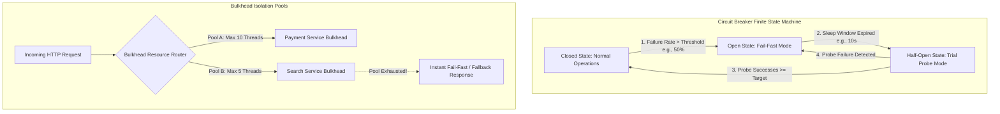

# Resiliency Patterns: Circuit Breakers, Bulkheads & Adaptive Rate Limiting

In microservice architectures, microservices continuously invoke downstream dependencies across network sockets.

When a downstream dependency experiences a outage or latency spike, upstream calling services often compound the failure: client threads block waiting for network timeouts, thread pools fill up, and CPU resources exhaust, causing a **Cascading Failure Avalanche**.

To protect microservice platforms from systemic collapse, systems engineers implement **Microservice Resiliency Patterns**.

By combining **Circuit Breakers** (pioneered by Netflix Hystrix), **Bulkhead Isolation**, and **Adaptive Rate Limiting**, applications gracefully degrade functionality during infrastructure distress.

This article details Circuit Breaker state machines, Bulkhead thread isolation, and Token Bucket adaptive rate limiting algorithms.

---

## Circuit Breaker Finite State Machine & Bulkhead Architecture

How Circuit Breakers trip and isolate resource pools during downstream outages:



### Core Resiliency Patterns
1. **Circuit Breaker State Machine**: Operates in 3 distinct states:
   * **Closed (Normal)**: Network calls pass through to the downstream service. The circuit monitors error rates over a sliding time window.
   * **Open (Tripped)**: When error rate exceeds the failure threshold (e.g. $>50\%$), the circuit trips OPEN. All incoming calls fail-fast instantly without calling the downstream dependency, protecting the failing dependency from traffic pressure.
   * **Half-Open (Testing)**: After a sleep window (e.g. $10$ seconds), the circuit enters HALF-OPEN state, allowing a limited number of trial probe requests. If probes succeed, the circuit resets to CLOSED; if probes fail, it trips back to OPEN.
2. **Bulkhead Pattern**: Inspired by ships partitioning hulls into watertight compartments to prevent sinking from a single leak. In software, Bulkheads isolate resource allocations (thread pools, semaphores, or memory buffers) per dependency. If the recommendation engine thread pool is exhausted, the payment checkout thread pool remains completely unaffected.
3. **Adaptive Rate Limiting**: Unlike static rate limiters (e.g. fixed 1,000 req/sec), **Adaptive Rate Limiters** dynamically measure current CPU load and p90 response times using TCP BBR-style algorithms, automatically throttling incoming requests when latency begins to curve upward.

---

## Python Implementation: Circuit Breaker & Bulkhead Engine

Here is a production-grade Python implementation of a Circuit Breaker State Machine Engine with Bulkhead Semaphore Isolation:

```python
import time
import threading
from typing import Callable, Any, Optional
from enum import Enum

class CircuitState(Enum):
    CLOSED = "CLOSED"
    OPEN = "OPEN"
    HALF_OPEN = "HALF_OPEN"

class CircuitBreakerOpenException(Exception):
    pass

class BulkheadExhaustedException(Exception):
    pass

class ResilientServiceProxy:
    """
    Combines Circuit Breaker State Machine with Bulkhead Semaphore Isolation.
    """
    def __init__(
        self,
        service_name: str,
        failure_threshold: float = 0.5,
        recovery_time_sec: float = 3.0,
        max_bulkhead_threads: int = 2
    ):
        self.service_name = service_name
        self.failure_threshold = failure_threshold
        self.recovery_time_sec = recovery_time_sec
        self.bulkhead_semaphore = threading.Semaphore(max_bulkhead_threads)

        self.state = CircuitState.CLOSED
        self.failure_count = 0
        self.success_count = 0
        self.total_requests = 0
        self.last_state_change = time.time()
        self.lock = threading.Lock()

    def execute(self, func: Callable, *args, **kwargs) -> Any:
        """Executes function guarded by Bulkhead Semaphore & Circuit Breaker."""
        # 1. Bulkhead Isolation Check
        acquired = self.bulkhead_semaphore.acquire(blocking=False)
        if not acquired:
            print(f" ⚠️ [{self.service_name}] Bulkhead Pool EXHAUSTED! Thread rejected.")
            raise BulkheadExhaustedException("Bulkhead thread pool limit reached.")

        try:
            # 2. Circuit Breaker State Check
            with self.lock:
                if self.state == CircuitState.OPEN:
                    if time.time() - self.last_state_change > self.recovery_time_sec:
                        print(f" 🔄 [{self.service_name}] Circuit Transitioning to HALF-OPEN (Testing probe)...")
                        self.state = CircuitState.HALF_OPEN
                        self.last_state_change = time.time()
                    else:
                        print(f" 🚨 [{self.service_name}] Circuit is OPEN! Failing Fast.")
                        raise CircuitBreakerOpenException("Circuit breaker is OPEN.")

            # 3. Call Downstream Target Function
            result = func(*args, **kwargs)

            # Record Success
            self._on_success()
            return result

        except Exception as e:
            if not isinstance(e, (CircuitBreakerOpenException, BulkheadExhaustedException)):
                self._on_failure()
            raise e
        finally:
            self.bulkhead_semaphore.release()

    def _on_success(self):
        with self.lock:
            if self.state == CircuitState.HALF_OPEN:
                print(f" ✅ [{self.service_name}] Probe Succeeded! Circuit Reset to CLOSED.")
                self.state = CircuitState.CLOSED
                self.failure_count = 0
                self.total_requests = 0
                self.last_state_change = time.time()

    def _on_failure(self):
        with self.lock:
            self.failure_count += 1
            self.total_requests += 1
            
            if self.state == CircuitState.CLOSED and self.total_requests >= 2:
                fail_rate = self.failure_count / self.total_requests
                if fail_rate >= self.failure_threshold:
                    print(f" 💥 [{self.service_name}] Failure Rate ({fail_rate*100:.0f}%) Exceeded Threshold! Circuit Tripped to OPEN.")
                    self.state = CircuitState.OPEN
                    self.last_state_change = time.time()
            elif self.state == CircuitState.HALF_OPEN:
                print(f" 💥 [{self.service_name}] Probe Failed! Circuit Re-Tripped to OPEN.")
                self.state = CircuitState.OPEN
                self.last_state_change = time.time()

# Demonstration Execution
if __name__ == "__main__":
    proxy = ResilientServiceProxy(
        service_name="Payment-Gateway",
        failure_threshold=0.5,
        recovery_time_sec=2.0,
        max_bulkhead_threads=2
    )

    print("🚀 Demonstrating Circuit Breaker & Bulkhead Resiliency Engine...")
    print("=" * 75)

    def failing_downstream():
        time.sleep(0.05)
        raise ValueError("500 Internal Server Error in Payment Gateway")

    def healthy_downstream():
        time.sleep(0.05)
        return "200 OK - Payment Processed"

    # 1. Simulate Failing Calls to Trip Circuit
    print("\n1. Triggering Failures to Trip Circuit:")
    for i in range(3):
        try:
            proxy.execute(failing_downstream)
        except Exception as e:
            print(f"   • Request #{i+1} Exception: {e}")

    # 2. Call while Circuit is OPEN (Fail Fast)
    print("\n2. Calling Service while Circuit is OPEN:")
    try:
        proxy.execute(healthy_downstream)
    except Exception as e:
        print(f"   • Fail-Fast Exception: {e}")

    # 3. Wait for Recovery Window to Test HALF-OPEN Reset
    print("\n3. Waiting 2.5s for Circuit Recovery Window...")
    time.sleep(2.5)

    print("\n4. Executing Probe Request in HALF-OPEN State:")
    res = proxy.execute(healthy_downstream)
    print(f"   • Result: {res}")
```

---

## Resiliency Pattern Gotchas & Best Practices

When implementing resiliency patterns:

> [!IMPORTANT]
> **Provide Graceful Fallback Responses**: When a Circuit Breaker trips open, return cached data or a degraded fallback payload (e.g. returning stale recommendation lists) rather than propagating raw 500 error pages to end users.

> [!CAUTION]
> **Avoid Retrying Non-Idempotent Operations**: Never configure automatic retries on non-idempotent HTTP POST endpoints (like `/api/v1/charge-credit-card`). Retrying timed-out POST requests can result in duplicate customer charges!

---

## Real-World Enterprise Impact
Microservice architectures implementing Circuit Breakers and Bulkheads report:
* **Zero Cascading Outages**: Isolating failing microservice instances prevents regional platform crashes.
* **$10\times$ Faster Mean Time to Recovery (MTTR)**: Automatic fail-fast responses allow degraded dependencies time to self-heal without manual human intervention.
