# Resumability vs. Hydration: Architectural Trade-Offs in Modern Frontend Frameworks

> [!NOTE]
> **📖 Article Overview**
> For years, Single Page Application (SPA) frameworks like React, Vue, and Angular followed a standard rendering lifecycle: render HTML on the server, send a massive JavaScript bundle to the client, and run it to attach event handlers. This boot-up process is called **Hydration**. As sites grow larger, the hydration phase delays the **Time to Interactive (TTI)**, creating a sluggish user experience. This article compares traditional **Hydration** against modern alternatives—**Resumability** (Qwik) and **Islands Architecture** (Astro)—detailing their core mechanics, trade-offs, and performance profiles.

---

## The Hydration Tax: Why Pages Load Slowly

In a classic hydrated framework (like Next.js or Nuxt), rendering is a two-step process:

1. **Server-Side Render (SSR)**: The server runs the JS components to generate static HTML, which is sent to the client. The user sees the page layout instantly.
2. **Hydration**: The browser downloads the framework bundle and component code, parses it, executes it from the root component down, reconstructs the virtual DOM, and attaches event listeners to the rendered HTML.

During hydration, the page looks interactive, but clicks and scrolls do not respond because the main thread is blocked executing JavaScript. This is the **Hydration Tax**.

```mermaid
%%{init: {'theme': 'dark', 'themeVariables': { 'primaryColor': '#0891b2', 'primaryTextColor': '#f3f4f6', 'primaryBorderColor': '#22d3ee', 'lineColor': '#0891b2', 'secondaryColor': '#111827', 'tertiaryColor': '#0b0f19'}}}%%
gantt
    title Framework Boot Lifecycle Comparison
    dateFormat  X
    axisFormat %ss
    
    section Hydration (React/Next)
    Download HTML        :active, 0, 10
    Parse & Render HTML  :done, 10, 20
    Download JS Bundle   :crit, active, 20, 65
    Execute JS & Hydrate :crit, 65, 95
    Time to Interactive  :milestone, active, 95, 95

    section Resumability (Qwik)
    Download HTML        :active, 0, 10
    Parse & Render HTML  :done, 10, 20
    Time to Interactive  :milestone, active, 20, 20
    Fetch Event JS on Click : 20, 25
```



---

## Resumability: Picking Up Where the Server Left Off

**Resumability** (pioneered by Qwik) completely eliminates the hydration tax. Instead of rebuilding the state and attaching listeners on startup, Qwik serializes all event listeners and component state directly into the HTML during server compilation.

When the HTML arrives in the browser:
* Zero framework JavaScript is executed on startup.
* The TTI (Time to Interactive) is identical to the FCP (First Contentful Paint).
* A tiny, global, 1KB inline listener intercepts all clicks. If a user clicks a button, the listener dynamically fetches *only* the specific code chunk associated with that click and executes it.

### Code Comparison: Hydration vs. Resumability HTML

In a **Hydrated React** app, the HTML is clean but completely dead until the bundle runs:

```html
<!-- Hydrated Output: Needs bundle to attach JS event listeners -->
<button class="btn-primary">Add to Cart</button>
```

In a **Resumable Qwik** app, the HTML contains serialization markers that allow the browser to locate the handler code lazily:

```html
<!-- Resumable Output: Event listener is serialized as an attribute pointer -->
<button 
  class="btn-primary" 
  on:click="./chunk-cart-handler.js#addToCart"
  q:id="3"
>
  Add to Cart
</button>
```

When the button is clicked, the micro-loader reads the `on:click` attribute, downloads `./chunk-cart-handler.js`, and executes the `addToCart` function.

---

## Islands Architecture: Isolating Interactivity

Another approach to optimizing startup performance is **Islands Architecture** (implemented by frameworks like Astro). Instead of making the entire page interactive, Astro renders the page as static, raw HTML by default. 

Developers declare specific components as dynamic "islands" of interactivity within the static shell. Only these isolated islands load and execute client-side JavaScript.

```html
<!-- Astro Islands Architecture Template -->
<Header /> <!-- Static HTML: 0kb JS -->

<MainArticle /> <!-- Static HTML: 0kb JS -->

<!-- Interactive island: Only this component loads React and hydrates -->
<ImageCarousel client:visible /> 

<Footer /> <!-- Static HTML: 0kb JS -->
```

Astro supports various hydration triggers:
* `client:load`: Hydrates immediately on page load.
* `client:visible`: Hydrates only when the component enters the viewport.
* `client:media`: Hydrates only when a media query matches (e.g. mobile menus).

---

## Framework Architecture Matrix

| Feature | Hydration (React / Next.js) | Resumability (Qwik) | Islands (Astro) |
| :--- | :--- | :--- | :--- |
| **Startup JS Execution** | High (Complete app hydrate) | Near Zero (1KB micro-loader) | Low (Only active islands) |
| **Time to Interactive** | Delayed (depends on bundle) | Instant | Fast (partial hydration) |
| **Data Double-Delivery** | Yes (Props sent as JSON) | No (State is serialized inline)| No (Static parts discarded) |
| **Ideal Use Case** | Highly dynamic dashboards | Content-heavy, SEO critical | Portals, Blogs, E-Commerce |

---

## Conclusion & Takeaways

When architecting high-performance web systems:
* [ ] **Avoid monolithic SPA frameworks for landing pages**: Standard hydration kills mobile performance and SEO page speed scores.
* [ ] **Leverage client directives in Astro**: Use `client:visible` or `client:idle` to defer JS loading until absolutely necessary.
* [ ] **Consider Resumability for heavy traffic**: If you need instant interactivity on pages with rich media, Qwik's chunk-on-click approach is ideal.
* [ ] **Audit your bundle sizes**: Use Webpack/Vite bundle analyzers to ensure third-party scripts are not inflating the hydration tax on page boot.
