# Dynamic Semantic Classifiers: Optimizing Routing Decisions with Local Embeddings

> [!NOTE]
> **📖 Article Overview**
> When constructing a multi-agent system, the router node determines which model or agent handles an incoming prompt. Using a large language model (LLM) to perform this classification classification loop is a major bottleneck: it adds 500 to 1000 milliseconds of latency and costs valuable tokens. In this article, we explore how to build **Dynamic Semantic Classifiers** using local vector embeddings to calculate cosine similarities against target routing categories, routing prompts instantly with zero external API calls.

---

## The Latency Penalty of LLM Routers

If a user submits a query, the router must choose:
1. `Route to Database Agent`
2. `Route to Frontend Agent`
3. `Route to Testing Agent`

Using an LLM for this choice requires parsing prompt logic, generating class tokens, and decoding responses.
By using **Semantic Similarity Routing**:
* We convert the query into a local vector embedding (e.g. using a lightweight local model like `all-MiniLM-L6-v2` or a fast API embedding).
* We calculate the cosine similarity of the query embedding against pre-calculated embeddings of our target categories.
* We route the query based on the highest score, executing classifications in under 5 milliseconds.

```mermaid
%%{init: {'theme': 'dark', 'themeVariables': { 'primaryColor': '#088574', 'primaryTextColor': '#f3f4f6', 'primaryBorderColor': '#0db49b', 'lineColor': '#088574', 'secondaryColor': '#111827', 'tertiaryColor': '#0b0f19'}}}%%
flowchart TD
    Prompt[Incoming User Prompt] --> Embed[Convert to Embedding Vector]
    Embed --> Cosine{Cosine Similarity Evaluator}
    
    Cosine -->|Class: DB Update| DB[Route to Database Queue]
    Cosine -->|Class: CSS Styling| FE[Route to Frontend Queue]
    Cosine -->|Class: Unit Tests| Test[Route to Testing Queue]
    
    style Cosine fill:#111827,stroke:#0db49b,stroke-width:2px
```



---

## 1. Under the Hood: Calculating Cosine Similarity

Cosine similarity measures the angle between two multi-dimensional vectors:
$$\text{similarity} = \frac{\mathbf{A} \cdot \mathbf{B}}{\|\mathbf{A}\| \|\mathbf{B}\|}$$
By comparing a query vector to category centroid vectors, we locate the nearest semantic match.

---

## 2. Setting up Threshold Gates

If the highest cosine similarity score falls below a safety threshold (e.g. `similarity < 0.65`), the router should:
1. **Fallback**: Send the query to a default general assistant model.
2. **Alert**: Flag the query for manual classification audit, helping refine category embeddings.

---

## Code Demo: Cosine Similarity Vector Router

Below is a Python implementation of a semantic embedding router. It converts categories and query strings into simulated vector coordinates, evaluates cosine similarity scores, and dispatches the task.

```python
import math
from typing import Dict, List, Tuple

class SemanticVectorRouter:
    def __init__(self):
        # Category centroids: Pre-calculated embeddings representing each target queue
        # For simplicity, we model 3D vector coordinates representing semantic space
        self.category_centroids = {
            "DATABASE_AGENT": [0.9, 0.1, 0.1],  # Heavy DB/SQL vector orientation
            "FRONTEND_AGENT": [0.1, 0.9, 0.1],  # Heavy CSS/UI vector orientation
            "TESTING_AGENT":  [0.1, 0.1, 0.9]   # Heavy Assert/Test vector orientation
        }

    def _dot_product(self, v1: List[float], v2: List[float]) -> float:
        return sum(x * y for x, y in zip(v1, v2))

    def _magnitude(self, v: List[float]) -> float:
        return math.sqrt(sum(x * x for x in v))

    def calculate_cosine_similarity(self, v1: List[float], v2: List[float]) -> float:
        dot = self._dot_product(v1, v2)
        mag1 = self._magnitude(v1)
        mag2 = self._magnitude(v2)
        if mag1 == 0 or mag2 == 0:
            return 0.0
        return dot / (mag1 * mag2)

    def route_query(self, query_vector: List[float], threshold: float = 0.65) -> Tuple[str, float]:
        best_match = "DEFAULT_AGENT"
        highest_score = 0.0

        for category, centroid in self.category_centroids.items():
            score = self.calculate_cosine_similarity(query_vector, centroid)
            if score > highest_score:
                highest_score = score
                best_match = category

        if highest_score < threshold:
            return "DEFAULT_AGENT", highest_score

        return best_match, highest_score

if __name__ == "__main__":
    router = SemanticVectorRouter()

    # Query 1: "Write a SQL migration statement" -> Maps close to DATABASE_AGENT
    query_1_vec = [0.85, 0.15, 0.05]

    # Query 2: "Adjust layout alignments for responsiveness" -> Maps close to FRONTEND_AGENT
    query_2_vec = [0.08, 0.88, 0.12]

    # Query 3: "General generic greeting" -> Low similarity scores across all centroids
    query_3_vec = [0.33, 0.33, 0.33]

    print("🛰️ Simulating Vector Cosine Routing...")
    print("---------------------------------------")

    for idx, vec in enumerate([query_1_vec, query_2_vec, query_3_vec], 1):
        target, similarity = router.route_query(vec)
        print(f"\n[Query #{idx}] Vector: {vec}")
        print(f"👉 Routed to: **{target}** (Similarity Score: {similarity:.4f})")
```

---

## Architectural Guidelines for Team Leads

* **Use Local Embeddings**: Use lightweight local embedding generators (`sentence-transformers`) on your router gateways to execute vector math in under 5 milliseconds.
* **Establish Safeguard Thresholds**: Configure fallback queues to catch queries with low similarity scores, preventing misrouting failures.
* **Audit Centroids**: Periodically update your centroid vectors using historical task logs to match updates in codebase scopes.
