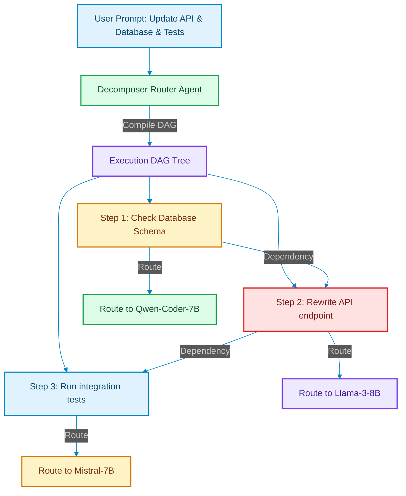

# Graph-Structured Routers: Decomposing Multi-Step Queries into DAG Paths

> [!NOTE]
> **📖 Article Overview**
> Single-model routers (like routing queries based on a simple classification check) are insufficient for complex, multi-stage requests. If a user asks to "audit the security schema, refactor the database connector, and update the API tests," a basic gateway cannot route this payload. Instead, we must build **Graph-Structured Routers**: planning nodes that decompose unstructured goals into a Directed Acyclic Graph (DAG) of sub-tasks and route each node to specialized specialized models. In this article, we map routing topologies and implement a DAG query planner in Python.

---

## Moving Beyond Single-Model Classifications

In simple architectures, a router evaluates a query (e.g. "Fix the button styling") and routes it to `Agent_Frontend` [1].

When facing complex tasks, this approach breaks down because the prompt contains **multiple sequential requirements**.
To solve this, system architects must build a **Decomposition Graph Router**:
1. **Decompose Prompt**: An agent parses the query and isolates independent execution steps.
2. **Build Dependency Edges**: The router defines step requirements (e.g. "Step B depends on Step A").
3. **Route Nodes**: The router dispatches each individual task step to the optimal model, executing them in parallel or sequence based on the graph topology.



---

## 1. Under the Hood: Building the Dependency Parser

The planning node reads the request and formats the output into a JSON graph structure:
* **Tasks**: Lists of operations containing ID and description parameters.
* **Dependencies**: Defining the structural order of operations.
* **Specialized Routing**: Identifying the best quantized model for the task based on scope tags.

---

## 2. Managing execution topologies

To execute graph plans, the routing engine must:
1. **Traverse Topological Paths**: Execute nodes with zero dependencies first.
2. **Handle Step Failures**: If a parent step fails, the gateway must halt children nodes and execute error compensation triggers.

---

## Code Demo: Graph Decomposer and Router

Below is a Python implementation of a graph decomposer. It parses a complex request, builds a Directed Acyclic Graph (DAG), maps tasks to specialized model queues, and returns the execution tree.

```python
import sys
from typing import Dict, List, Set, Tuple

class GraphRoutingPlanner:
    def __init__(self):
        # Dictionary mapping scope tags to specialized model queues
        self.model_mapping = {
            "DB_SCHEMA": "qwen-coder-7b",
            "API_WRITE": "llama-3-8b",
            "TEST_EXEC": "mistral-7b"
        }

    def decompose_and_plan(self, prompt: str) -> Dict[str, Any]:
        # In production, an LLM performs the semantic decomposition of the prompt.
        # Here we simulate the compilation output for "Update DB, rewrite API, run tests".
        plan = {
            "tasks": [
                {
                    "id": "T1",
                    "description": "Check database table partitions",
                    "scope": "DB_SCHEMA",
                    "depends_on": []
                },
                {
                    "id": "T2",
                    "description": "Rewrite API endpoint handling data",
                    "scope": "API_WRITE",
                    "depends_on": ["T1"]
                },
                {
                    "id": "T3",
                    "description": "Execute integration test suite",
                    "scope": "TEST_EXEC",
                    "depends_on": ["T2"]
                }
            ]
        }
        return plan

    def resolve_routing_queue(self, plan: Dict[str, Any]) -> List[Dict[str, str]]:
        routing_actions = []
        
        # Traverse tasks and resolve target model queues
        for task in plan["tasks"]:
            scope = task["scope"]
            assigned_model = self.model_mapping.get(scope, "default-model")
            
            routing_actions.append({
                "task_id": task["id"],
                "description": task["description"],
                "target_model": assigned_model,
                "depends_on": task["depends_on"]
            })
            
        return routing_actions

if __name__ == "__main__":
    planner = GraphRoutingPlanner()
    user_goal = "Audit database partitions, rewrite the controller endpoint, and execute integration tests."

    print("🕸️ Compiling Graph Routing Topology...")
    print(f"   User Goal: '{user_goal}'")
    print("-----------------------------------------------------------------")

    # Decompose into plan structure
    compiled_plan = planner.decompose_and_plan(user_goal)
    
    # Resolve routing
    execution_tree = planner.resolve_routing_queue(compiled_plan)

    print("\n--- Resolved DAG Routing Map ---")
    for step in execution_tree:
        print(f"Task: {step['task_id']} | '{step['description']}'")
        print(f"👉 Route to: **{step['target_model']}**")
        print(f"   Dependencies: {step['depends_on']}\n")
```

---

## Architectural Takeaways

* **Avoid Monolithic Processing**: Decompose compound user queries into structured execution DAGs rather than feeding them as a single prompt to a single model.
* **Map to Specialized Models**: Route simple validation tasks to lightweight edge models, reserving larger reasoning models for complex refactoring nodes.
* **Trace Dependencies**: Validate that execution graphs do not contain circular dependencies before routing steps to worker queues. [2]

## References & Further Reading

1. **Malkov, Y. A., & Yashunin, D. A. (2018)**. *Efficient and Robust Approximate Nearest Neighbor Search Using Hierarchical Navigable Small World Graphs*. IEEE TPAMI. [https://arxiv.org/abs/1603.09320](https://arxiv.org/abs/1603.09320)
2. **Jégou, H., Douze, M., & Schmid, C. (2011)**. *Product Quantization for Nearest Neighbor Search*. IEEE TPAMI. [https://hal.inria.fr/inria-00514462v2/document](https://hal.inria.fr/inria-00514462v2/document)
3. **Johnson, J., Douze, M., & Jégou, H. (2019)**. *Billion-scale Similarity Search with GPUs*. IEEE Transactions on Big Data. [https://arxiv.org/abs/1702.08734](https://arxiv.org/abs/1702.08734)
4. **Vercel Engineering (2025)**. *Next.js 16*. Next.js Blog. [https://nextjs.org/blog/next-16](https://nextjs.org/blog/next-16)
5. **Vercel Engineering (2024)**. *Next.js 15*. Next.js Blog. [https://nextjs.org/blog/next-15](https://nextjs.org/blog/next-15)
6. **Vercel Documentation (2026)**. *Caching in Next.js*. Next.js Docs. [https://nextjs.org/docs/app/getting-started/caching](https://nextjs.org/docs/app/getting-started/caching)
7. **React Team (2024)**. *React Server Components and Related RFCs*. reactjs/rfcs. [https://github.com/reactjs/rfcs](https://github.com/reactjs/rfcs)
