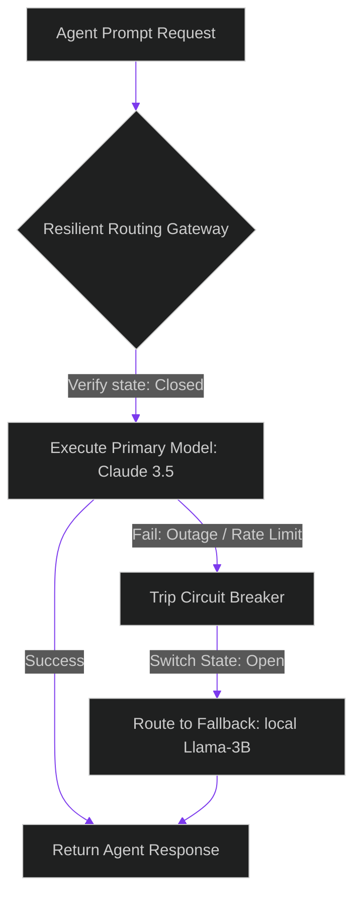

# LiteLLM vs. RouteLLM: Implementing Enterprise Cost-Latency Optimizers

> [!NOTE]
> **📖 Article Overview**
> In enterprise multi-agent applications, routing tasks to optimal model providers is key to managing operational costs and latency. If we send every query to the most expensive frontier model, our API bills skyrocket. Conversely, sending complex logic requests to small models causes execution failures. In this article, we analyze the architectural trade-offs of model routing frameworks, design a **Circuit Breaker Gateway**, and implement an API routing proxy in Python.

---

## The Economics of Inference Routing

A production-grade system manages cost and latency profiles:
* **The Cost-Performance Curve**: Frontier models (e.g. Claude 3.5 Sonnet, GPT-4o) are highly capable but expensive. Small, local models (e.g. Llama-3B) are cheap and fast but lack complex reasoning context.
* **Intelligent Routing**: By deploying routing proxies, we analyze query inputs and direct traffic dynamically, routing simple tasks (e.g. classification, code linting) to cheap SLMs, and reserving frontier LLMs for complex refactoring tasks.
* **The Solution**: Integrating gateways like **LiteLLM** or **RouteLLM** to decouple application code from provider interfaces, configure automatic failovers, and handle circuit breakers.



---

## 1. Gateway Resilience: Fallbacks and Retries

When a model provider suffers an outage or returns an HTTP 429 (rate limit):
1. **Fallback List**: The gateway intercepts the exception and immediately retries the request using a backup provider configured in the fallback list.
2. **Circuit Breakers**: If the primary provider fails multiple times, the gateway trips its circuit breaker, routing all subsequent traffic directly to the fallback provider for a cooldown period before attempting to check the primary again.

---

## 2. Decoupling Runtimes

Using unified interfaces (like LiteLLM's standardized OpenAI-format requests) allows developers to swap backing LLMs (e.g. swapping Anthropic endpoints for local Ollama runtimes) by modifying configuration JSONs, eliminating the need to write custom provider integration wrappers.

---

## Code Demo: Resilient Circuit Breaker Routing Proxy

Below is a Python implementation of a routing gateway proxy. It coordinates task routing, tracks failure limits, trips circuit breakers during provider outages, and routes requests to fallback models.

```python
import time
from typing import Dict, Any, Tuple, List

class PrimaryProviderOutage(Exception):
    pass

class CircuitBreakerGateway:
    def __init__(self, failure_threshold: int = 3, cooldown_seconds: int = 5):
        self.failure_threshold = failure_threshold
        self.cooldown_seconds = cooldown_seconds
        
        # State indicators: CLOSED, OPEN, HALF-OPEN
        self.state = "CLOSED"
        self.failure_count = 0
        self.last_state_change = time.time()

    def route_request(self, prompt: str, primary_func, fallback_func) -> str:
        now = time.time()

        # Check circuit breaker cooldown state
        if self.state == "OPEN":
            if now - self.last_state_change > self.cooldown_seconds:
                self.state = "HALF-OPEN"
                print("🔄 [Circuit Breaker] Transitioning to HALF-OPEN. Testing primary provider...")
            else:
                print("🚨 [Circuit Breaker] State is OPEN. Bypassing primary and routing directly to fallback.")
                return fallback_func(prompt)

        # Execute primary provider call
        try:
            result = primary_func(prompt)
            # If successful and was HALF-OPEN, close circuit breaker
            if self.state == "HALF-OPEN":
                self.state = "CLOSED"
                self.failure_count = 0
                print("✅ [Circuit Breaker] Primary call succeeded. Closing circuit breaker.")
            return result
        except PrimaryProviderOutage:
            self.failure_count += 1
            print(f"❌ [Circuit Breaker] Primary provider failed (Count: {self.failure_count}/{self.failure_threshold}).")
            
            if self.failure_count >= self.failure_threshold and self.state != "OPEN":
                self.state = "OPEN"
                self.last_state_change = time.time()
                print(f"🚨 [Circuit Breaker] Failure threshold met. Tripping breaker to OPEN state.")

            # Route to fallback
            return fallback_func(prompt)

# Mock provider wrappers
def call_claude_api(prompt: str) -> str:
    # Simulate a network outage exception
    raise PrimaryProviderOutage("API Endpoint Unreachable.")

def call_local_llama(prompt: str) -> str:
    return f"Llama response: (Processed locally for prompt: '{prompt}')"

if __name__ == "__main__":
    # Initialize gateway
    gateway = CircuitBreakerGateway(failure_threshold=2, cooldown_seconds=3)

    print("🤖 Initiating Resilient Gateway Proxy...")
    print("------------------------------------------")

    # Run 4 requests sequentially
    for request_num in range(1, 5):
        print(f"\n[Request #{request_num}] Sending prompt...")
        response = gateway.route_request(
            "Refactor auth logic.",
            call_claude_api,
            call_local_llama
        )
        print(f"Response: {response}")
        time.sleep(1)
```

---

## Architectural Guidelines

* **Deploy Unified Gateways**: Use systems like LiteLLM to standardize prompt schemas across various LLM providers.
* **Enforce Circuit Breakers**: Wrap provider connections in circuit breakers to route traffic around offline API endpoints automatically.
* **Log Failures**: Feed fallback metrics into Grafana or Prometheus dashboards to track provider availability.
