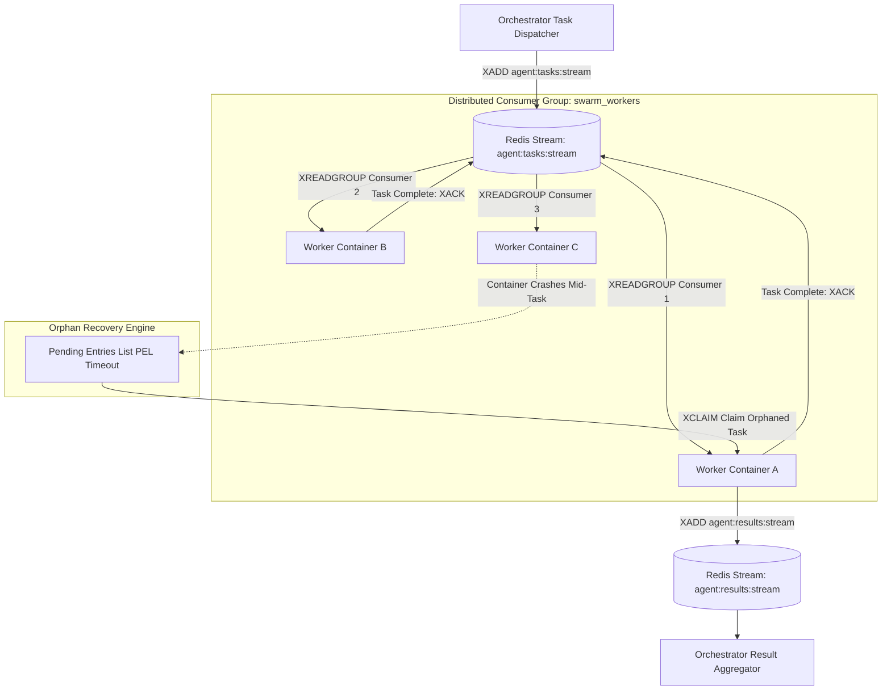

# Scaling Event-Driven Subagent Swarms with Redis Streams

When scaling multi-agent applications from single-process scripts to distributed cloud clusters, orchestrating task events across containerized worker nodes becomes a core infrastructure challenge.

In-memory task queues (such as Python's `asyncio.Queue`) cannot cross container boundaries. If an agent worker container crashes mid-task, in-flight execution events are lost forever. Traditional heavyweight message brokers (such as RabbitMQ or Kafka) add significant operational complexity and lack lightweight pub/sub stream semantics needed for real-time trajectory fan-out.

To build scalable, fault-tolerant agent swarms, engineering teams utilize **Redis Streams**. Redis Streams combines append-only log durability, distributed **Consumer Groups** (`XREADGROUP`), explicit message acknowledgments (`XACK`), and automatic orphan recovery (`XCLAIM`).

This article details how to architect and scale an event-driven subagent swarm using Redis Streams.

---

## 📖 Redis Streams Swarm Architecture

The architecture decouples task dispatchers, subagent worker pools, and result aggregators using Redis Streams Consumer Groups:



### Core Redis Streams Operations for Agent Swarms
1. **`XADD` (Task Event Publishing)**: Dispatches a new task payload onto the stream with an auto-generated millisecond ID (`1722567000000-0`).
2. **`XREADGROUP` (Distributed Worker Consumption)**: Distributes stream tasks across multiple worker containers inside a shared Consumer Group (`swarm_workers`). Each task is delivered to exactly one worker node.
3. **`XACK` & Pending Entries List (PEL)**: When a worker finishes a task node, it sends an `XACK` acknowledgment. If a worker container crashes before sending `XACK`, the task remains in the Pending Entries List (PEL).
4. **`XCLAIM` (Orphaned Task Recovery)**: An automated supervisor periodically checks the PEL for unacknowledged tasks older than a timeout threshold (e.g. 60 seconds) and reassigns (`XCLAIM`) the orphaned task to a healthy worker.

---

## 🛠️ Python Implementation: Redis Streams Agent Swarm Engine

Here is a production Python implementation using `redis-py` demonstrating an event-driven agent worker consumer group with automatic task claiming (`XCLAIM`) for crashed workers:

```python
import os
import time
import json
import uuid
import redis
from pydantic import BaseModel

STREAM_KEY = "agent:tasks:stream"
GROUP_NAME = "swarm_workers"
CONSUMER_NAME = f"worker-{uuid.uuid4().hex[:6]}"

class SwarmTaskPayload(BaseModel):
    task_id: str
    target_role: str
    action: str
    payload: dict

class RedisStreamsSwarmWorker:
    """
    Event-driven agent worker consuming tasks from a Redis Stream Consumer Group
    with automatic pending task claim (XCLAIM) fault recovery.
    """
    def __init__(self, redis_client: redis.Redis):
        self.r = redis_client
        self._setup_consumer_group()

    def _setup_consumer_group(self):
        """
        Creates the Redis Stream consumer group if it does not already exist.
        """
        try:
            self.r.xgroup_create(STREAM_KEY, GROUP_NAME, id="0", mkstream=True)
            print(f"✅ [Redis Streams] Consumer group '{GROUP_NAME}' created.")
        except redis.exceptions.ResponseError as err:
            if "BUSYGROUP" in str(err):
                pass  # Group already exists
            else:
                raise err

    def start_worker_loop(self):
        print(f"🚀 [Worker Agent '{CONSUMER_NAME}'] Listening for stream events on '{STREAM_KEY}'...")
        
        while True:
            try:
                # 1. Periodically check for & claim orphaned tasks (PEL Timeout > 30s)
                self._claim_orphaned_pending_tasks()

                # 2. Consume new task events assigned to this consumer
                entries = self.r.xreadgroup(
                    groupname=GROUP_NAME,
                    consumername=CONSUMER_NAME,
                    streams={STREAM_KEY: ">"},  # '>' means read new un-delivered messages
                    count=1,
                    block=2000  # Block for up to 2 seconds
                )

                if not entries:
                    continue

                for stream_name, message_list in entries:
                    for message_id, data in message_list:
                        self._process_message(message_id, data)

            except Exception as err:
                print(f"❌ [Worker Error] Unexpected error in worker loop: {err}")
                time.sleep(1.0)

    def _process_message(self, message_id: bytes, data: dict):
        msg_id_str = message_id.decode("utf-8")
        task_json_str = data.get(b"payload", b"{}").decode("utf-8")
        
        task = SwarmTaskPayload.model_validate_json(task_json_str)
        print(f"\n⚡ [Worker '{CONSUMER_NAME}'] Processing Task '{task.task_id}' (Msg ID: {msg_id_str})...")

        # Simulate subagent execution
        time.sleep(0.5)
        print(f"  - Executed action '{task.action}' for role '{task.target_role}'.")

        # Acknowledge task completion in Redis Stream (Remove from PEL)
        self.r.xack(STREAM_KEY, GROUP_NAME, message_id)
        print(f"✅ [Task Completed] Sent XACK for message '{msg_id_str}'.")

    def _claim_orphaned_pending_tasks(self):
        """
        Scans Pending Entries List (PEL) and claims tasks unacknowledged for > 30,000ms.
        """
        try:
            # XPENDING summary check
            pending_info = self.r.xpending(STREAM_KEY, GROUP_NAME)
            if pending_info["pending"] == 0:
                return

            # Read pending messages details
            pending_details = self.r.xpending_range(
                STREAM_KEY, GROUP_NAME, min="-", max="+", count=10
            )

            MIN_IDLE_TIME_MS = 30000
            for item in pending_details:
                idle_time = item["idle"]
                msg_id = item["message_id"]

                if idle_time > MIN_IDLE_TIME_MS:
                    print(f"⚠️ [Orphan Recovery] Claiming message '{msg_id}' idle for {idle_time}ms...")
                    # XCLAIM transfers message ownership to this consumer
                    claimed_msgs = self.r.xclaim(
                        STREAM_KEY, GROUP_NAME, CONSUMER_NAME, MIN_IDLE_TIME_MS, [msg_id]
                    )
                    for c_id, c_data in claimed_msgs:
                        self._process_message(c_id, c_data)
        except Exception as err:
            print(f"Error during orphan claim check: {err}")

# Demonstration Execution
if __name__ == "__main__":
    r_client = redis.Redis(host="localhost", port=6379, db=0)
    
    # Publish a sample task payload using XADD
    sample_payload = SwarmTaskPayload(
        task_id="task-swarm-101",
        target_role="CodeRefactorWorker",
        action="refactor_ast",
        payload={"target_file": "main.py"}
    )
    
    # XADD task event onto Redis Stream
    msg_id = r_client.xadd(STREAM_KEY, {"payload": sample_payload.model_dump_json()})
    print(f"📥 [Orchestrator] Dispatched task 'task-swarm-101' to Redis Stream. Msg ID: {msg_id.decode('utf-8')}")

    # Start worker listener instance
    worker = RedisStreamsSwarmWorker(r_client)
    # worker.start_worker_loop()
```

---

## ⚠️ Important Redis Streams Architecture Guardrails

When scaling agentic swarms with Redis Streams:

> [!IMPORTANT]
> **Set Stream Trimming Caps (`MAXLEN`)**: Redis Streams grow indefinitely if not trimmed. Always cap stream length when publishing events to prevent memory exhaustion: `r.xadd(STREAM_KEY, fields, maxlen=100000, approximate=True)`.

> [!CAUTION]
> **Tune Idle Time Thresholds for XCLAIM**: Set your `XCLAIM` idle threshold to at least 2x your longest expected subagent task execution time. If a worker legitimately takes 20 seconds to finish a task, claiming it after 10 seconds will cause duplicate task execution.

---

## 📈 Real-World Enterprise Impact
Teams deploying Redis Streams for subagent orchestration report:
* **100% Zero-Loss Fault Tolerance**: Pending Entries List (PEL) and `XCLAIM` automatically recover 100% of tasks from crashed worker containers.
* **Massive Horizontal Scalability**: Adding 20 new Cloud Run worker containers automatically scales task throughput without reconfiguring the orchestrator.
