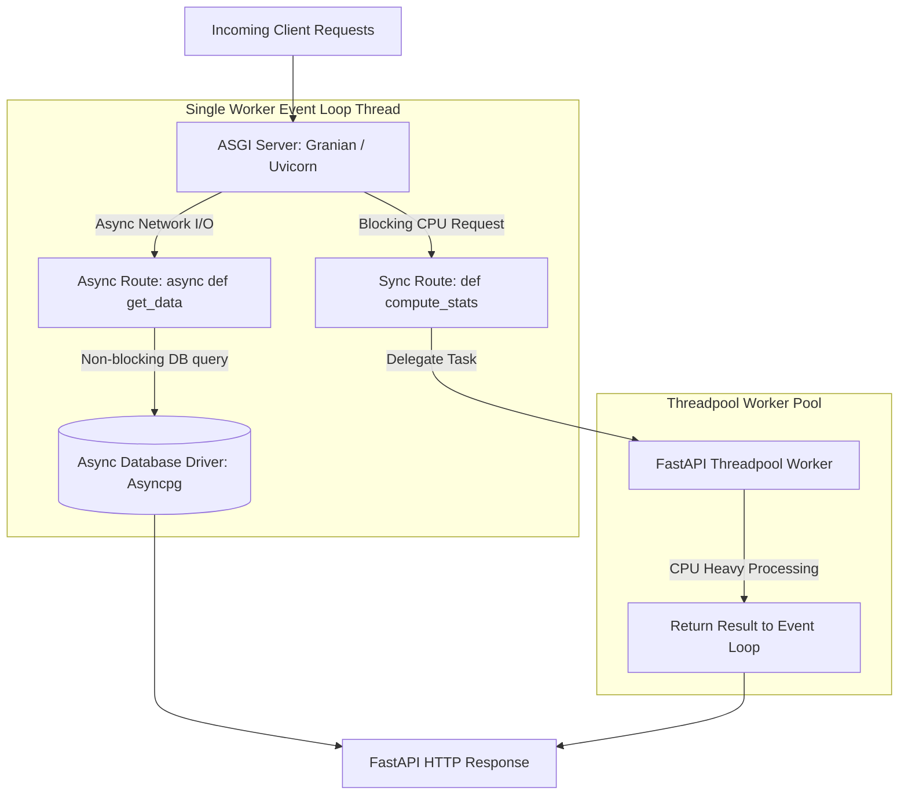

# Scaling FastAPI: Async Event Loop Optimization & Worker Architecture

FastAPI delivers exceptional performance when handling I/O-bound web requests. However, in high-concurrency production environments, developers frequently encounter performance degradation caused by a single misconfigured route.

Because Python's `asyncio` event loop runs on a single thread per worker process, executing a single blocking synchronous computation (such as CPU-heavy data transformations or blocking third-party library calls) within an `async def` endpoint freezes the entire event loop, blocking all other incoming connections.

To scale FastAPI to tens of thousands of concurrent requests, developers must master **Async Event Loop Optimization** and select the appropriate **Worker Process Architecture**.

This article details how to profile event loop latency, offload CPU workloads, and configure high-performance ASGI servers.

---

## ASGI Worker & Threadpool Architecture

Separating non-blocking async network I/O from blocking CPU-bound computations:



### Worker Server Comparison
* **Uvicorn (CPython asyncio)**: The reference ASGI server. It uses `uvloop` (Cython wrapper around `libuv`) for high-speed event loop execution. It is typically managed by **Gunicorn** to run one worker process per CPU core.
* **Granian (Rust / Tokio Core)**: A modern ASGI server written in Rust. It offloads HTTP parsing and socket handling to Rust (`hyper`), reducing Python memory overhead and boosting concurrency throughput by up to 40% compared to standard Uvicorn worker setups.

---

## Python Implementation: Event Loop Profiler & Threadpool Offloader

Here is a production-grade Python script demonstrating how blocking synchronous calls freeze the event loop, and how to offload CPU-bound computations safely to threadpools using `fastapi.concurrency.run_in_threadpool`:

```python
import time
import asyncio
from fastapi import FastAPI
from fastapi.concurrency import run_in_threadpool
from pydantic import BaseModel

app = FastAPI(title="Event Loop Optimization Demo")

class LatencyReport(BaseModel):
    endpoint: str
    execution_time_ms: float
    loop_lag_ms: float

class EventLoopProfiler:
    """
    Profiles event loop lag by measuring execution delays
    in scheduled background tasks.
    """
    @staticmethod
    async def measure_loop_lag() -> float:
        start = time.perf_counter()
        await asyncio.sleep(0.0)  # Yield control to loop
        lag = (time.perf_counter() - start) * 1000.0
        return lag

# 1. ANTI-PATTERN: Blocking CPU call inside async def (Freezes Event Loop!)
def heavy_cpu_blocking_work(iterations: int = 10_000_000):
    count = 0
    for i in range(iterations):
        count += i
    return count

@app.get("/bad-blocking", response_model=LatencyReport)
async def bad_blocking_endpoint():
    start = time.perf_counter()
    
    # ❌ Directly calling blocking CPU function in async endpoint
    _ = heavy_cpu_blocking_work()
    
    exec_time = (time.perf_counter() - start) * 1000.0
    loop_lag = await EventLoopProfiler.measure_loop_lag()
    
    return LatencyReport(
        endpoint="/bad-blocking", execution_time_ms=exec_time, loop_lag_ms=loop_lag
    )

# 2. RECOMMENDED PATTERN: Offloading CPU work to Threadpool
@app.get("/good-offloaded", response_model=LatencyReport)
async def good_offloaded_endpoint():
    start = time.perf_counter()
    
    # ✅ Offloading blocking work to threadpool worker
    _ = await run_in_threadpool(heavy_cpu_blocking_work)
    
    exec_time = (time.perf_counter() - start) * 1000.0
    loop_lag = await EventLoopProfiler.measure_loop_lag()
    
    return LatencyReport(
        endpoint="/good-offloaded", execution_time_ms=exec_time, loop_lag_ms=loop_lag
    )

# Benchmark Execution Simulation
if __name__ == "__main__":
    async def run_simulation():
        print("🚀 Benchmarking FastAPI Event Loop Blocking vs Threadpool Offloading...")
        print("=" * 75)
        
        # Test Bad Endpoint
        print("🔴 Testing /bad-blocking endpoint...")
        report_bad = await bad_blocking_endpoint()
        print(f" Execution Time : {report_bad.execution_time_ms:.2f} ms")
        print(f" Event Loop Lag : {report_bad.loop_lag_ms:.2f} ms (Loop was frozen!)")
        
        print("\n🟢 Testing /good-offloaded endpoint...")
        report_good = await good_offloaded_endpoint()
        print(f" Execution Time : {report_good.execution_time_ms:.2f} ms")
        print(f" Event Loop Lag : {report_good.loop_lag_ms:.2f} ms (Loop remained responsive!)")

    asyncio.run(run_simulation())
```

---

## Event Loop Gotchas & Mitigation

When scaling FastAPI applications:

> [!IMPORTANT]
> **Use `def` (Sync) Endpoints for Blocking Libraries**: If an endpoint relies on a legacy synchronous database driver (like standard `psycopg2`) or blocking SDKs, declare the route with standard `def` instead of `async def`. FastAPI automatically runs `def` endpoints in a threadpool, preventing them from freezing the main event loop.

> [!CAUTION]
> **Tune Threadpool Size for Heavy Traffic**: By default, Starlette's threadpool allows up to 40 threads per worker. Under heavy concurrent traffic, 40 threads can exhaust memory or DB connection pools. Adjust threadpool limits explicitly using `anyio` or custom `ThreadPoolExecutor` configurations.

---

## Real-World Enterprise Impact
Teams deploying event-loop optimization strategies report:
* **Zero Event Loop Lockups**: Offloading CPU tasks prevents single-route spikes from freezing API gateways.
* **40% Memory Reduction**: Switching to Rust-based Granian ASGI servers reduces baseline memory footprint while maintaining high throughput.
