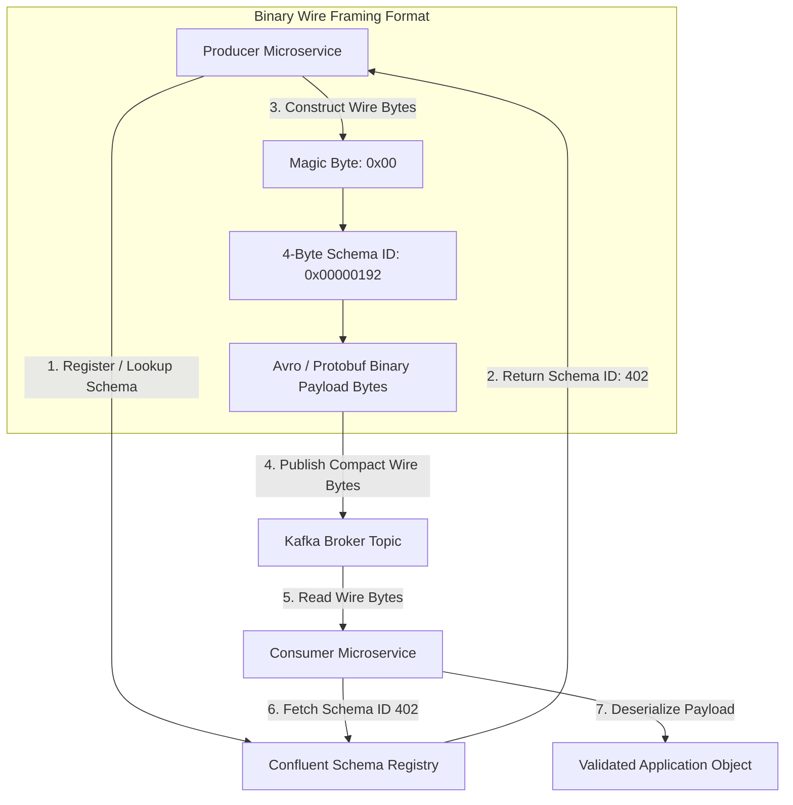

# Schema Evolution & Contract Enforcement with Confluent Schema Registry

In distributed event-driven systems, microservices communicate by publishing and consuming messages across shared topics. When event payloads are transmitted as un-typed JSON strings without strict contract enforcement, a producer updating a payload schema (such as renaming or dropping a field) can silently crash dozens of downstream consumer microservices.

To guarantee zero-downtime payload evolution, software engineering teams deploy **Confluent Schema Registry** alongside **Apache Avro** or **Protocol Buffers (Protobuf)**.

Schema Registry acts as a central governance authority that enforces strict schema compatibility rules before messages are written to Kafka topics. By serializing events into compact binary formats prefixed with a 4-byte Schema ID, applications achieve up to **80% payload size reduction** compared to raw JSON.

This article details how to manage schema evolution and contract enforcement in Kafka pipelines.

---

## Binary Wire Format & Compatibility Architecture

The binary framing layout and schema validation workflow:



### Schema Compatibility Modes
Confluent Schema Registry enforces four primary compatibility rules when producers register a new schema version ($V_2$ over $V_1$):

1. **BACKWARD Compatibility (Default)**: Consumers running $V_2$ can parse messages written by producers using $V_1$. *Rule*: Delete fields or add optional fields with default values. (Deploy consumers first).
2. **FORWARD Compatibility**: Consumers running $V_1$ can parse messages written by producers using $V_2$. *Rule*: Add new fields or delete optional fields. (Deploy producers first).
3. **FULL Compatibility**: Guarantees both BACKWARD and FORWARD compatibility. Consumers and producers can be deployed in any arbitrary sequence without breaking parsing logic.
4. **NONE**: Disables compatibility checks (Dangerous in production).

---

## Python Implementation: Schema Registry Serializer & Validator

Here is a production-grade Python simulation of a Confluent Schema Registry client, Avro wire format encoder, and compatibility checker:

```python
import struct
import json
from typing import Dict, Any, Optional
from pydantic import BaseModel

class SchemaRegistryClient:
    """
    Simulates a Confluent Schema Registry maintaining versioned Avro schemas
    and enforcing compatibility rules.
    """
    def __init__(self):
        # subject -> list of schema versions
        self.subjects: Dict[str, list] = {}
        self.schema_id_counter = 100
        self.id_to_schema: Dict[int, Dict[str, Any]] = {}

    def register_schema(self, subject: str, schema_json: Dict[str, Any]) -> int:
        """Registers schema and assigns a 4-byte Schema ID."""
        if subject not in self.subjects:
            self.subjects[subject] = []

        # Check compatibility if previous version exists
        if self.subjects[subject]:
            latest_schema = self.subjects[subject][-1]["schema"]
            self._validate_backward_compatibility(latest_schema, schema_json)

        self.schema_id_counter += 1
        schema_id = self.schema_id_counter
        
        record = {"id": schema_id, "version": len(self.subjects[subject]) + 1, "schema": schema_json}
        self.subjects[subject].append(record)
        self.id_to_schema[schema_id] = schema_json
        
        print(f" 📜 [Schema Registry] Registered '{subject}' Version {record['version']} with Schema ID {schema_id}")
        return schema_id

    def _validate_backward_compatibility(self, old_schema: Dict[str, Any], new_schema: Dict[str, Any]):
        """Enforces BACKWARD compatibility: Cannot remove required fields without default."""
        old_fields = {f["name"]: f for f in old_schema.get("fields", [])}
        new_fields = {f["name"]: f for f in new_schema.get("fields", [])}

        # If old field is missing in new schema, ensure it had a default value
        for f_name, f_def in old_fields.items():
            if f_name not in new_fields and "default" not in f_def:
                raise ValueError(f"BACKWARD Incompatibility: Removed required field '{f_name}' without default!")

class ConfluentAvroSerializer:
    """
    Encodes/Decodes payloads according to the Confluent Wire Format:
    [Magic Byte 0x00] [4-Byte Schema ID] [Avro Binary Data]
    """
    MAGIC_BYTE = b'\x00'

    @classmethod
    def encode(cls, schema_id: int, payload: Dict[str, Any]) -> bytes:
        # Pack 4-byte Schema ID (Big-Endian int)
        schema_id_bytes = struct.pack(">I", schema_id)
        # Convert payload to compact JSON bytes (simulating binary Avro encoding)
        data_bytes = json.dumps(payload, separators=(',', ':')).encode('utf-8')
        return cls.MAGIC_BYTE + schema_id_bytes + data_bytes

    @classmethod
    def decode(cls, wire_bytes: bytes) -> Tuple[int, Dict[str, Any]]:
        magic = wire_bytes[0:1]
        if magic != cls.MAGIC_BYTE:
            raise ValueError("Invalid Confluent Wire Format: Missing Magic Byte 0x00")
        
        schema_id = struct.unpack(">I", wire_bytes[1:5])[0]
        data_bytes = wire_bytes[5:]
        payload = json.loads(data_bytes.decode('utf-8'))
        return schema_id, payload

# Demonstration Execution
if __name__ == "__main__":
    registry = SchemaRegistryClient()

    # 1. Define V1 Schema
    schema_v1 = {
        "type": "record",
        "name": "UserOrder",
        "fields": [
            {"name": "order_id", "type": "string"},
            {"name": "amount", "type": "double"}
        ]
    }
    schema_id_v1 = registry.register_schema("orders-value", schema_v1)

    # 2. Serialize Message into Confluent Wire Format
    raw_event = {"order_id": "ord-8812", "amount": 149.99}
    wire_bytes = ConfluentAvroSerializer.encode(schema_id_v1, raw_event)
    print(f"\n📦 Wire Framing: {len(wire_bytes)} bytes total (Header: 5 bytes, Payload: {len(wire_bytes)-5} bytes)")

    # 3. Consumer Deserializes Wire Bytes
    rx_schema_id, decoded_payload = ConfluentAvroSerializer.decode(wire_bytes)
    print(f" 📥 Consumer Deserialized (Schema ID {rx_schema_id}): {decoded_payload}")

    # 4. Attempt Incompatible Schema V2 Registration (Breaking Backward Compatibility)
    print("\n🚨 Attempting Incompatible Schema V2 Registration...")
    schema_v2_invalid = {
        "type": "record",
        "name": "UserOrder",
        "fields": [
            {"name": "amount", "type": "double"}  # Removed required 'order_id' field!
        ]
    }
    try:
        registry.register_schema("orders-value", schema_v2_invalid)
    except ValueError as e:
        print(f" ❌ Schema Registry Rejected Registration: {e}")
```

---

## Schema Evolution Gotchas & Guardrails

When enforcing contracts with Schema Registry:

> [!IMPORTANT]
> **Always Provide Default Values for New Fields**: When introducing new fields in Avro/Protobuf schemas, always specify a default value (e.g. `"default": ""` or `"default": null`). This ensures existing consumers reading new messages can assign default values without raising parsing exceptions.

> [!CAUTION]
> **Never Change Field Data Types In-Place**: Changing a field from `"type": "int"` to `"type": "string"` breaks both forward and backward compatibility. Instead of mutating types in-place, create a new field (e.g. `user_id_v2`) and deprecate the old field gracefully over a deprecation window.

---

## Real-World Enterprise Impact
Teams using Confluent Schema Registry report:
* **80% Payload Compression**: Replacing verbose JSON headers with 5-byte Confluent wire framing reduces network bandwidth costs dramatically across high-throughput Kafka clusters.
* **Zero Production Deserialization Outages**: Schema compatibility validation catches breaking API contract changes at deployment time before events enter production topics.
