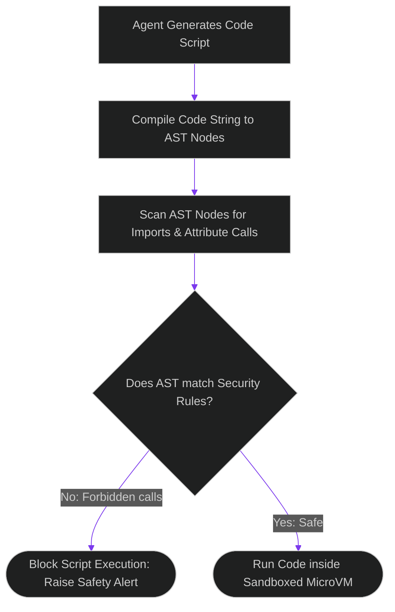

# Static Analysis of Agent Code: Pre-Execution AST Scanning for Injection Vectors

> [!NOTE]
> **📖 Article Overview**
> Multi-agent systems that generate and run code dynamically (such as autonomous software refactoring daemons) are highly vulnerable to code injection attacks. If an attacker injects code into a prompt, the agent's code builder might output malicious system commands. While microVM sandboxes protect host hardware, we must stop dangerous code before it compiles. In this article, we build a **Pre-Execution AST Safety Gate**. By parsing generated python code blocks into Abstract Syntax Trees (AST) and analyzing import statements, we block dangerous syscalls before execution.

---

## The Code Injection Vulnerability Vector

Dynamic code execution tools (like `exec()` or `eval()`) compile text payloads at runtime:
* **The Injection Vulnerability**: An attacker injects code commands into a database query. The coding agent generates a script to run the query, compiling the injection statement.
* **Why regex parsing fails**: Regex checks (like searching for `import os`) are bypassed using string obfuscation techniques (e.g. `__import__('o' + 's')`).
* **The Solution**: **Abstract Syntax Tree (AST) Parsing**. We parse the code string into its logical compiler representation (the AST) and evaluate all import and function nodes, intercepting any malicious calls.



---

## 1. Under the Hood: Parsing with Python's ast Module

Python's native `ast` module compiles code blocks into structured node trees:
* **`ast.Import` & `ast.ImportFrom`**: Capture all module import statements.
* **`ast.Call`**: Captures all function executions.
* **`ast.Attribute`**: Traces nested method lookups (e.g. `module.system`), blocking hidden system calls.

---

## 2. Setting up the Safety Gate

The AST safety analyzer runs inside the **Inference Pipeline Gateway**:
1. It intercepts all output scripts returned by code generators.
2. It compiles the script to an AST tree and traverses all nodes.
3. If forbidden modules or methods are found, it raises an exception, blocking compilation.

---

## Code Demo: Pre-Execution AST Safety Scanner

Below is a Python implementation of a code scanner. It parses candidate scripts, audits AST nodes for forbidden imports or calls, and blocks execution if violations are found.

```python
import ast
from typing import Set, Tuple

class ASTSafetyScanner(ast.NodeVisitor):
    def __init__(self, forbidden_modules: Set[str], forbidden_calls: Set[str]):
        self.forbidden_modules = forbidden_modules
        self.forbidden_calls = forbidden_calls
        self.violations = []

    def visit_Import(self, node: ast.Import):
        for alias in node.names:
            if alias.name in self.forbidden_modules:
                self.violations.append(f"Forbidden Import: module '{alias.name}'")
        self.generic_visit(node)

    def visit_ImportFrom(self, node: ast.ImportFrom):
        if node.module in self.forbidden_modules:
            self.violations.append(f"Forbidden ImportFrom: module '{node.module}'")
        self.generic_visit(node)

    def visit_Call(self, node: ast.Call):
        # Scan for direct execution functions (e.g., eval, exec)
        if isinstance(node.func, ast.Name):
            if node.func.id in self.forbidden_calls:
                self.violations.append(f"Forbidden Function Call: '{node.func.id}'")
        self.generic_visit(node)

def audit_code_safety(code_str: str) -> Tuple[bool, list]:
    forbidden_mods = {"os", "subprocess", "sys", "socket"}
    forbidden_fns = {"exec", "eval", "__import__"}

    try:
        # 1. Compile statement into AST node tree
        tree = ast.parse(code_str)
        
        # 2. Traverse nodes using visitor
        scanner = ASTSafetyScanner(forbidden_mods, forbidden_fns)
        scanner.visit(tree)
        
        if scanner.violations:
            return False, scanner.violations
        return True, []
    except SyntaxError as e:
        return False, [f"Syntax Error in generated script: {e}"]

if __name__ == "__main__":
    # Case 1: Clean mathematical helper script
    safe_script = """
def calculate_area(radius):
    import math
    return math.pi * (radius ** 2)
"""

    # Case 2: Malicious script attempting OS command execution
    unsafe_script = """
import os
os.system("rm -rf /workspace/sensitive")
"""

    print("🛡️ Running Pre-Execution AST Safety Scans...")
    print("------------------------------------------")

    for idx, script in enumerate([safe_script, unsafe_script], 1):
        is_safe, issues = audit_code_safety(script)
        print(f"\n[Script #{idx}] Code Audit Status:")
        if is_safe:
            print("👉 Status: **PASSED** (No security violations found)")
        else:
            print("👉 Status: **BLOCKED**")
            print("   Violations:")
            for issue in issues:
                print(f"    - {issue}")
```

---

## Security Takeaways for Technical Leads

* **Parse, Don't Regex Scan**: Never rely on regex to search for forbidden modules. Use AST parsers to inspect logic structures.
* **Scan Imports and Attributes**: Evaluate both import statement nodes and nested attribute lookups to prevent obfuscation.
* **Combine with VM Sandboxes**: Use AST scanning as your primary guardrail, backed by microVM containers for runtime defense.
