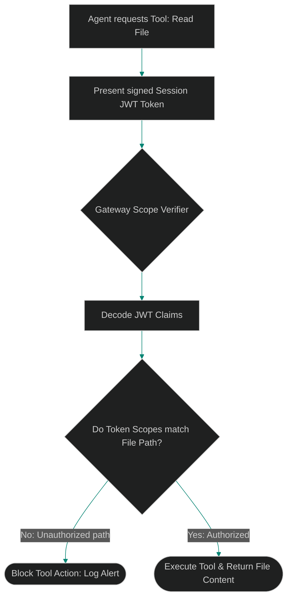

# Dynamic Tool RBAC: Implementing Scoped Tool Grants for Swarms

> [!NOTE]
> **📖 Article Overview**
> Sharing global access tokens across multi-agent systems is a major security flaw. If a compromised helper agent gains full read/write access to the host filesystem, it can overwrite config files or leak environment secrets. To enforce safety boundaries, teams must implement **Dynamic Tool Role-Based Access Control (RBAC)**. By requiring agents to authenticate tool requests using scoped session tokens, we restrict operations dynamically. In this article, we map token authorization flows and implement an RBAC tool gateway in Python.

---

## The Danger of Over-Privileged Agent Swarms

In basic systems, agents share a single API key or run with root host privileges:
* **Horizontal Privilege Escalation**: A database auditor agent should not have permission to delete files or run git pushes, but shared credentials grant these capabilities.
* **Malicious Context Hijacking**: If an agent is compromised via a prompt injection attack, the attacker can leverage the agent's broad tool permissions to execute system mutations.
* **The Solution**: **Scoped Session Tokens**. The coordinator agent generates signed JWT keys with specific scope limits (e.g. `files:read:/workspace/src`) and delegates them to child agents. Tool routers parse the token claims before executing operations.



---

## 1. Defining Fine-Grained Tool Scopes

We structure scope claims using hierarchical patterns:
* **Read-only Filesystem (`files:read:<path>`)**: Restricting file-read operations to specific workspace subdirectories.
* **Network Restrictions (`network:connect:<domain>`)**: Restricting external HTTP requests to a whitelist of api providers.
* **Limited System Access (`system:write:<target>`)**: Blocking shell commands unless target scripts are explicitly authorized.

---

## 2. Decoupling Authorization Gates

The authorization gate resides in the **Tool Router Proxy**, not the agent codebase:
1. Child agents submit tool requests alongside their assigned JWT token.
2. The router validates the token signature, checks claims against path parameters, and blocks execution if scopes are missing.

---

## Code Demo: Scoped Tool RBAC Gateway

Below is a Python implementation of an RBAC tool gateway. It parses session tokens, evaluates path permissions, and blocks unauthorized tool actions.

```python
import json
from typing import Dict, Any, Tuple

class ScopedToolGateway:
    def __init__(self):
        # Whitelisted directories and allowed actions per session token
        # Simulates decoded JWT payloads
        self.session_tokens = {
            "token_auditor_abc": {
                "role": "auditor",
                "scopes": [
                    "files:read:G:/ReplitProjects/akmalkhaniub.github.io/blog/posts",
                    "network:connect:api.github.com"
                ]
            },
            "token_deployer_xyz": {
                "role": "deployer",
                "scopes": [
                    "files:read:G:/ReplitProjects/akmalkhaniub.github.io/blog",
                    "files:write:G:/ReplitProjects/akmalkhaniub.github.io/blog",
                    "system:execute:deploy_script"
                ]
            }
        }

    def verify_tool_access(self, token: str, action: str, target_path: str) -> Tuple[bool, str]:
        session = self.session_tokens.get(token)
        if not session:
            return False, "Access Denied: Invalid session token."

        scopes = session.get("scopes", [])
        required_scope = f"{action}:{target_path}"

        # Evaluate exact path matches and parent directory scopes
        for scope in scopes:
            scope_action, scope_path = scope.split(":", 1)[0] + ":" + scope.split(":", 1)[1], scope.split(":", 2)[2]
            
            # Check if action matches
            if action == scope_action:
                # Check if target_path starts with scope path configuration
                if target_path.startswith(scope_path):
                    return True, f"Access Granted: Authorized role '{session['role']}' with scope '{scope}'."

        return False, f"Access Denied: Role '{session['role']}' lacks required scope: '{required_scope}'."

if __name__ == "__main__":
    gateway = ScopedToolGateway()

    # Case 1: Auditor agent reads allowed blog posts folder
    token_1 = "token_auditor_abc"
    path_1 = "G:/ReplitProjects/akmalkhaniub.github.io/blog/posts/posts.json"
    success_1, msg_1 = gateway.verify_tool_access(token_1, "files:read", path_1)
    print("🔒 Running Scoped Tool Authorization Checks...")
    print("-----------------------------------------------")
    print(f"[Run #1] Target: {path_1}\n👉 {msg_1}")

    # Case 2: Auditor agent attempts to write/overwrite blog files
    success_2, msg_2 = gateway.verify_tool_access(token_1, "files:write", path_1)
    print(f"\n[Run #2] Target: {path_1}\n👉 {msg_2}")

    # Case 3: Deployer agent runs schema updates on allowed root
    token_3 = "token_deployer_xyz"
    path_3 = "G:/ReplitProjects/akmalkhaniub.github.io/blog/posts.json"
    success_3, msg_3 = gateway.verify_tool_access(token_3, "files:write", path_3)
    print(f"\n[Run #3] Target: {path_3}\n👉 {msg_3}")
```

---

## Security Takeaways

* **Avoid Unified Master Keys**: Never supply parent root access keys directly to worker agent nodes. Enforce token scopes.
* **Isolate Filesystem Tools**: Restrict filesystem reads and writes to specific subdirectories using path validation checks.
* **Establish Gateway Audits**: Log authorization failures to alert security monitors about potential prompt injection attacks.
