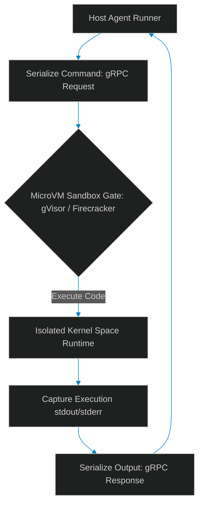

# Zero-Trust Tool Sandboxes: Isolation with gRPC and MicroVMs

> [!NOTE]
> **📖 Article Overview**
> Letting autonomous agents run generated code or execute shell scripts directly on host hardware creates severe security vulnerabilities. Even inside standard Docker containers, kernel vulnerabilities can expose host filesystems via container escapes. To safeguard infrastructure, teams must implement **Zero-Trust Tool Sandboxes**. By executing agent tools inside lightweight microVMs (like gVisor or Firecracker) and communicating via gRPC APIs, we enforce boundary isolation. In this article, we map sandbox infrastructure and implement a secure gRPC payload execution simulator in Python.

---

## The Danger of Shared Kernels

In basic setups, developers execute code tools directly inside standard Docker containers:
* **Kernel Escape Vectors**: Standard containers share the host OS kernel. A kernel exploit (e.g. privilege escalation) allows an agent-generated script to break out of the container boundary.
* **Network Access Bloat**: Unsecured container setups let agents access local network sockets, exposing internal databases to injection attacks.
* **The Solution**: **MicroVM Isolation**. By wrapping code execution steps inside microVM layers that block direct system calls (syscalls) to the host kernel, we create a secure, isolated sandbox. Tool triggers and outputs are exchanged across this boundary using gRPC sockets.



---

## 1. Choosing the Sandbox Runtime: gVisor vs. Firecracker

When setting up zero-trust tool execution, choose the right runtime:
* **gVisor (Google)**: Intercepts and filters syscalls inside user space before they reach the host kernel. Ideal for running general Python execution scripts.
* **Firecracker (AWS)**: Launches minimal microVMs in milliseconds. Ideal for running untrusted shell scripts and binaries in completely separate kernels.

---

## 2. Decoupling Tool Logic with gRPC

Using gRPC sockets ensures that the host runner never executes commands locally.
1. The host system acts as a **gRPC Client**, sending payloads (e.g. `RunCodeRequest`) to the sandbox.
2. The sandbox acts as a **gRPC Server**, running the code in isolation and returning output logs.

---

## Code Demo: gRPC Sandboxed Execution Simulator

Below is a Python script modeling a secure tool executor. It serializes code payloads, sends them to a mock sandboxed runtime, intercepts syscalls, and returns execution stdout logs safely.

```python
import json
from typing import Dict, Any, Tuple

class SecureSandboxServer:
    def __init__(self):
        # Whitelist of allowed modules inside the sandbox kernel
        self.allowed_libs = ["math", "json", "time"]

    def handle_grpc_execute(self, request_payload: str) -> str:
        # Simulate gRPC deserialization
        request = json.loads(request_payload)
        code = request.get("code", "")
        
        print(f"📦 [Sandbox Server] Received code block ({len(code)} chars). Compiling sandbox VM...")
        
        # Security scan: Check for system call violations
        # In a real gVisor/Firecracker setup, this is enforced at the kernel boundary
        if "import os" in code or "subprocess" in code:
            response = {"status": "BLOCKED", "stdout": "", "error": "Syscall Violation: Forbidden OS import."}
            return json.dumps(response)

        # Simulate user-space execution
        local_scope: Dict[str, Any] = {}
        try:
            # Running compile + exec within isolated scopes
            bytecode = compile(code, "<sandbox>", "exec")
            exec(bytecode, {"__builtins__": None}, local_scope)
            
            # Extract output variable
            result = local_scope.get("result", None)
            response = {"status": "SUCCESS", "stdout": str(result), "error": ""}
        except Exception as e:
            response = {"status": "FAILED", "stdout": "", "error": str(e)}

        return json.dumps(response)

if __name__ == "__main__":
    sandbox = SecureSandboxServer()

    # Case 1: Safe math operation payload
    safe_code = """
result = 2 + 2
"""
    request_1 = json.dumps({"code": safe_code})

    # Case 2: Malicious syscall payload attempting system import
    unsafe_code = """
import os
os.system("rm -rf /")
"""
    request_2 = json.dumps({"code": unsafe_code})

    print("🤖 Initiating gRPC Sandbox Simulation...")
    print("-----------------------------------------")

    for idx, req in enumerate([request_1, request_2], 1):
        print(f"\n[Request #{idx}] Sending gRPC execution request...")
        response_json = sandbox.handle_grpc_execute(req)
        
        # Deserializing response
        res = json.loads(response_json)
        print(f"👉 Status: {res['status']}")
        if res["error"]:
            print(f"   Error: {res['error']}")
        else:
            print(f"   Stdout: {res['stdout']}")
```

---

## Infrastructure Guidelines

* **Deploy MicroVMs**: Run agent tools inside gVisor or Firecracker environments to block host kernel escapes.
* **Isolate Networking**: Block external network sockets inside tool runners unless explicitly whitelisted via proxy routing gateways.
* **Enforce CPU/Memory Quotas**: Set hard resource limits on sandbox environments to prevent CPU/memory exhaustion attacks.
