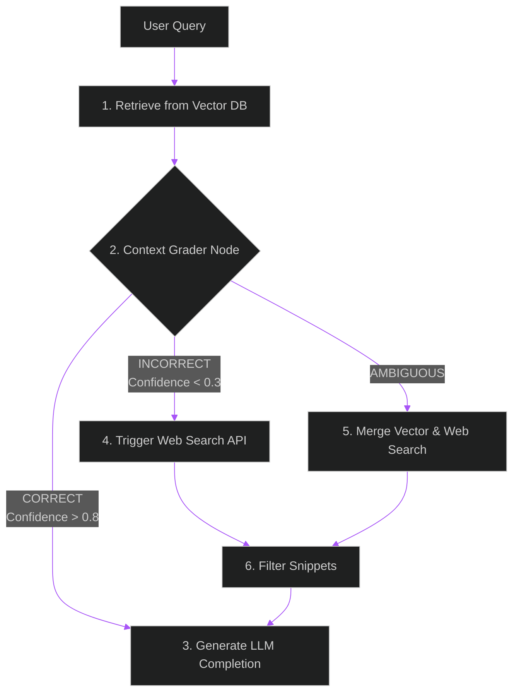

# Self-Reflective RAG (CRAG): Corrective Search Loops

> [!NOTE]
> **📖 Article Overview**
> Traditional Retrieval-Augmented Generation (RAG) pipelines suffer from a major structural flaw: **they assume the retriever always finds the correct context**. If the vector database returns irrelevant or outdated documents, the LLM will generate an incorrect, hallucinated response. To solve this, advanced AI teams build **Self-Reflective RAG (also known as Corrective RAG or CRAG)** pipelines. By inserting a grader node that evaluates retrieved context relevance and triggers dynamic web search fallback when information is missing, CRAG ensures your generation is always grounded. This article walks through building a CRAG pipeline in Python.

---

## The Corrective RAG (CRAG) Architecture

Instead of feeding retrieved documents directly into the prompt generator, a CRAG pipeline routes them through three logical stages:
1. **Context Grading**: An evaluator LLM grades each retrieved document block as `CORRECT`, `INCORRECT`, or `AMBIGUOUS`.
2. **Dynamic Web Search Fallback**: If the grader marks all documents as `INCORRECT` (indicating the local vector database lacks the query's answer), the pipeline suspends generation and queries a Web Search API (like Tavily) to fetch real-time context.
3. **Context Filtering & Ingestion**: The system extracts the highly relevant web search snippets, discards the irrelevant local database records, and compiles the final grounded prompt.



---

## Implementing Corrective RAG in Python

Below is a complete implementation using Python, `pydantic` for structured grading outputs, and a mock web search searcher routing logic.

```python
import os
from typing import Literal
from pydantic import BaseModel, Field
from openai import OpenAI

# Initialize client
client = OpenAI(api_key=os.getenv("OPENAI_API_KEY"))

# Define structured grading output schema
class DocumentGrade(BaseModel):
    relevance: Literal["CORRECT", "INCORRECT", "AMBIGUOUS"] = Field(
        ..., 
        description="Whether the document contains information directly answering the user query."
    )
    explanation: str = Field(..., description="Short rationale for the grade.")

def grade_retrieved_document(query: str, doc_content: str) -> DocumentGrade:
    """
    Grades the relevance of a retrieved document to the user query
    """
    system_prompt = (
        "You are an objective grader. Evaluate if the retrieved document contains "
        "any information relevant to answering the user query. "
        "Grade as CORRECT if relevant, INCORRECT if irrelevant, and AMBIGUOUS if partially relevant."
    )
    
    prompt = f"Query: {query}\n\nDocument: {doc_content}"
    
    completion = client.beta.chat.completions.parse(
        model="gpt-4o-mini",
        messages=[
            {"role": "system", "content": system_prompt},
            {"role": "user", "content": prompt}
        ],
        response_format=DocumentGrade
    )
    return completion.choices[0].message.parsed

def mock_web_search(query: str) -> str:
    """
    Simulates calling a Web Search API (like Tavily or Searx)
    """
    print(f"-> Triggering Web Search Fallback for: '{query}'")
    return "Web Search Result: According to official PostgreSQL documents, PgBouncer Transaction Mode disables prepared statement caching natively."

def execute_crag_pipeline(query: str, retrieved_docs: list[str]) -> str:
    valid_contexts = []
    needs_search = False
    
    # 1. Grade all retrieved documents
    for doc in retrieved_docs:
        grade = grade_retrieved_document(query, doc)
        print(f"Document Grade: {grade.relevance} ({grade.explanation})")
        
        if grade.relevance in ["CORRECT", "AMBIGUOUS"]:
            valid_contexts.append(doc)
        
        if grade.relevance == "AMBIGUOUS":
            # Partial hit - we can enrich this with search
            needs_search = True

    # 2. If no documents were relevant, trigger full web search fallback
    if not valid_contexts:
        print("-> Local context database lookup failed completely.")
        web_context = mock_web_search(query)
        valid_contexts.append(web_context)
    elif needs_search:
        web_context = mock_web_search(query)
        valid_contexts.append(web_context)

    # 3. Assemble final context and generate completion
    final_context = "\n\n".join(valid_contexts)
    prompt = f"Context:\n{final_context}\n\nQuery: {query}\n\nAnswer:"
    
    completion = client.chat.completions.create(
        model="gpt-4o-mini",
        messages=[{"role": "user", "content": prompt}],
        temperature=0.0
    )
    
    return completion.choices[0].message.content

# Run Simulation
if __name__ == "__main__":
    query = "How do I fix PgBouncer prepared statement error?"
    
    # Mock documents returned from vector search that are IRRELEVANT (outdated info)
    mock_retrieved_docs = [
        "To start PgBouncer, run the pgbouncer command pointing to your .ini configuration file.",
        "PostgreSQL connection pooling saves memory limits by multiplexing client ports."
    ]
    
    final_answer = execute_crag_pipeline(query, mock_retrieved_docs)
    print("\n--- Final Answer ---")
    print(final_answer)
```

---

## 🏁 Conclusion & Takeaways

Self-Reflective loops protect RAG systems from poor vector search results:
* [ ] **Insert a grader node**: Always evaluate the semantic relevancy of retrieved document fragments before passing them to the generator.
* [ ] **Enforce structured grading criteria**: Use strict grading schemas (CORRECT, INCORRECT, AMBIGUOUS) using Pydantic parse endpoints.
* [ ] **Establish search fallback gates**: If local vector data scores below your relevancy threshold, dynamically trigger search API gateways to collect fresh data.
* [ ] **Filter context dynamically**: Strip away flagged irrelevant context blocks to optimize input token costs and keep prompts focused.
