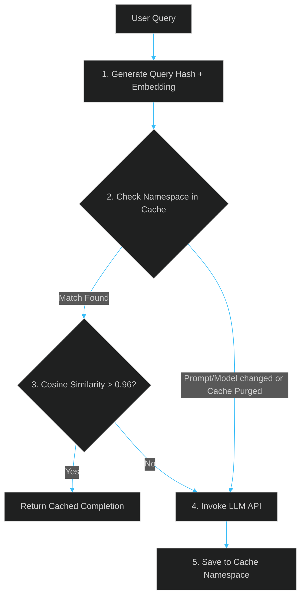

# Semantic Cache Eviction: Managing Stale LLM Cache Databases

> [!NOTE]
> **📖 Article Overview**
> Implementing a semantic cache (like matching query embedding distances in Redis or Qdrant before calling LLM APIs) is a standard optimization to reduce latency and token costs. However, caching LLM responses introduces a complex problem: **cache invalidation**. If you update your model version, tweak your system prompt, or modify your underlying databases, your semantic cache will continue serving stale, outdated, or now-incorrect answers. This article outlines the architecture of **Semantic Cache Eviction** — hashing prompts, namespace routing, and executing targeted purges — with a complete implementation in Python.

---

## The Stale Embedding Problem

In traditional web development, we evict caches using direct keys (e.g. `DEL user:99`). In semantic caching, we search for matching keys using vector similarity.

If the prompt template changes from *"Summarize this text in 3 sentences"* to *"Summarize this text in 5 bullet points"*, a naive vector lookup will match the new user query with the old 3-sentence summary cached under the previous template. The cache is stale, but because the user query embedding is similar, the system returns the wrong output style.



---

## 3 Pillars of Semantic Cache Invalidation

To build a reliable semantic cache, you must tie cache keys to the variables that define the execution state:

### 1. Hashing the Application Context
The cache key should not just be the user query. It must include a hash of the **system prompt version** and the **active model name**. If either the prompt template changes or the model is upgraded, the hash changes, automatically partitioning new cached completions from legacy ones.

### 2. Metadata Namespaces
Store cache entries with strict metadata fields (e.g., `tenant_id`, `category`, `data_version`). This allows you to run bulk deletes across specific namespaces without wiping the entire global cache.

### 3. Soft Eviction (Re-evaluation thresholds)
Instead of a binary hit/miss, evaluate similarity scores:
* **Score > 0.98**: High confidence. Serve cache instantly.
* **Score 0.94 - 0.98**: Ambiguous. Serve cache, but trigger an asynchronous LLM request in the background to verify the answer. If the new response differs, overwrite the cache.
* **Score < 0.94**: Cache miss. Route directly to LLM.

---

## Implementation: Hashed Semantic Cache Router in Python

Below is a Python implementation utilizing `redis-py` that creates contextual cache keys, conducts vector similarity lookups, and supports namespace-based cache eviction.

```python
import hashlib
import json
import redis
from redis.commands.search.query import Query

# Connect to Redis Server
# (Assuming Redis Stack is running locally with the Search module enabled)
redis_client = redis.Redis(host="localhost", port=6379, decode_responses=True)

class SemanticCacheManager:
    def __init__(self, system_prompt: str, model_name: str):
        self.model_name = model_name
        # 1. Compile a unique hash representing the system state/prompt
        self.context_hash = hashlib.sha256(
            f"{system_prompt}:{model_name}".encode("utf-8")
        ).hexdigest()
        
    def generate_cache_key(self, query_text: str) -> str:
        """
        Creates a unique cache key prefix incorporating the system state hash
        """
        query_hash = hashlib.sha256(query_text.encode("utf-8")).hexdigest()
        return f"cache:{self.context_hash}:{query_hash}"

    def set_cache_entry(self, query_text: str, query_vector: list[float], completion: str, namespace: str):
        """
        Saves completion to the semantic cache with metadata namespace
        """
        key = self.generate_cache_key(query_text)
        
        # Save structured document fields
        payload = {
            "query": query_text,
            "completion": completion,
            "namespace": namespace,
            "context_hash": self.context_hash,
            # Store raw vector as binary blob for Redis Index
            "embedding": bytes(bytearray(query_vector))
        }
        
        redis_client.hset(key, mapping=payload)
        # Set standard TTL (e.g. 7 days)
        redis_client.expire(key, 604800)

    def get_cache_entry(self, query_vector: list[float], threshold: float = 0.96) -> str | None:
        """
        Performs vector similarity search constrained to the current context hash
        """
        # Formulate a Vector Search query matching current context_hash
        vector_query = (
            f"(@context_hash:{self.context_hash})=>[KNN 1 @embedding $query_vector AS score]"
        )
        
        q = Query(vector_query).sort_by("score").paging(0, 1).return_fields("completion", "score").dialect(2)
        
        query_params = {
            "query_vector": bytes(bytearray(query_vector))
        }
        
        # Execute Redis Search index query
        results = redis_client.ft("idx_cache").search(q, query_params)
        
        if results.docs:
            doc = results.docs[0]
            # Convert Redis score (distance) to cosine similarity
            similarity = 1.0 - float(doc.score)
            if similarity >= threshold:
                return doc.completion
        return None

    def purge_namespace(self, namespace: str):
        """
        Evicts all cache entries belonging to a specific metadata namespace
        """
        # Find all keys matching the index filter
        q = Query(f"@namespace:{namespace}").return_fields("id").paging(0, 1000)
        results = redis_client.ft("idx_cache").search(q)
        
        for doc in results.docs:
            redis_client.delete(doc.id)
        print(f"Purged {len(results.docs)} entries from cache namespace: {namespace}")
```

### Key Highlights of the Code:
* **Context Partitioning**: By prefixing the key with `self.context_hash`, the cache automatically partitions itself. If you update your prompt, the new queries generate a different hash, rendering the old cache entries unreachable without requiring database-wide drops.
* **Granular Eviction**: The `purge_namespace` method lets you invalidate specific customers' data or categories (e.g., when a user deletes their profile) without affecting global caching.

---

## Conclusion & Takeaways

An invalidation strategy is the difference between a secure cache and a stale system:
* [ ] **Hash the system parameters**: Always include the system prompt template and model name inside the cache key prefix.
* [ ] **Add metadata namespaces**: Tag cache entries with database tenancy and data versions to allow targeted invalidation.
* [ ] **Use transaction local variables**: Set TTLs on all cache writes to naturally phase out unused historical entries.
* [ ] **Soft evict ambiguous matches**: Build re-evaluation ranges to run asynchronous background LLM queries for mid-similarity hits.
