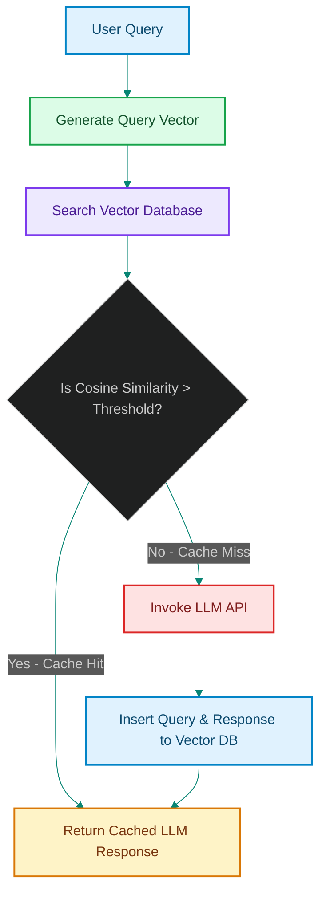

# Semantic Cache Layers for LLMs: Reducing Token Costs with Vector-Based Prompt Lookups

> [!NOTE]
> **📖 Article Overview**
> While provider-side prompt caching accelerates execution for exact prefix matches, it fails to capture variations in user queries. If a user asks *"How do I restart Nginx?"* followed by *"What is the command to restart Nginx?"*, provider-side caches treat them as entirely different prompts. In this article, we design a client-side **Semantic Cache Layer** using vector embeddings and cosine similarity thresholds, and implement a production-ready semantic cache manager in Python.

---

## The Catch-22 of Exact String Caching

In traditional web applications, key-value stores (like Redis) cache database query results using exact string keys (e.g., query SQL string hash). In LLM interactions, this approach falls short:
* **Query Variations**: Users express the same intent in infinitely varied formats, structures, or spelling.
* **Redundant API Costs**: Processing these variation queries forces the LLM to generate identical answers, wasting token budgets and execution time.
* **The Solution**: A **Semantic Cache**. Instead of comparing characters, we compare **semantic vectors** (embeddings). If the vector distance between the incoming query and a previously cached query is close enough, we return the cached response [1].



---

## 1. Cosine Similarity & Threshold Tuning

To construct a reliable semantic cache, we calculate the **Cosine Similarity** between the embedding vector of the incoming query (\(\vec{A}\)) and cached query vectors (\(\vec{B}\)):

\[\text{Similarity} = \frac{\vec{A} \cdot \vec{B}}{\|\vec{A}\| \|\vec{B}\|}\]

* **Threshold Selection**:
  * **0.98+**: Extreme precision. Only catches near-duplicate inputs (e.g., minor typo corrections).
  * **0.95 - 0.97**: Recommended production sweet spot. Catches identical semantic meanings across different sentence patterns.
  * **Below 0.90**: High risk of false hits. The cache might return an answer for a completely different topic (e.g., returning Apache restart instructions for an Nginx query).

---

## Code Demo: Building a Semantic Cache Layer

Below is a Python implementation of a semantic cache layer. It handles embedding generation (simulated with a mock vector space), performs cosine similarity matches, and saves results in an in-memory repository.

```python
import math
from typing import List, Dict, Any, Optional

# Helper function to compute cosine similarity between two float lists
def cosine_similarity(v1: List[float], v2: List[float]) -> float:
    dot_product = sum(x * y for x, y in zip(v1, v2))
    magnitude1 = math.sqrt(sum(x * x for x in v1))
    magnitude2 = math.sqrt(sum(x * x for x in v2))
    if magnitude1 == 0 or magnitude2 == 0:
        return 0.0
    return dot_product / (magnitude1 * magnitude2)

# Mock Embedding Client (generates vectors based on word frequencies for testing)
class MockEmbeddingClient:
    def get_embedding(self, text: str) -> List[float]:
        # Formulate a simplistic 8-dimensional vector based on keywords
        keywords = ["nginx", "restart", "apache", "status", "linux", "systemctl", "error", "log"]
        text_lower = text.lower()
        vector = []
        for word in keywords:
            vector.append(1.0 if word in text_lower else 0.0)
        
        # Normalize vector to unit length
        length = math.sqrt(sum(x*x for x in vector))
        if length == 0:
            return [0.0] * 8
        return [x / length for x in vector]

class SemanticCache:
    def __init__(self, embedding_client: MockEmbeddingClient, threshold: float = 0.95):
        self.embedding_client = embedding_client
        self.threshold = threshold
        # Schema: [{"query": str, "vector": List[float], "response": str}]
        self.store: List[Dict[str, Any]] = []

    def lookup(self, query: str) -> Optional[str]:
        query_vector = self.embedding_client.get_embedding(query)
        best_score = 0.0
        best_response = None
        
        for entry in self.store:
            score = cosine_similarity(query_vector, entry["vector"])
            if score > best_score:
                best_score = score
                best_response = entry["response"]
                
        if best_score >= self.threshold:
            print(f"🎯 Cache Hit! Semantic Similarity: {best_score:.4f}")
            return best_response
            
        print(f"💨 Cache Miss. Highest Similarity was: {best_score:.4f}")
        return None

    def insert(self, query: str, response: str):
        vector = self.embedding_client.get_embedding(query)
        self.store.append({
            "query": query,
            "vector": vector,
            "response": response
        })
        print(f"💾 Inserted new query-response vector into cache.")

if __name__ == "__main__":
    embed_client = MockEmbeddingClient()
    cache = SemanticCache(embed_client, threshold=0.95)

    # Seed the cache with a response
    cache.insert(
        query="How do I restart the nginx server?",
        response="Run: sudo systemctl restart nginx"
    )

    # 1. Test case: Similar semantic query (different sentence structure)
    test_query_1 = "what is the command to restart nginx?"
    result_1 = cache.lookup(test_query_1)
    print(f"Query: '{test_query_1}' -> Response: {result_1}\n")

    # 2. Test case: Non-matching query (different keywords)
    test_query_2 = "How do I check Apache server logs?"
    result_2 = cache.lookup(test_query_2)
    print(f"Query: '{test_query_2}' -> Response: {result_2}")
```

---

## Architectural Guidelines

* **Select a High-Quality Embedding Model**: Models like OpenAI `text-embedding-3-small` or Cohere `embed-english-v3.0` provide high semantic separation, reducing false positives.
* **Handle Cache Eviction**: Set an LRU (Least Recently Used) cache policy or TTL (Time-To-Live) on vector entries. If underlying application data or prompts change, invalidate target vector namespaces.
* **Blend Vector Caching with Local Database**: Store vector search indexes in Redis (using RediSearch vector utilities) or pgvector for sub-millisecond retrieval speeds in high-scale environments. [2]


## References & Further Reading

1. **Malkov, Y. A., & Yashunin, D. A. (2018)**. *Efficient and Robust Approximate Nearest Neighbor Search Using Hierarchical Navigable Small World Graphs*. IEEE TPAMI. [https://arxiv.org/abs/1603.09320](https://arxiv.org/abs/1603.09320)
2. **Jégou, H., Douze, M., & Schmid, C. (2011)**. *Product Quantization for Nearest Neighbor Search*. IEEE TPAMI. [https://hal.inria.fr/inria-00514462v2/document](https://hal.inria.fr/inria-00514462v2/document)
3. **Johnson, J., Douze, M., & Jégou, H. (2019)**. *Billion-scale Similarity Search with GPUs*. IEEE Transactions on Big Data. [https://arxiv.org/abs/1702.08734](https://arxiv.org/abs/1702.08734)
4. **Vercel Engineering (2025)**. *Next.js 16*. Next.js Blog. [https://nextjs.org/blog/next-16](https://nextjs.org/blog/next-16)
5. **Vercel Engineering (2024)**. *Next.js 15*. Next.js Blog. [https://nextjs.org/blog/next-15](https://nextjs.org/blog/next-15)
6. **Vercel Documentation (2026)**. *Caching in Next.js*. Next.js Docs. [https://nextjs.org/docs/app/getting-started/caching](https://nextjs.org/docs/app/getting-started/caching)
7. **React Team (2024)**. *React Server Components and Related RFCs*. reactjs/rfcs. [https://github.com/reactjs/rfcs](https://github.com/reactjs/rfcs)
