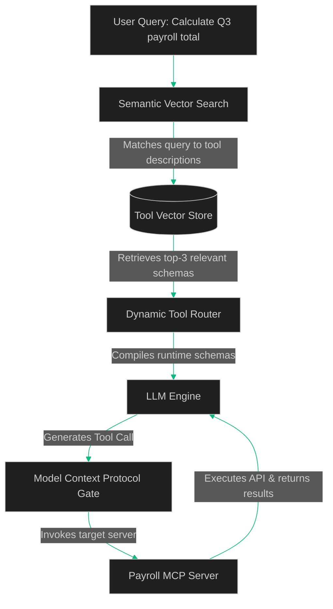

# Semantic Tool Routing: Scaling to Hundreds of Enterprise Tools via Vector Retrieval & MCP

> [!NOTE]
> **📖 Article Overview**
> As enterprises deploy AI agents across their operations, the number of available tools (APIs, database adapters, internal calculators) scales into the hundreds. However, sending every tool schema in the LLM's system prompt exhausts token budgets, degrades reasoning latency, and increases tool-calling hallucinations. In this article, we explain how to build a **Semantic Tool Routing** pipeline. We index tool definitions inside a vector database, dynamically retrieve only the top-k relevant tools for the current query, and mount them securely at runtime using the **Model Context Protocol (MCP)**.

---

## The Tool Bloat Problem: Hallucinations & Cost

When an LLM client is configured to use tools, the developer supplies a JSON array containing the schema of every available tool (including parameters, descriptions, and types). 

If you expose 100+ tools:
1. **Context Window Inflation**: Storing 100 tool schemas can consume 10,000 to 30,000 tokens on *every single interaction*, significantly increasing execution costs.
2. **Reasoning Degradation**: LLMs struggle to select the correct tool when faced with a massive catalog of overlapping functions. This leads to selecting the wrong parameters or hallucinating function calls.



To prevent this, we introduce a **Semantic Tool Router**. We generate embeddings of our tool descriptions and store them in a vector index. Before querying the LLM, we perform a vector search to fetch the top-3 matching tools. The LLM only sees the tools it actually needs.

---

## Indexing & Formatting Tool Metadata

For vector search to work effectively, each tool must have a clear semantic description. Instead of embedding code, we embed the human-readable explanation of what the tool does:

* **Function**: `get_user_payroll_data(user_id: str, quarter: int)`
* **Embedded Text**: *"Retrieves financial payroll data, total salaries paid, tax deductions, and bonuses for a specific user ID and calendar quarter."*

---

## Implementing a Semantic Tool Router in Python

Below is a complete Python implementation demonstrating how to vectorize tool metadata, execute a cosine-similarity query, and dynamically construct a subset of tool schemas for an LLM execution loop.

```python
import numpy as np
from typing import List, Dict, Any

# Mock embedding generator (in production, use OpenAI, SentenceTransformers, or Gemini embeddings)
def get_mock_embedding(text: str) -> np.ndarray:
    # Deterministic mock vector generation based on word presence
    vector = np.zeros(128)
    words = text.lower().split()
    for word in words:
        char_sum = sum(ord(c) for c in word) % 128
        vector[char_sum] += 1.0
    # Normalize vector
    norm = np.linalg.norm(vector)
    if norm > 0:
        vector = vector / norm
    return vector

class ToolRegistry:
    def __init__(self):
        self.tools: Dict[str, Dict[str, Any]] = {}
        self.vectors: Dict[str, np.ndarray] = {}

    def register_tool(self, name: str, description: str, schema: Dict[str, Any]) -> None:
        self.tools[name] = {
            "name": name,
            "description": description,
            "schema": schema
        }
        # Vectorize the description of the tool
        self.vectors[name] = get_mock_embedding(description)
        print(f"[Registry] Registered tool: {name}")

    def get_relevant_tools(self, query: str, top_k: int = 2) -> List[Dict[str, Any]]:
        query_vector = get_mock_embedding(query)
        scores = []

        for name, tool_vector in self.vectors.items():
            # Calculate cosine similarity
            similarity = np.dot(query_vector, tool_vector)
            scores.append((name, similarity))

        # Sort tools by similarity score in descending order
        scores.sort(key=lambda x: x[1], reverse=True)
        
        print(f"\n[Search] Top matching tools for query '{query}':")
        relevant_tools = []
        for name, score in scores[:top_k]:
            print(f" - {name} (Similarity Score: {score:.3f})")
            relevant_tools.append(self.tools[name])
            
        return relevant_tools

# 1. Define schemas and descriptions
payroll_schema = {
    "type": "function",
    "function": {
        "name": "calculate_quarterly_payroll",
        "parameters": {
            "type": "object",
            "properties": {
                "quarter": {"type": "integer", "description": "1, 2, 3, or 4"}
            },
            "required": ["quarter"]
        }
    }
}

server_reboot_schema = {
    "type": "function",
    "function": {
        "name": "reboot_kubernetes_pod",
        "parameters": {
            "type": "object",
            "properties": {
                "pod_name": {"type": "string"}
            },
            "required": ["pod_name"]
        }
    }
}

db_query_schema = {
    "type": "function",
    "function": {
        "name": "run_read_only_sql",
        "parameters": {
            "type": "object",
            "properties": {
                "query": {"type": "string"}
            },
            "required": ["query"]
        }
    }
}

# 2. Initialize and populate the registry
if __name__ == "__main__":
    registry = ToolRegistry()
    
    registry.register_tool(
        name="calculate_quarterly_payroll",
        description="Calculates payroll sums, salaries paid, and expenses for tax reporting and fiscal auditing.",
        schema=payroll_schema
    )
    
    registry.register_tool(
        name="reboot_kubernetes_pod",
        description="Restarts a failing docker container, pod deployment, or backend service in the cluster.",
        schema=server_reboot_schema
    )
    
    registry.register_tool(
        name="run_read_only_sql",
        description="Executes SELECT queries, read-only analytics, database scans, and table fetches.",
        schema=db_query_schema
    )

    # 3. Query the registry semantically
    user_prompt = "Auditor request: calculate the employee salaries paid in Q3."
    selected_tools = registry.get_relevant_tools(user_prompt, top_k=1)
    
    print("\n[Engine] Compiled Runtime Schemas:")
    print(selected_tools[0]["schema"])
```

---

## Standardizing Bindings via Model Context Protocol (MCP)

Once we identify the relevant tools for a session, we invoke them using the **Model Context Protocol (MCP)**. Developed by Anthropic, MCP decouples the client application from the execution environments. 

Rather than baking API keys and execution scripts directly into the main agent host, the agent connects via stdin/stdout or HTTP SSE transport to modular **MCP Servers**. The client acts as a gateway that routes queries and reads schemas dynamically from the connected servers, enforcing a clean separation of concerns and scaling integrations securely.

---

## 🏁 Conclusion & Takeaways

To scale tool access for enterprise-grade agents:
* [ ] **Enforce tool schema caching**: Avoid generating tool embeddings dynamically during execution. Cache tool schemas and description vectors inside a fast registry DB.
* [ ] **Index semantic descriptions, not code names**: Model routers rely on natural language descriptions to match queries. Write detailed explanations of *when* to use a tool.
* [ ] **Limit LLM context exposure**: Set `top_k` constraints (usually 3 to 5 tools maximum) to optimize execution costs and prevent tool hallucinations.
* [ ] **Enforce MCP boundaries**: Run sensitive execution scripts inside isolated MCP servers with strict read/write boundaries, rather than hosting execution files on your main server.
