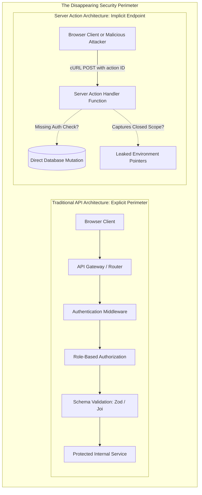

In full-stack software development, security has historically relied on an unambiguous physical perimeter: the network boundary between the client browser and the backend server.

If you wanted a client to mutate data on the server, you followed a disciplined ritual:
1. You declared a specific HTTP endpoint in your router (`POST /api/v1/billing/cancel-subscription`).
2. You passed the request through authentication middleware (validating bearer tokens or session cookies).
3. You passed the payload through an authorization guard (verifying that User A actually owns Subscription 402).
4. You parsed the request body with a validation schema (Zod, Pydantic, JSON Schema).
5. You dispatched the operation to your database.

Every backend engineer understood that an API endpoint was a public door to the outside world.

With the introduction of **Server Actions** in React 19 and Next.js, that entire architectural ceremony was replaced by a single directive:

```tsx
// Is this a private function, or a public internet endpoint?
async function updateProfile(formData: FormData) {
  'use server';
  await db.user.update({ ... });
}
```

To developer advocacy teams, Server Actions are heralded as the ultimate DX breakthrough: Remote Procedure Calls (RPC) without boilerplate, type-safe full-stack mutations, and native progressive enhancement.

To security researchers and penetration testers, Server Actions represent something far more alarming: **the dissolution of the security perimeter**.

By allowing developers to write server functions directly inline inside UI component files, full-stack frameworks have obscured the reality that **every single Server Action is an unauthenticated, publicly addressable HTTP POST endpoint exposed to anyone with a terminal and cURL**.

Here is the threat model of Server Actions, and the architectural patterns required to secure them in production.


*Figure 1: Server Action RPC invocation lifecycle, cryptographic action ID hash verification, and closed-over scope boundaries. Source: OWASP Full-Stack Security Taskforce & React Documentation [1, 2, 4].*

---

## 1. Why This Feature? The Ergonomic Nightmare of REST Plumbing

To understand why React and Next.js built Server Actions, consider the sheer volume of incidental complexity required to build a simple user feedback form in a classic React Single Page Application:
* Creating an API route handler in `/pages/api/feedback.ts`.
* Configuring an HTTP client (`fetch`, `axios`, or React Query).
* Writing manual loading states (`const [isSubmitting, setIsSubmitting] = useState(false)`).
* Handling error state management and optimistic UI rollbacks.
* Writing duplicate TypeScript types for request and response payloads.

Server Actions unify data mutation with the HTML standard:
```tsx
export default function FeedbackForm() {
  async function submitFeedback(formData: FormData) {
    'use server';
    const message = formData.get('message');
    await db.feedback.create({ data: { message } });
  }

  return (
    <form action={submitFeedback}>
      <textarea name="message" />
      <button type="submit">Submit Feedback</button>
    </form>
  );
}
```

### The Progressive Enhancement Superpower
If JavaScript fails to load on a flaky cellular network, or if an aggressive browser extension blocks script execution, the form still functions! The browser falls back to a native HTTP POST submission. When JavaScript loads, React intercepts the submission asynchronously, managing loading states via `useActionState` and optimistic UI updates via `useOptimistic`.

---

## 2. The Threat Surface: Four Critical Vulnerabilities in Production

Because Server Actions look syntactically like local helper functions, developers frequently treat them as private internal methods. This mental model creates four distinct security vulnerabilities:

### 1. The Missing Authorization Vulnerability (The BOLA Hazard)
In a traditional REST API, routing files live in an isolated directory (`/api/admin/...`), where middleware easily enforces role-based access control (RBAC).

Server Actions, however, can be defined inside any component file anywhere in your repository:

```tsx
// components/user-row.tsx (Rendered on Admin Dashboard)
export default function UserRow({ user }) {
  async function deleteUser() {
    'use server';
    // CRITICAL BUG: No session check!
    // The developer assumed only admins see this button,
    // forgetting that the action is a PUBLIC HTTP endpoint!
    await db.user.delete({ where: { id: user.id } });
  }

  return <button onClick={deleteUser}>Delete User</button>;
}
```

#### The Exploit:
An unprivileged attacker inspects the page source or network logs, finds the cryptographic action ID for `deleteUser`, and executes:

```bash
curl -X POST https://example.com/dashboard \
  -H "Next-Action: 7b8f9e4210a1b2c3d4e5f6" \
  -F "0=usr_admin_999"
```

The server deletes the administrator account. The developer relied on **security through UI obscurity**: assuming that because normal users cannot see the button, they cannot trigger the action.

---

### 2. Scope Capturing & Accidental Secret Leakage
When a Server Action is defined inline inside a Server Component, it creates a JavaScript closure that captures variables from its parent scope:

```tsx
// app/documents/[id]/page.tsx
export default async function DocumentPage({ params }) {
  const secretEncryptionKey = await fetchInternalVaultKey();

  async function decryptDocument() {
    'use server';
    // The action closes over secretEncryptionKey!
    return decrypt(params.id, secretEncryptionKey);
  }

  return <DocumentViewer action={decryptDocument} />;
}
```

#### Under the Hood:
To allow the client to trigger `decryptDocument` later, Next.js must serialize the action's captured closure variables and send them to the client browser in an encrypted or signed token. If encryption configurations are misaligned, or if secret keys are captured in client-visible action bounds, sensitive server-side variables can be exposed to reverse-engineering.

---

### 3. Cross-Site Request Forgery (CSRF) in Server Actions
In traditional web applications, forms require anti-CSRF tokens to prevent malicious third-party websites from submitting forged POST requests using a victim's active session cookies.

#### How Next.js Mitigates CSRF:
Next.js inspects the incoming HTTP `Origin` header against the `Host` header. If the origin does not match the host, the framework automatically rejects the Server Action.

#### The Edge Case Hazard:
If your application runs behind an improperly configured reverse proxy that fails to forward the `Host` or `X-Forwarded-Host` headers correctly, or if your domain allows cross-subdomain cookie sharing across untrusted subdomains (`*.yourdomain.com`), malicious scripts hosted on a compromised subdomain can trigger authenticated Server Actions on behalf of users.

---

## 3. The Defense-in-Depth Pattern: Action Gateways

To make Server Actions enterprise-safe, architects must ban raw, unvalidated inline server functions. All mutations should pass through a standardized **Action Gateway** pattern enforcing authentication, Zod input parsing, and rate limiting:

```typescript
// lib/safe-action.ts
import { auth } from '@/lib/auth';
import { z } from 'zod';

export function createProtectedAction<TSchema extends z.ZodType, TResult>(
  schema: TSchema,
  handler: (data: z.infer<TSchema>, user: AuthUser) => Promise<TResult>
) {
  return async (rawInput: unknown): Promise<{ success: boolean; data?: TResult; error?: string }> => {
    // 1. Enforce Authentication Gate
    const session = await auth();
    if (!session || !session.user) {
      return { success: false, error: 'Unauthorized: Session expired or missing.' };
    }

    // 2. Enforce Schema Validation Gate
    const parseResult = schema.safeParse(rawInput);
    if (!parseResult.success) {
      return { success: false, error: 'Bad Request: Schema validation failed.' };
    }

    // 3. Execute with Injected Trusted Context
    try {
      const result = await handler(parseResult.data, session.user);
      return { success: true, data: result };
    } catch (err: any) {
      console.error('[Action Error]', err);
      return { success: false, error: 'Internal Server Error' };
    }
  };
}
```

### Usage in Production:
```typescript
// actions/billing.ts
'use server';

import { z } from 'zod';
import { createProtectedAction } from '@/lib/safe-action';

const CancelSubscriptionSchema = z.object({
  subscriptionId: z.string().uuid(),
  reason: z.string().max(500)
});

export const cancelSubscription = createProtectedAction(
  CancelSubscriptionSchema,
  async (input, user) => {
    // Both input and user are mathematically verified!
    return await billingService.cancel(input.subscriptionId, user.id);
  }
);
```

---

## 4. Cross-Framework Comparison: Full-Stack Mutation Models

| Dimension | React / Next.js Server Actions | Remix / React Router 7 `action` | SvelteKit Form Actions | tRPC Mutations |
|---|---|---|---|---|
| **Declaration Scope** | Anywhere (Inline or external files) | **Strictly one `action()` per route module** | **Strictly declared in `+page.server.js`** | Centralized API router file |
| **Endpoint Discovery** | Implicit (Compiler hashes function names) | Explicit (Maps directly to route URL) | Explicit (Named actions on route URL) | Explicit (Procedure paths) |
| **Progressive Enhancement** | Native (Works with `<form action={...}>`) | Native (Works with `<Form method="post">`) | Native (Works with `use:enhance`) | No (Requires client JS) |
| **Authorization Auditability** | Hard (Functions scattered across UI tree) | **Very Easy (Single entry point per route)** | **Very Easy (Single entry point per route)** | **Very Easy (Middleware pipelines)** |

---

## 5. Architectural Summary

Server Actions are an incredible ergonomic advancement, but they demand a fundamental shift in security awareness.

The moment you write `'use server'`, you are not creating a private helper function; you are publishing a public endpoint to the global internet.

By establishing strict Action Gateways, enforcing Zod schema validation, verifying tenant ownership on every invocation, and avoiding accidental closure captures, engineering teams can enjoy the productivity of full-stack React without compromising their application's security posture.

---

## References & Further Reading

1. **OWASP Foundation (2023)**. *OWASP Top 10 API Security Risks: Broken Object Level Authorization & Server-Side Security*. OWASP Foundation. [https://owasp.org/API-Security/](https://owasp.org/API-Security/)
2. **React Core Team (2024)**. *Server Actions Security Model and Cryptographic ID Generation*. React 19 RFCs. [https://react.dev/reference/rsc/server-actions](https://react.dev/reference/rsc/server-actions)
3. **Zod Team & Colinhacks (2024)**. *TypeScript-First Schema Validation with Static Type Inference*. GitHub Repository. [https://github.com/colinhacks/zod](https://github.com/colinhacks/zod)
4. **Barth, A., Jackson, C., & Mitchell, J. C. (2008)**. *Robust Defenses for Cross-Site Request Forgery*. Proceedings of the 15th ACM Conference on Computer and Communications Security (CCS '08), 75–88. [https://doi.org/10.1145/1455770.1455782](https://doi.org/10.1145/1455770.1455782)
5. **Remix Team (2023)**. *Action Functions and Route Security Boundaries*. Remix Guides. [https://remix.run/docs/en/main/route/action](https://remix.run/docs/en/main/route/action)
