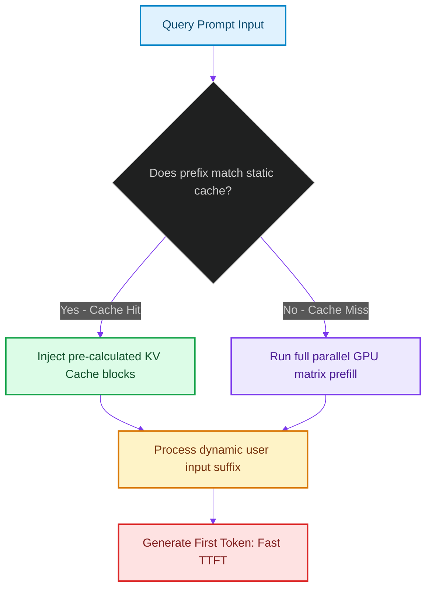

# Context Prefill Acceleration: Dynamic Chunking and KV Cache Reuse

> [!NOTE]
> **📖 Article Overview**
> When users interact with real-time agent web applications, the most critical latency metric is **Time to First Token (TTFT)**. If an agent takes several seconds to output its initial planning updates, user engagement drops. During inference, TTFT is dominated by the **Prefill Phase** (processing input prompt tokens). To accelerate this process, serving runtimes (like `vLLM` or `llama.cpp`) must implement **KV Cache Reuse** and **Dynamic Chunking**. In this article, we analyze prefill optimization pipelines and build an execution simulator in Python.

---

## The Prefill Phase Latency Bottleneck

LLM generation happens in two distinct phases:
* **The Prefill Phase**: The model processes the entire input prompt in a single parallel operation to compute attention matrices [1]. This is highly parallel but computationally expensive, scaling quadratically with prompt length.
* **The Decoding Phase**: The model generates output tokens one by one. This is autoregressive and memory-bound, requiring sequential runs.
* **The Solution**: **KV Cache Reuse**. If the system prompt contains static instructions or long database schemas that remain unchanged across requests, caching these calculated KV states avoids recalculating them on subsequent queries.



---

## 1. Prefill Optimization Topologies

Accelerate your model serving runtimes:
* **Prefix Caching**: Cache the KV cache states of static system prompts or database schemas. Subsequent requests with matching prefixes skip the prefill phase for the cached tokens.
* **Chunked Prefill**: Split long input prompts into smaller chunks (e.g., 512 tokens) and process them incrementally to prevent VRAM allocation spikes and lower latency.

---

## 2. Setting up Prefix Caching Gates

Configure your serving runtimes (like vLLM) with:
1. **Enable Prefix Caching**: Set the `--enable-prefix-caching` flag when launching the vLLM server.
2. **Standardize Prompts**: Ensure static instructions (e.g., system rules) are positioned at the beginning of the prompt to maximize prefix cache hits.

---

## Code Demo: KV Cache Reuse Latency Simulator

Below is a Python implementation of a serving coordinator. It simulates prefix cache matching, compares prefill execution latencies, and calculates TTFT reductions.

```python
import time
from typing import Dict, Any, Tuple

class ServingPrefillCoordinator:
    def __init__(self):
        # Cached system instructions state representing a long schema document
        self.cached_prefix = "system_instructions_schema_v2"
        self.prefix_token_size = 2048 # 2k tokens of static schema metadata

        # Simulated latency metrics per token
        self.prefill_latency_per_token_ms = 0.5
        self.decoding_latency_per_token_ms = 20.0

    def process_prompt(self, prompt_prefix: str, user_query: str) -> Dict[str, Any]:
        user_query_tokens = len(user_query.split()) # Estimate query size
        
        # 1. Determine cache hit status
        cache_hit = prompt_prefix == self.cached_prefix

        # 2. Calculate prefill execution overhead
        if cache_hit:
            # Skip prefill for cached prefix tokens
            prefill_tokens_processed = user_query_tokens
            prefill_time_ms = user_query_tokens * self.prefill_latency_per_token_ms
        else:
            # Prefill full prompt (prefix + user query)
            prefill_tokens_processed = self.prefix_token_size + user_query_tokens
            prefill_time_ms = prefill_tokens_processed * self.prefill_latency_per_token_ms

        # 3. Calculate Time to First Token (TTFT)
        # TTFT is dominated by the prefill phase plus one decoding step
        ttft_ms = prefill_time_ms + self.decoding_latency_per_token_ms

        return {
            "cache_hit": cache_hit,
            "tokens_prefilled": prefill_tokens_processed,
            "ttft_sec": ttft_ms / 1000.0,
            "latency_reduction_percent": 100.0 * (1 - (ttft_ms / ((self.prefix_token_size + user_query_tokens) * self.prefill_latency_per_token_ms + self.decoding_latency_per_token_ms)))
        }

if __name__ == "__main__":
    coordinator = ServingPrefillCoordinator()

    print("⚡ Simulating KV Cache Prefix Reuse Metrics...")
    print("---------------------------------------------")

    # Case 1: Cache Miss (Uncached system instruction prefix)
    miss_metrics = coordinator.process_prompt("uncached_prefix_schema", "Retrieve user profile details.")
    print(f"❌ [Cache Miss] TTFT: {miss_metrics['ttft_sec']:.3f} seconds (Tokens prefilled: {miss_metrics['tokens_prefilled']})")

    # Case 2: Cache Hit (Cached system instruction prefix)
    hit_metrics = coordinator.process_prompt("system_instructions_schema_v2", "Retrieve user profile details.")
    print(f"✅ [Cache Hit]  TTFT: {hit_metrics['ttft_sec']:.3f} seconds (Tokens prefilled: {hit_metrics['tokens_prefilled']})")
    print(f"👉 Latency Reduction: {hit_metrics['latency_reduction_percent']:.1f}%")
```

---

## Serving Optimization Takeaways

* **Cache Static Prefixes**: Position static instructions at the beginning of the prompt to maximize prefix cache hits and lower TTFT.
* **Enable Prefix Caching**: Configure your serving runtimes (e.g. vLLM) with `--enable-prefix-caching` to reuse KV cache pages.
* **Monitor TTFT**: Track Time to First Token (TTFT) metrics to identify prefill latency bottlenecks in your RAG pipelines. [2]

## References & Further Reading

1. **Malkov, Y. A., & Yashunin, D. A. (2018)**. *Efficient and Robust Approximate Nearest Neighbor Search Using Hierarchical Navigable Small World Graphs*. IEEE TPAMI. [https://arxiv.org/abs/1603.09320](https://arxiv.org/abs/1603.09320)
2. **Jégou, H., Douze, M., & Schmid, C. (2011)**. *Product Quantization for Nearest Neighbor Search*. IEEE TPAMI. [https://hal.inria.fr/inria-00514462v2/document](https://hal.inria.fr/inria-00514462v2/document)
3. **Johnson, J., Douze, M., & Jégou, H. (2019)**. *Billion-scale Similarity Search with GPUs*. IEEE Transactions on Big Data. [https://arxiv.org/abs/1702.08734](https://arxiv.org/abs/1702.08734)
4. **Dao, T., et al. (2022)**. *FlashAttention: Fast and Memory-Efficient Exact Attention with IO-Awareness*. NeurIPS. [https://arxiv.org/abs/2205.14135](https://arxiv.org/abs/2205.14135)
5. **Vaswani, A., et al. (2017)**. *Attention Is All You Need*. NeurIPS. [https://arxiv.org/abs/1706.03762](https://arxiv.org/abs/1706.03762)
6. **Kwon, W., et al. (2023)**. *Efficient Memory Management for Large Language Model Serving with PagedAttention*. SOSP. [https://arxiv.org/abs/2309.06180](https://arxiv.org/abs/2309.06180)
