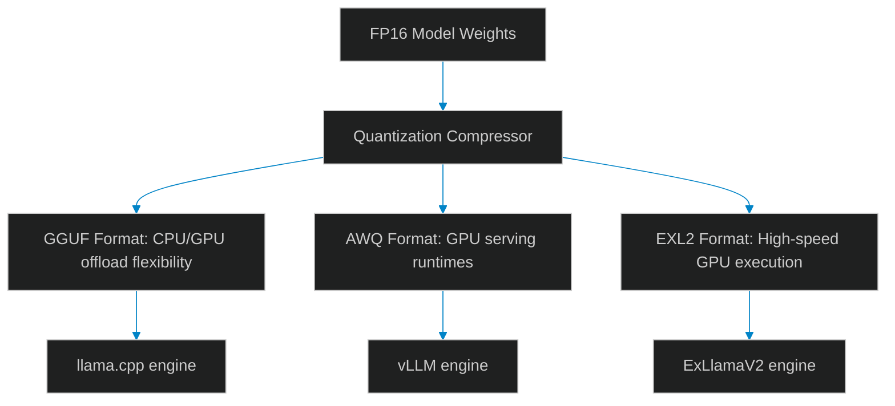

# Quantization Formats: GGUF vs. AWQ and EXL2 for Production Edge Runtimes

> [!NOTE]
> **📖 Article Overview**
> Running large language models on edge hardware is a key requirement for secure, low-latency agent architectures. However, deploying uncompressed FP16 models requires massive VRAM capacities that are unavailable on standard developer workstations. To reduce hardware requirements, teams rely on model quantization. In this article, we compare **GGUF**, **AWQ**, and **EXL2** quantization formats, analyze their performance trade-offs, and implement a benchmark simulator in Python.

---

## Quantization: Compressing Model Parameters

Quantization reduces the precision of model weights (e.g. from 16-bit floating points to 4-bit integers), dramatically reducing file sizes and memory usage:
* **The Performance Trade-off**: Lower bit-depths reduce VRAM usage but introduce quantization loss, which can degrade model reasoning capabilities.
* **The Formats**:
    * **GGUF (llama.cpp)**: A single-file format optimized for CPU execution with optional GPU offloading. Ideal for workstations lacking dedicated VRAM.
    * **AWQ (Activation-aware Weight Quantization)**: A hardware-optimized format that retains model accuracy by protecting salient weights. Designed for high-throughput GPU serving runtimes (e.g., vLLM).
    * **EXL2 (ExLlamaV2)**: A format designed for maximum GPU execution speeds, supporting variable bitrates.



---

## 1. Comparing Formats: GGUF, AWQ, and EXL2

Select the optimal format based on your deployment hardware:
* **GGUF**: Best for hybrid CPU/GPU setups and local development. It is highly portable but offers lower throughput than GPU-only formats.
* **AWQ**: Best for production cloud deployments on NVIDIA GPUs. It is widely supported by high-throughput serving frameworks like vLLM.
* **EXL2**: Best for maximizing generation speeds on dedicated GPUs. It supports fine-grained bitrates (e.g. 4.65-bit) to fit models into specific VRAM targets.

---

## 2. Managing Quantization Loss

To minimize accuracy degradation:
1. **Use AWQ for Reasoning**: Protect activation weight distributions during quantization to preserve model logic.
2. **Benchmark Task Accuracy**: Evaluate the quantized model against your test suite to ensure performance has not drifted.

---

## Code Demo: Quantized Model Benchmark Simulator

Below is a Python script that simulates token generation speeds, VRAM requirements, and throughput metrics for GGUF, AWQ, and EXL2 formats.

```python
import time
from typing import Dict, Any

class ModelServingSimulator:
    def __init__(self):
        # Format specifications for a 7B parameter model
        self.format_specs = {
            "gguf_4bit": {
                "format_name": "GGUF (4-bit)",
                "vram_required_gb": 6.5,
                "token_gen_latency_ms": 45, # Simulated latency per token on hybrid hardware
                "supported_hardware": "CPU/GPU Hybrid"
            },
            "awq_4bit": {
                "format_name": "AWQ (4-bit)",
                "vram_required_gb": 5.8,
                "token_gen_latency_ms": 20, # Simulated latency on dedicated GPU
                "supported_hardware": "NVIDIA GPU Only"
            },
            "exl2_4bit": {
                "format_name": "EXL2 (4-bit)",
                "vram_required_gb": 5.5,
                "token_gen_latency_ms": 12, # Optimized GPU kernel execution
                "supported_hardware": "NVIDIA GPU Only"
            }
        }

    def run_benchmark(self, format_key: str, prompt_length: int) -> Dict[str, Any]:
        spec = self.format_specs.get(format_key)
        if not spec:
            raise ValueError("Unknown format configuration.")

        # Simulate generating 100 tokens
        generated_tokens = 100
        total_time_ms = spec["token_gen_latency_ms"] * generated_tokens
        tokens_per_second = 1000 / spec["token_gen_latency_ms"]

        return {
            "format": spec["format_name"],
            "vram_gb": spec["vram_required_gb"],
            "tokens_per_sec": tokens_per_second,
            "total_time_sec": total_time_ms / 1000.0,
            "hardware": spec["supported_hardware"]
        }

if __name__ == "__main__":
    simulator = ModelServingSimulator()

    print("📊 Simulating Quantized Model Serving Performance...")
    print("-----------------------------------------------------")

    for key in ["gguf_4bit", "awq_4bit", "exl2_4bit"]:
        metrics = simulator.run_benchmark(key, prompt_length=500)
        print(f"\nFormat: **{metrics['format']}** ({metrics['hardware']})")
        print(f"  VRAM Required: {metrics['vram_gb']} GB")
        print(f"  Throughput:    {metrics['tokens_per_sec']:.1f} tokens/sec")
        print(f"  Time for 100 tokens: {metrics['total_time_sec']:.2f} seconds")
```

---

## Model Serving Takeaways

* **Choose the Right Format**: Use GGUF for local CPU/GPU hybrid development, and AWQ/EXL2 for production GPU serving.
* **Protect Reasoning**: Use AWQ to protect model activation weight distributions during compression.
* **Test Task Performance**: Always validate your agent's task accuracy after quantizing to ensure reasoning capabilities are preserved.
