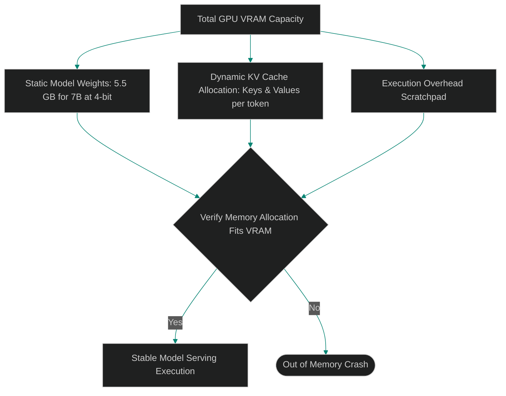

# VRAM Allocation Budgets: Optimizing Layer Offloading and KV Cache Limits

> [!NOTE]
> **📖 Article Overview**
> Running local models in production requires strict hardware resource budgeting. A common failure mode in local serving runtimes (e.g. `llama.cpp` or `vLLM`) is hitting Out-Of-Memory (OOM) errors during long agent conversations. VRAM allocation is not just about loading model weights—the Key-Value (KV) cache grows dynamically with context length and concurrent request counts. In this article, we analyze VRAM allocation stacks, detail KV cache math formulas, and implement a VRAM memory calculator in Python.

---

## Calculating VRAM Allocation Budgets

To run local models without OOM crashes, we budget VRAM allocation across three distinct segments:
* **Model Weights**: The static memory required to load the quantized model weights into VRAM. For a 7B parameter model at 4-bit precision, this is approximately 5.5 GB.
* **KV Cache Pages**: The dynamic memory allocated to store the attention key and value matrices for active context windows. This grows linearly with context length and concurrent session limits.
* **System Scratch Memory**: The temporary overhead required for execution kernels, context window calculations, and page mapping tables.



---

## 1. Under the Hood: The KV Cache Formula

The VRAM size of the KV cache is calculated as follows:

$$\text{KV Cache Size (Bytes)} = 2 \times (\text{layers}) \times (\text{attention\_heads}) \times (\text{head\_dimension}) \times (\text{precision\_bytes}) \times (\text{context\_length}) \times (\text{batch\_size})$$

Where:
* **Layers**: The number of transformer layers in the model architecture.
* **Attention Heads**: The number of key-value attention heads (reduced in models using Grouped-Query Attention - GQA).
* **Head Dimension**: The dimension size per attention head.
* **Precision Bytes**: The byte-size of the data type (e.g., 2 bytes for FP16).
* **Context Length**: The target context window size in tokens.
* **Batch Size**: The number of concurrent requests.

---

## 2. Optimizing Layer Offloading

When serving models on hardware with limited VRAM:
1. **Calculate KV cache limits**: Restrict the dynamic KV cache allocation page sizes to fit within available VRAM.
2. **Configure Layer Offloading**: Offload only the static model weights that fit in VRAM, allowing the CPU to handle the remaining layers.

---

## Code Demo: VRAM Memory Budget Calculator

Below is a Python script that calculates VRAM usage metrics based on model parameters, context window targets, and batch counts.

```python
from typing import Dict, Any

class VRAMBudgetCalculator:
    def __init__(self, gpu_vram_gb: float):
        self.gpu_vram_gb = gpu_vram_gb

    def calculate_vram_usage(
        self,
        model_size_billions: float,
        quantization_bits: int,
        num_layers: int,
        kv_heads: int,
        head_dim: int,
        context_length: int,
        batch_size: int
    ) -> Dict[str, Any]:
        # 1. Calculate static model weights size (GB)
        # 1 billion parameters at 8 bits = 1 GB
        model_weights_gb = (model_size_billions * quantization_bits) / 8.0

        # 2. Calculate dynamic KV Cache size (GB)
        # Formula: 2 * layers * kv_heads * head_dim * precision_bytes * context_length * batch_size
        precision_bytes = 2 # FP16 precision for KV cache
        kv_cache_bytes = 2 * num_layers * kv_heads * head_dim * precision_bytes * context_length * batch_size
        kv_cache_gb = kv_cache_bytes / (1024 ** 3) # Convert bytes to GB

        # 3. Execution overhead scratchpad
        overhead_gb = 1.0 # Standard system overhead reservation

        total_required_gb = model_weights_gb + kv_cache_gb + overhead_gb
        fits_in_vram = total_required_gb <= self.gpu_vram_gb

        return {
            "model_weights_gb": model_weights_gb,
            "kv_cache_gb": kv_cache_gb,
            "total_required_gb": total_required_gb,
            "fits_in_vram": fits_in_vram,
            "vram_headroom_gb": self.gpu_vram_gb - total_required_gb
        }

if __name__ == "__main__":
    # Budgeting for an NVIDIA RTX 4060 Ti GPU (16 GB VRAM)
    calculator = VRAMBudgetCalculator(gpu_vram_gb=16.0)

    print("📊 Budgeting VRAM for Local Model Serving...")
    print("---------------------------------------------")

    # Target model: Qwen-7B (4-bit quantization, 32 layers, 32 heads, 128 head dim)
    metrics = calculator.calculate_vram_usage(
        model_size_billions=7.2,
        quantization_bits=4,
        num_layers=32,
        kv_heads=32,
        head_dim=128,
        context_length=8192, # 8k context window
        batch_size=4 # 4 concurrent requests
    )

    print(f"Model Weights Memory:  {metrics['model_weights_gb']:.2f} GB")
    print(f"KV Cache Memory:       {metrics['kv_cache_gb']:.2f} GB")
    print(f"Total Required VRAM:   {metrics['total_required_gb']:.2f} GB / 16.0 GB")
    print(f"Allocation Status:     {'✅ Stably Fits' if metrics['fits_in_vram'] else '❌ OOM Danger!'}")
    print(f"Headroom Remaining:    {metrics['vram_headroom_gb']:.2f} GB")
```

---

## VRAM Optimization Takeaways

* **Budget the KV Cache**: Dynamic KV cache memory usage grows linearly with context lengths and concurrent request counts.
* **Leverage Grouped-Query Attention (GQA)**: Deploy models using GQA (e.g. Mistral-7B) to reduce KV cache size and memory footprints.
* **Configure Memory Headrooms**: Reserve at least 1 GB of VRAM headroom for execution kernel overheads to prevent system OOM crashes.
