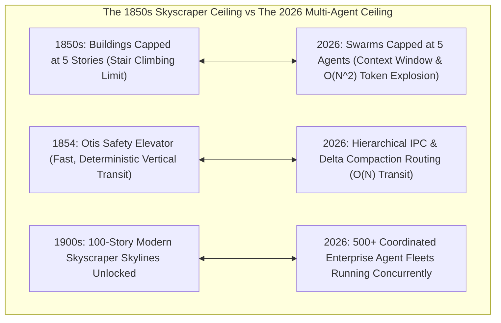
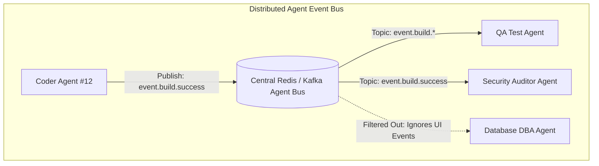

# The Skyscraper Elevator Problem: Scaling Multi-Agent Inter-Process Communication (IPC) without Context Explosion

In the 1850s, civil engineers had already mastered the structural metallurgy required to build 10- and 20-story buildings using cast iron frames and load-bearing masonry.

Yet, cities across the world remained flat, capped at **5 to 6 stories**.

The bottleneck was not structural—it was **vertical human transport**. Humans physically refused to climb more than five flights of stairs.

Consequently, top floors had the lowest rents, and tall buildings were economically unviable.

In 1854, at the New York World’s Fair, **Elisha Graves Otis** stood on a hoisting platform high above the crowd and ordered the suspension rope cut.

His revolutionary spring-operated **Safety Brake** engaged instantly, arresting the platform.

By eliminating the terror of elevator crashes and solving vertical mobility, Otis unlocked the **modern urban skyscraper**.

Today, multi-agent artificial intelligence networks face their own **Structural Height Ceiling**.



---

## 1. The Multi-Agent Structural Ceiling ($O(N^2)$ Chaos)

In naive multi-agent frameworks, agents communicate in a flat peer-to-peer mesh.

When a 10-agent swarm attempts to coordinate on a software delivery mission:

$$\text{Communication Channels} = \frac{N(N - 1)}{2} = \frac{10 \times 9}{2} = \mathbf{45 \text{ cross-dialogue streams}}$$

```
Flat P2P Mesh (O(N^2) Context Blowup):        Hierarchical IPC Router (O(N) Scalability):
         [A] <-----> [B]                                     [Root Supervisor]
        / ^ \       / ^ \                                       /        \
       /  |  \     /  |  \                                [Lead Dev]    [Lead SecOps]
     [C]<-+-->[D]<-+-->[E]                                  /    \        /     \
       \  |  /     \  |  /                               [Coder] [QA] [Auditor] [Policy]
        \ v /       \ v /                                 (Strict O(N) Delta Routing)
         [F] <-----> [G]
```

### The 3 Fatal Symptoms of the Context Ceiling:
1. **Quadratic Token Cost Explosion**: When every agent appends the conversational transcripts of 9 other agents into its working memory, token consumption grows quadratically ($O(N^2)$), driving API costs into thousands of dollars per single user request.
2. **The "Lost in the Chorus" Attention Degradation**: As prompts balloon with 100,000 tokens of cross-agent banter, the LLM’s attention mechanism dilutes, resulting in missed instructions and circular hallucinations.
3. **Deadlocks and Race Conditions**: Without centralized sequence coordination, Agent $A$ waits for Agent $B$’s output while Agent $B$ waits for Agent $A$’s confirmation.

---

## 2. The "Safety Elevator" for Multi-Agent IPC

To scale agent fleets from 5 workers to **500+ coordinated enterprise agents**, modern architectures implement three core Inter-Process Communication (IPC) paradigms:

```
> **THE 3 MULTI-AGENT IPC SCALING PILLARS**
| 1. Hierarchical Tree Routing      : Strict O(N) Supervisor -> Sub-Supervisor -> Worker delegation |
| 2. Semantic Delta Compaction      : Passing structured state diffs rather than full chat transcripts|
| 3. Topic-Filtered Pub/Sub Buses   : Selective event subscriptions (agent.secops.*, agent.db.*)   |

```

### 1. Hierarchical Tree Routing ($O(N)$ Complexity)
Instead of broadcasting to all peers, worker agents communicate **strictly vertically with their immediate domain lead**:
* A **Frontend Coder Agent** reports only to the **Lead UI Supervisor**.
* The **Lead UI Supervisor** compacts the frontend status into a 3-line delta summary and passes it up to the **Chief Mission Orchestrator**.

### 2. Semantic Delta Compaction (State Diffs Over Transcripts)
Raw chat transcripts (`"Hey, I just ran the linter and it looked good, what do you think?"`) are banned from inter-agent IPC.
Agents exchange immutable, strongly typed **Delta Payloads**:

```json
{
  "sender": "worker-coder-04",
  "task_id": "feat-auth-101",
  "delta_type": "ARTIFACT_PRODUCED",
  "payload": {
    "file_path": "src/auth/jwt.ts",
    "sha256": "0x89f2a0b1",
    "status": "COMPILED_CLEAN"
  }
}
```

---

## 3. High-Throughput Event-Driven Pub/Sub Routing

At large scale, agents subscribe to a centralized **Topic-Filtered Event Bus** (backed by Redis Streams or Apache Kafka):



Agents receive *only* the specific domain events required for their next execution phase, keeping individual context buffers under **4,000 tokens** regardless of how large the total fleet grows.

---

## Python Implementation: Lock-Free Hierarchical Agent IPC Router

Here is a Python implementation demonstrating a **Hierarchical Agent IPC Router with Semantic Delta Compaction and Topic Filtering**:

```python
from collections import defaultdict, deque
from dataclasses import dataclass
from typing import Callable, Dict, List, Optional

@dataclass
class AgentDeltaMessage:
    msg_id: str
    topic: str
    sender_id: str
    summary_delta: str
    structured_data: Dict

class HierarchicalIPCRouter:
    """
    Solves the Skyscraper Ceiling:
    Routes messages hierarchically with topic filtering and semantic compaction.
    """
    def __init__(self):
        # Topic -> list of subscriber callbacks
        self.subscribers: Dict[str, List[Callable[[AgentDeltaMessage], None]]] = defaultdict(list)
        # Message log for auditing
        self.audit_log: deque[AgentDeltaMessage] = deque(maxlen=1000)

    def subscribe(self, topic_pattern: str, handler: Callable[[AgentDeltaMessage], None]):
        print(f" 📡 [IPC Subscription] Subscribed handler to topic pattern: '{topic_pattern}'")
        self.subscribers[topic_pattern].append(handler)

    def publish_delta(self, message: AgentDeltaMessage):
        print(f"\n🛗 [IPC Publish] Message [{message.msg_id}] on '{message.topic}' from [{message.sender_id}]")
        print(f"   ↳ Delta Summary: '{message.summary_delta}'")
        
        self.audit_log.append(message)

        # Route to matching subscribers
        delivered_count = 0
        for topic_pattern, handlers in self.subscribers.items():
            if self._topic_matches(topic_pattern, message.topic):
                for handler in handlers:
                    handler(message)
                    delivered_count += 1

        print(f"   ✅ Dispatched to {delivered_count} filtered domain agent(s) (Zero broadcast waste).")

    def _topic_matches(self, pattern: str, topic: str) -> bool:
        if pattern == "*" or pattern == topic:
            return True
        if pattern.endswith(".*"):
            prefix = pattern[:-2]
            return topic.startswith(prefix)
        return False

# Demonstration Execution
if __name__ == "__main__":
    router = HierarchicalIPCRouter()

    # 1. Register Specialized Subagent Handlers
    def qa_agent_handler(msg: AgentDeltaMessage):
        print(f"   🧪 [QA Agent Received] Triggering test suite for artifact: {msg.structured_data.get('artifact')}")

    def secops_agent_handler(msg: AgentDeltaMessage):
        print(f"   🛡️ [SecOps Agent Received] Auditing SHA: {msg.structured_data.get('sha256')}")

    def dba_agent_handler(msg: AgentDeltaMessage):
        print(f"   🗄️ [DBA Agent Received] Inspecting SQL migration...")

    # Subscribe with selective topic filters
    router.subscribe("code.build.*", qa_agent_handler)
    router.subscribe("code.build.release", secops_agent_handler)
    router.subscribe("db.migration.*", dba_agent_handler)

    # 2. Coder Agent publishes code build event
    msg1 = AgentDeltaMessage(
        msg_id="evt-001",
        topic="code.build.release",
        sender_id="coder-subagent-8",
        summary_delta="Compiled JWT auth service cleanly (0 errors).",
        structured_data={"artifact": "auth.ts", "sha256": "0xfe92a1"}
    )
    router.publish_delta(msg1)

    # 3. Database Agent publishes migration event
    msg2 = AgentDeltaMessage(
        msg_id="evt-002",
        topic="db.migration.v2",
        sender_id="dba-subagent-2",
        summary_delta="Applied zero-downtime index migration to orders table.",
        structured_data={"table": "orders", "migration_time_ms": 45}
    )
    router.publish_delta(msg2)
```

---

## Summary: Overcoming the Structural Ceiling

| Scaling Dimension | Flat P2P Agent Mesh | Hierarchical Delta IPC Router |
|---|---|---|
| **Message Complexity** | $O(N^2)$ quadratic explosion | $O(N)$ linear routing |
| **Context Window Consumption** | Full conversational transcript duplication | Compact, strongly-typed JSON deltas |
| **Attention Integrity** | Severe prompt dilution & hallucination | Tightly focused domain prompts ($< 4\text{k}$ tokens) |
| **Deadlock Vulnerability** | High (Circular uncoordinated waits) | Zero (Deterministic supervisor state machine) |
| **Maximum Fleet Capacity** | $\approx 4\text{ to } 6$ agents | **$500+$ enterprise agents** |

---

## Architectural Takeaway
Just as the safety elevator transformed urban architecture from 5-story blocks into 100-story skyscrapers, **hierarchical IPC and semantic delta routing unlock the true scale of enterprise multi-agent swarms**.

By eliminating conversational broadcast noise and enforcing structured topic-filtered communication, software architects build massive, collaborative agent fleets that operate with sub-second responsiveness and flawless coordination.
